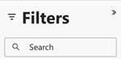
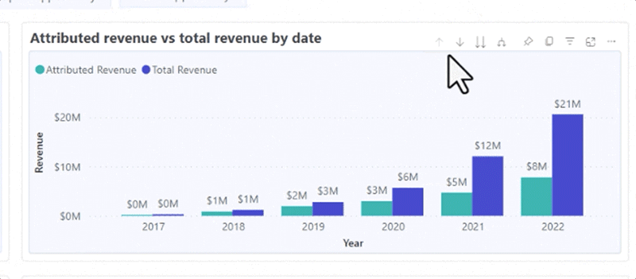

# Découvrir les bases du tableau de bord {#discover-dashboard-basics}

Cet article vous guidera tout au long des fonctionnalités fondamentales de l’interface repensée, en vous assurant que vous pouvez accéder facilement à vos données et les interpréter. Découvrez la dynamique du volet de filtrage et les complexités de nos fonctionnalités de création de rapports améliorées, telles que les fonctions d’analyse, le filtrage croisé et les info-bulles.

## Volet Filtrer {#filter-pane}

Chaque tableau de bord comporte une gamme de filtres, accompagnés des commandes suivantes pour une navigation et une personnalisation fluides.

<table style="table-layout:auto"> 
 <tbody> 
  <tr> 
   <th>Nom</th> 
   <th>Description</th>
  </tr> 
  <tr> 
   <td><b>Bouton de basculement de filtre</b></td>
   <td>Active ou ferme le volet de filtrage.
   
</td>
  </tr>
  <tr> 
   <td><b>Barre de recherche</b></td>
   <td>Pour rechercher un filtre spécifique, utilisez la recherche dans la partie supérieure du volet de filtrage. Chaque filtre possède également sa propre barre de recherche.
   
</td>
  </tr>
   <tr> 
   <td><b>Bouton Effacer le filtre</b></td>
   <td>Pour effacer un filtre, cliquez sur l’icône de gomme située dans le coin supérieur droit de chaque filtre.
   
</td>
  </tr>
  <tr> 
   <td><b>Bouton Appliquer</b></td>
   <td>Cliquez sur pour confirmer et implémenter vos modifications de filtre dans le tableau de bord.
   
</td>
  </tr>
 </tbody> 
</table>

## Filtres en mode visuel {#filters-on-visual}

Passez la souris sur le coin supérieur droit d’un visuel pour afficher une liste de filtres appliqués en lecture seule.

## Fonctionnalités des rapports {#report-capabilities}

### Zoom avant {#drill-down-and-up}

* Pointez sur un visuel pour déterminer s’il comporte une hiérarchie. C’est ce que indique la présence d’options de contrôle de l’analyse dans la barre d’actions.

* Activez l’analyse en cliquant sur la simple flèche vers le bas mise en surbrillance par un arrière-plan gris. Pour annuler, utilisez l’icône d’exploration.

Pour descendre d’un champ à l’autre, activez l’icône de défilement et sélectionnez un élément visuel, tel qu’une barre.

Utilisez l’icône d’exploration à double flèche pour passer au niveau de hiérarchie suivant.

Utilisez l’icône en forme de branchement pour ajouter un niveau de hiérarchie supplémentaire dans la vue actuelle.

### Exploration {#drill-through}

Pour explorer les données derrière le visuel, cliquez avec le bouton droit de la souris sur l’élément visuel et sélectionnez l’option &quot;perceuse&quot;.

### Exporter des données {#export-data}

Pour exporter les données sous-jacentes à partir d’un visuel, passez la souris sur son coin supérieur droit. Cliquez sur le bouton &quot;Plus d&#39;options&quot;, choisissez &quot;Exporter les données&quot;, sélectionnez le format de votre choix, puis cliquez sur &quot;Exporter&quot;.

### Mode de mise au point {#focus-mode}

Pour effectuer un zoom avant sur un visuel ou une mosaïque spécifique, passez la souris sur le coin supérieur droit et sélectionnez le bouton &quot;mise au point&quot;.

### Filtrage croisé {#cross-filtering}

La sélection d’un libellé de valeur ou d’axe dans une visualisation transcende d’autres visuels sur la page du rapport, en s’assurant qu’ils n’affichent que les données pertinentes filtrées.

### Infobulles {#tooltips}

Les info-bulles fournissent des détails supplémentaires sur les données affichées. Passez la souris sur un élément visuel et une info-bulle contextuelle s’affiche, fournissant des informations ou des explications relatives à ce point de données spécifique.

