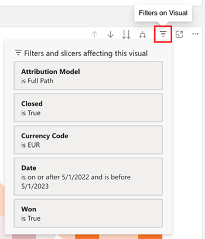

# Découvrir les bases du tableau de bord {#discover-dashboard-basics}

Cet article vous guidera à travers les fonctionnalités fondamentales de l’interface repensée, en vous assurant que vous pouvez accéder à vos données et les interpréter facilement. Explorez la dynamique du volet de filtrage et découvrez les subtilités de nos fonctionnalités de création de rapports améliorées, telles que les fonctionnalités de pratique, le filtrage croisé et les info-bulles.

## Volet de filtrage {#filter-pane}

Chaque tableau de bord comporte une plage de filtres, accompagnés des commandes suivantes pour une navigation et une personnalisation transparentes.

<table style="table-layout:auto"> 
 <tbody> 
  <tr> 
   <th>Nom</th> 
   <th>Description</th>
  </tr> 
  <tr> 
   <td><b>Bouton Bascule Filtre</b></td>
   <td>Activez/désactivez l’ouverture ou la fermeture du volet de filtrage.
   
</td>
  </tr>
  <tr> 
   <td><b>Barre de recherche</b></td>
   <td>Utilisez la recherche en haut du volet de filtrage pour rechercher un filtre spécifique. Chaque filtre possède également sa propre barre de recherche.
   
</td>
  </tr>
   <tr> 
   <td><b>Bouton Effacer le filtre</b></td>
   <td>Pour effacer un filtre, cliquez sur l’icône Gomme située dans le coin supérieur droit de chaque filtre.
   
</td>
  </tr>
  <tr> 
   <td><b>Bouton Appliquer</b></td>
   <td>Cliquez sur pour confirmer et implémenter vos modifications de filtre sur le tableau de bord.
   
</td>
  </tr>
 </tbody> 
</table>

## Filtres visuels {#filters-on-visual}

Pointez sur le coin supérieur droit d’un élément visuel pour afficher une liste en lecture seule des filtres appliqués.

## Fonctionnalités de rapport {#report-capabilities}

### Analyser en profondeur et en amont {#drill-down-and-up}

* Passez la souris sur un élément visuel pour déterminer s’il possède une hiérarchie. C’est ce qu’indique la présence d’options de contrôle de hiérarchisation dans la barre d’actions.

* Activez l’analyse en cliquant sur la seule flèche vers le bas, mise en surbrillance par un arrière-plan gris. Pour revenir en arrière, utilisez l’icône d’exploration.

Pour analyser un champ à la fois, activez l’icône d’analyse et sélectionnez un élément visuel, tel qu’une barre.

Utilisez l’icône d’analyse à double flèche pour passer au niveau hiérarchique suivant.

Utilisez l&#39;icône en forme de branchement pour ajouter un niveau de hiérarchie supplémentaire à votre affichage actuel.

### Analyser en amont {#drill-through}

Pour explorer les données derrière le visuel, cliquez avec le bouton droit sur l’élément visuel et sélectionnez l’option « exploration ».

### Exporter des données {#export-data}

Pour exporter les données sous-jacentes d’un élément visuel, pointez sur son coin supérieur droit. Cliquez sur le bouton « plus d’options », choisissez « exporter les données », sélectionnez le format souhaité, puis cliquez sur « exporter ».

### Mode de mise au point {#focus-mode}

Pour effectuer un zoom avant sur un élément visuel ou une mosaïque spécifique, pointez sur le coin supérieur droit et sélectionnez le bouton « sélection ».

### Filtrage croisé {#cross-filtering}

La sélection d’une valeur ou d’un libellé d’axe dans une visualisation permet d’appliquer un filtre croisé à d’autres visuels de la page du rapport, en veillant à ce qu’ils affichent uniquement les données filtrées pertinentes.

### Infobulles {#tooltips}

Les info-bulles affichent des détails supplémentaires sur les données affichées. Pointez sur un élément visuel et une info-bulle contextuelle s’affiche, fournissant des insights ou des explications liés à ce point de données spécifique.

