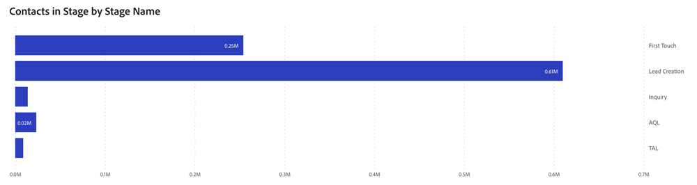

# Tableau de bord des passeports {#passport-dashboard}

Le tableau de bord des passeports offre aux marketeurs une vue dynamique des pistes, des contacts et des opportunités lorsqu’ils passent par différentes étapes au cours d’une période donnée. En filtrant pour une date spécifique, les utilisateurs peuvent également obtenir un instantané des enregistrements pour cette journée.

Questions sur le panorama :

* Combien de pistes, de contacts ou d’opportunités existaient dans chaque étape non terminale un jour donné ?
* Pendant une période donnée, combien de pistes ou de contacts distincts ont progressé au cours de chaque étape transitoire ?
   * _Exemple_: si le prospect A était à l’étape 1 le 1/1/2023 et passait à l’étape 5 d’ici 3/31/2023, l’analyse des passeports du 1er trimestre 2023 compterait le prospect A aux étapes 1 à 5.
* Combien d’opportunités uniques ont été transmises au cours de chaque étape transitoire au cours d’une période donnée ?

<table style="table-layout:auto"> 
<tbody>
<tr> 
   <th>Composant</th> 
   <th>Description</th>
   <th>Type de date</th>
   <th>Champs d’exploration</th>
   <th>Filtres</th>
  </tr>
  <tr>
    <td>Opportunités</td>
    <td><li>Chaque étape indique le nombre d’opportunités avec des MAT qui les ont passées au cours d’une période donnée.</li>
<ul style="padding-left: 30px;"><li>Si une opportunité passe par plusieurs étapes au cours de cette période, elles sont comptabilisées à chaque étape qu’elle a franchie.</li></ul>
<li>Les étapes terminales telles que "Closed Won" et "Closed Lost" sont exclues.</li>
<li>Les dates de début et de fin sont inclusives.</li>
 </td>
    <td rowspan="2">Date de transition</td>
    <td></td>
    <td rowspan="2"><li>Date</li>
<li>Canal</li>
<li>Sous-canal</li>
<li>Campagne</li>
<li>Segments</li></td>
  </tr>
  <tr>
    <td>Leads/contacts</td>
    <td><li>Chaque étape indique le nombre de Leads ou de contacts avec les BT qui les ont transmis au cours d’une période donnée.</li>
<ul style="padding-left: 30px;"><li>L’affichage ou non de "Prospère" ou "Contact" est déterminé par les préférences définies dans : Paramètres &gt; Paramètres d’attribution &gt; Objet de tableau de bord par défaut.</li></ul>
<li>Les étapes terminales telles que "Closed Won" et "Closed Lost" sont exclues.</li>
<li>Les dates de début et de fin sont inclusives.</li>
 </td>
    <td><li>Identifiant de piste/contact</li>
<li>Adresse électronique de piste/contact</li>
<li>Date de création</li>
<li>Étape actuelle</li>
<li>Date de transition entrante</li>
<li>Date de transition sortante</li></td>
  </tr>
</tbody>
</table>

>[!MORELIKETHIS]
>
>[Découvrir les bases d’un tableau de bord](/help/marketo-measure-discover-ui/dashboards/discover-dashboard-basics.md){target="_blank"}
