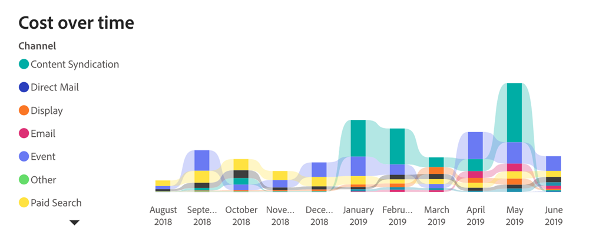

# Tableau de bord Retour sur investissement {#roi-dashboard}

Le tableau de bord du retour sur investissement offre aux marketeurs une vue granulaire des retours sur investissement sur l’ensemble des canaux, sous-canaux et campagnes. Il ventile méticuleusement les modèles de coûts et de revenus, tout en mettant en évidence des mesures telles que le coût par lead, les affaires et les opportunités, afin de garantir une compréhension globale de l’attribution marketing.

**Questions auxquelles le panorama répond**

* Quelles étaient les valeurs de retour sur investissement pour chaque canal, sous-canal et campagne ?
* Comment les coûts et les revenus ont-ils été répartis sur chaque canal, sous-canal et campagne ?
* Quels étaient les coûts par lead, les coûts par contrat et les coûts par opportunité?

## Composants de tableau de bord {#dashboard-components}

### Mosaïques de KPI {#kpi-tiles}

* **Coût** : coûts totaux des sources de données connectées et coûts téléchargés manuellement.
* **Chiffre d’affaires attribué** : contribution totale au chiffre d’affaires, en fonction du modèle d’attribution choisi, à partir des opportunités avec des points de contact qui se sont terminés au cours de la période filtrée.
* **Chiffre d’affaires attribué réalisé** : contribution totale au chiffre d’affaires, en fonction du modèle d’attribution choisi, à partir des opportunités avec des points de contact au cours de la période filtrée, quelle que soit la date à laquelle elles ont été fermées.
* **Nombre total de nouvelles pistes** : nombre total de nouvelles pistes générées, y compris les pistes touchées et non touchées.
* **Coût par nouveau lead** : coût moyen par nouveau lead, dérivé du coût total divisé par le nombre total de nouveaux leads.
* **Total des nouvelles opportunités** : nombre total de nouvelles opportunités générées, y compris les opportunités touchées et non touchées.
* **Coût par nouvelle opportunité** : coût moyen par nouvelle opportunité, dérivé du coût total divisé par le nombre total de nouvelles opportunités.
* **Total des affaires** : nombre d’opportunités « closes et confirmées », y compris les opportunités sans points de contact.
* **RSI simple** : chiffre d’affaires attribué divisé par les coûts au cours de la période filtrée.
* **Retour sur investissement réalisé** : revenu attribué réalisé divisé par les coûts au cours de la période filtrée.

### Graphique Coûts et revenus par canal {#cost-and-revenue-by-channel-graph}

Graphique à barres illustrant les coûts et les recettes, conçu pour offrir une perspective comparative de leur ampleur par rapport à divers canaux, sous-canaux et campagnes.

* Utilisez les fonctionnalités d’analyse et de classement vers le haut pour classer les données par sous-canal et campagne.
* Pointez sur chaque barre pour afficher les RSI simples et réalisés.

**Questions auxquelles le graphique répond**

* Quelles étaient les valeurs de retour sur investissement pour chaque canal, sous-canal et campagne ?
* Existe-t-il des canaux ou sous-canaux aberrants dont les coûts sont inhabituellement élevés ou faibles par rapport à leur chiffre d’affaires ?

### Retour sur investissement simple ou réalisé au fil du temps {#realized-vs-simple-roi-over-time}

Graphique en courbes des séries temporelles présentant la comparaison entre le retour sur investissement réalisé et simple, suivi de leur progression dans le temps.

* Passez la souris sur une section du graphique pour afficher les RSI simples et réalisés.

**Questions auxquelles le graphique répond**

* Comment le retour sur investissement réalisé se compare-t-il au retour sur investissement simple sur des périodes spécifiques ?
* Comment la tendance du retour sur investissement réalisé se rapporte-t-elle à des événements marketing significatifs au cours de la même période ?

### Graphique Coût par période {#cost-over-time-graph}

Graphique à barres empilées affichant les coûts totaux, segmentés par canaux associés pour chaque mois/trimestre/année.

* Utilisez les fonctionnalités d’analyse et d’élévation pour classer les données par mois, trimestre ou année.
* Pointez sur un segment de barre ou sur l’espace entre les barres pour afficher des informations détaillées.

**Questions auxquelles le graphique répond**

* Comment le coût combiné de tous les canaux se compare-t-il d&#39;un trimestre/mois à l&#39;autre ?
* Comment les coûts d’un canal spécifique ont-ils évolué au fil du temps ?

### Graphique Coût par canal {#cost-by-channel-graph}

Graphique à barres affichant les dépenses marketing segmentées par canal/sous-canal/campagne.

* Utilisez les fonctionnalités d’analyse et de classement vers le haut pour classer les données par canal/sous-canal/campagne.

**Questions auxquelles le graphique répond**

* Quels sous-canaux ou campagnes au sein d’un canal principal ont la plus forte allocation ?
* Quelles sont les pistes marketing (canal, sous-canal ou campagne) qui semblent sous-financées par rapport aux autres ?

### Tableau récapitulatif du RSI {#roi-summary-table}

Tableau présentant le chiffre d’affaires, les coûts et le retour sur investissement attribués segmentés par canal individuel pour une répartition détaillée.

* Cliquez sur l’icône « + » en regard de chaque canal pour afficher la répartition par sous-canal et par campagne.

**Colonnes**

* Canal/Sous-Canal/Campagne
* Coût
* Revenu attribué
* Chiffre d’affaires attribué réalisé
* Retour sur investissement simple
* Retour sur investissement réalisé
* Chiffre d’affaires de pipeline attribué non réalisé : chiffre d’affaires de pipeline lié aux points de contact (opportunités ouvertes) créé au cours de la période filtrée.

### Tableau des dépenses marketing {#marketing-spend-table}

Tableau présentant les coûts, les nouveaux prospects, les opportunités et les affaires clôturées, segmentés par canaux individuels pour une répartition détaillée.

* Cliquez sur l’icône « + » en regard de chaque canal pour afficher la répartition par sous-canal et par campagne.

**Colonnes**

* Canal/Sous-Canal/Campagne
* Coût
* Nouveaux leads
* Coût par nouveau lead
* Nouvelles opportunités
* Coût par nouvelle opportunité
* Offres
* Coût par contrat

## Volet de filtrage {#filter-pane}

Ce tableau de bord est équipé des paramètres et filtres suivants :

* Date
   * Basé sur :
      * Date de création : nouveaux prospects et nouvelles opportunités
      * Date du coût engagé : coût
      * Date de clôture : revenus attribués (retour sur investissement simple), offres
      * Date du point de contact : points de contact du chiffre d’affaires attribué réalisé (RSI réalisé)
* Modèle d’attribution
* Canal, Sous-Canal
* Campagne

>[!MORELIKETHIS]
>
>* [Bases du tableau de bord Discover](/help/marketo-measure-discover-ui/dashboards/discover-dashboard-basics.md){target="_blank"}
>* [Politique de visibilité des données dans les tableaux de bord](/help/marketo-measure-discover-ui/dashboards/dashboard-data-visibility-policy.md){target="_blank"}

