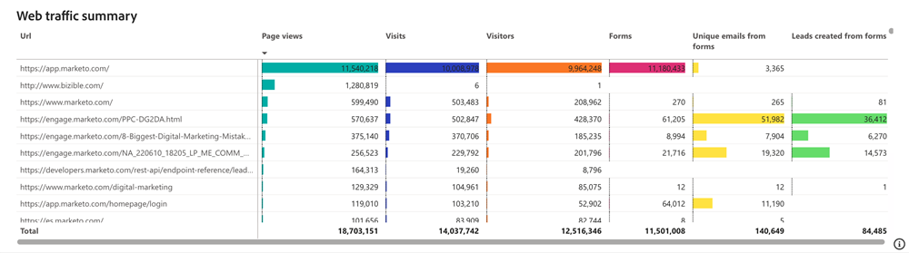

# Tableau de bord Trafic web {#web-traffic-dashboard}

Le tableau de bord Trafic Web offre une vue d’ensemble complète des interactions des visiteurs de votre site. Explorez des mesures telles que le nombre de visiteurs uniques par URL, les visites globales, les pages vues et les envois de formulaire à partir d’URL ou de pages d’entrée de formulaire spécifiques. Surveillez les tendances de trafic mensuelles et identifiez les médias payants hautement performants, ce qui vous permet d’affiner vos stratégies pour une génération optimale de recettes.

Questions : Ce tableau de bord répond :

* Combien de visites/visiteurs uniques avons-nous de chaque URL ?
* Combien de pages vues et d’envois de formulaire disposons-nous de chaque URL ?
* Quel est le niveau de tendance du trafic web au cours de l’année écoulée ?

## Composants de tableau de bord {#dashboard-components}

**Mosaïques IPC**

<table>
<thead>
  <tr>
    <td>Visites</td>
    <td>Le nombre total de visites (sessions) du site initiées à partir de pages externes englobant les utilisateurs connus et anonymes.</td>
  </tr>
</thead>
<tbody>
  <tr>
    <td>Visiteurs</td>
    <td>Nombre total de visiteurs uniques.</td>
  </tr>
  <tr>
    <td>Aperçu pages</td>
    <td>Nombre total d’affichages sur les pages du site web.</td>
  </tr>
  <tr>
    <td>Formulaires</td>
    <td>Nombre total d’envois de formulaire, y compris LinkedIn Lead Gen Forms.</td>
  </tr>
  <tr>
    <td>Emails uniques à partir de Forms</td>
    <td>Nombre total de courriers électroniques uniques provenant des envois de formulaire.</td>
  </tr>
  <tr>
    <td>Pistes créées à partir de Forms</td>
    <td>Nombre total de nouvelles pistes créées à partir des envois de formulaire.</td>
  </tr>
</tbody>
</table>

## Trafic web dans le temps {#web-traffic-over-time}

Graphique en courbes de série temporelle présentant les tendances des pages vues, des visites, des visiteurs, de Forms, des courriers électroniques uniques provenant de formulaires et de la création de pistes à partir de formulaires. Utilisez ce graphique pour visualiser et comparer les performances et l’engagement de votre site web au fil du temps.

* Passez la souris sur une section du graphique pour afficher le total des visites, des visiteurs uniques ou des envois de formulaire.
* Zoomer sur des plages de valeurs spécifiques à l’aide du curseur de gauche.

Questions sur le graphique :

* Comment les tendances du total des visites se comparent-elles aux visites uniques et aux envois de formulaire au cours de la période affichée ?
* Dans quelle période le site web a-t-il enregistré le plus grand nombre de visiteurs uniques par rapport au nombre total de visites et d’envois de formulaire ?

## Tableau récapitulatif du trafic web {#web-traffic-summary-table}

Tableau affichant Pages vues, Visites, Visiteurs, Forms, Emails uniques provenant de formulaires et Création de pistes à partir de formulaires par URL.

**Colonnes**

* Titre de la page
* URL de la page
* Aperçu pages
* Visites
* Visiteurs uniques
* Envois du formulaire
* Emails uniques à partir de formulaires
* Création de pistes à partir de formulaires

## Tableau de référents {#referrer-table}

Tableau affichant le nombre total de visites et de visiteurs uniques par référents.

**Colonnes**

* Nom du référent
* Visites
* Visiteurs uniques

## Visites/visiteurs par canal {#visits-visitors-by-channel}

Graphique à barres affichant Visites ou Visiteurs uniques segmentés par Canal/Sous-canal/Campagne.

* utilisez les fonctionnalités d’analyse et d’analyse pour classer les données par sous-canal et par campagne.
* Passez la souris sur chaque barre pour afficher les Visites ou les Visiteurs uniques.

Questions sur le graphique :

* Quel canal/sous-canal/campagne attire le plus grand nombre de visites ou de visiteurs uniques ?
* Comment le nombre de visiteurs uniques se compare-t-il au nombre total de visites dans un canal/sous-canal/campagne spécifique ?

## Volet Filtrer {#filter-pane}

Ce tableau de bord est équipé des paramètres et filtres suivants :

* Date (en fonction de la date de l’événement)
* Canal, sous-canal
* Campagne
* URL
* Titre de la page
