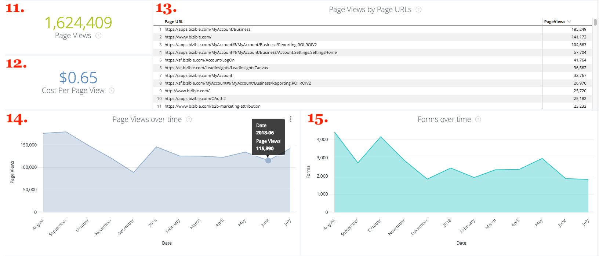
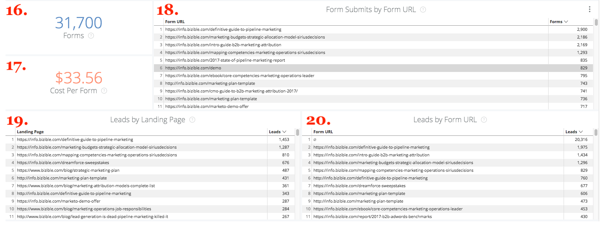

# Exploration publicitaire {#drill-throughs}

La variable [!DNL Marketo Measure Discover] experience permet aux clients d’analyser le jeu de données qui les intéresse le plus. Sur certaines mesures tout au long [!DNL Marketo Measure Discover], les clients peuvent cliquer sur une mosaïque pour en savoir plus sur cette mesure.

Vous trouverez ci-dessous une liste des tableaux de bord et des mosaïques qui contiennent des analyses et de l’expérience que l’utilisateur doit attendre lorsqu’il effectue des explorations. Gardez à l’esprit que les filtres globaux du tableau de bord persistent lors de l’exploration.

## Vue d’ensemble {#overview}

**Recettes**

Définition : Chiffre d’affaires total par mois, à partir d’un graphique à barres et d’un tableau. À partir de là, il est possible d’analyser un seul mois ou de ventiler un mois par semaine, jour ou heure.

**Recettes (graphique)**

Définition : Chiffre d’affaires total par mois, à partir d’un graphique à barres et d’un tableau. Comme la mosaïque parent est déjà un graphique à barres, accédez à Afficher les détails pour n’afficher qu’un seul mois.

_Exploration : total des recettes par mois ventilé par semaine ou date._

**Dépenser**

Définition : somme des dépenses par mois, exprimée en graphique à barres et en tableau. À partir de là, il est possible d’analyser un seul mois ou de ventiler un mois par semaine, jour ou heure.

**Offres**

Définition : Nombre total d&#39;offres par mois, via graphique à barres et tableau. À partir de là, il est possible d’analyser un seul mois ou de ventiler un mois par semaine, jour ou heure.

**Recettes du pipeline**

Définition : Chiffre d’affaires total du pipeline par mois, à partir d’un graphique à barres et d’un tableau. À partir de là, il est possible d’analyser un seul mois ou de ventiler un mois par semaine, jour ou heure.

**Résumé du ROI**

Définition : Total des recettes ou des dépenses de chaque canal par mois, sous la forme d’un graphique à barres et d’un tableau. À partir de là, il est possible d’explorer cette ligne pendant un seul mois ou de ventiler un mois par semaine, jour ou heure.

**Coût par opération**

Définition : somme des dépenses divisée par le nombre total d’offres, qui fournit le coût moyen nécessaire pour acquérir une opportunité remportée fermée. À partir de là, il est possible d’explorer cette ligne pendant un seul mois ou de ventiler un mois par semaine, jour ou heure.

**Canaux par recettes**

Définition : Chiffre d’affaires total de chaque canal par mois, à partir d’un graphique à barres et d’un tableau. À partir de là, il est possible d’explorer cette ligne pendant un seul mois ou de ventiler un mois par semaine, jour ou heure.

**Sous-canaux par recettes**

Définition : Chiffre d’affaires total, par mois, de chaque sous-canal au moyen d’un graphique à barres et d’un tableau. À partir de là, il est possible d’explorer cette ligne pendant un seul mois ou de ventiler un mois par semaine, jour ou heure.

**Campagnes par recettes**

Définition : total des recettes de chaque opération, par mois, à partir d&#39;un graphique à barres et d&#39;un tableau. À partir de là, il est possible d’explorer cette ligne pendant un seul mois ou de ventiler un mois par semaine, jour ou heure.

**Résumé des transactions**

Définition : Nombre total de dépenses ou d’affaires depuis chaque canal par mois, via un graphique à barres et un tableau. À partir de là, il est possible d’explorer cette ligne pendant un seul mois ou de ventiler un mois par semaine, jour ou heure.

## Croissance {#growth}

**Recettes totales**

Définition : Chiffre d’affaires total par mois, à partir d’un graphique à barres et d’un tableau. À partir de là, il est possible d’analyser un seul mois ou de ventiler un mois par semaine, jour ou heure.

**Recettes dans le temps**

Définition : Chiffre d’affaires total par mois, à partir d’un graphique à barres et d’un tableau. Comme la mosaïque parent est déjà un graphique, accédez à Afficher les détails pour n’afficher qu’un seul mois.

_Chiffre d’affaires total par mois ventilé par semaine ou date._

**Total des affaires**

Définition : Nombre total d&#39;offres par mois, via graphique à barres et tableau. À partir de là, il est possible d’analyser un seul mois ou de ventiler un mois par semaine, jour ou heure.

**Offres au fil du temps**

Définition : Nombre total d&#39;offres par mois, via graphique à barres et tableau. Comme la mosaïque parent est déjà un graphique, accédez à Afficher les détails pour n’afficher qu’un seul mois.

_Nombre total d’offres par mois, ventilées par semaine ou date._

**Recettes totales du pipeline**

Définition : Chiffre d’affaires total du pipeline par mois, à partir d’un graphique à barres et d’un tableau. À partir de là, il est possible d’analyser un seul mois ou de ventiler un mois par semaine, jour ou heure.

**Recettes du pipeline au fil du temps**

Définition : Chiffre d’affaires total du pipeline par mois, à partir d’un graphique à barres et d’un tableau. Comme la mosaïque parent est déjà un graphique, accédez à Afficher les détails pour n’afficher qu’un seul mois.

_Chiffre d’affaires total du pipeline par mois ventilé par semaine ou date._

**Total des pistes**

Définition : Nombre total de pistes par mois, via un graphique à barres et un tableau. À partir de là, il est possible d’analyser un seul mois ou de ventiler un mois par semaine, jour ou heure.

**Pistes dans le temps**

Définition : Nombre total de pistes par mois, via un graphique à barres et un tableau. Comme la mosaïque parent est déjà un graphique, accédez à Afficher les détails pour n’afficher qu’un seul mois.

_Nombre total de pistes par mois ventilé par semaine ou date._

**Nombre total de contacts**

Définition : Nombre total de contacts par mois, via graphique à barres et tableau. À partir de là, il est possible d’analyser un seul mois ou de ventiler un mois par semaine, jour ou heure.

**Contacts dans le temps**

Définition : Nombre total de contacts par mois, via graphique à barres et tableau. Comme la mosaïque parent est déjà un graphique, accédez à Afficher les détails pour n’afficher qu’un seul mois.

_Nombre total de contacts par mois, répartis par semaine ou date._

**Opportunités totales**

Définition : Nombre total d&#39;opportunités par mois, via graphique à barres et tableau. À partir de là, il est possible d’analyser un seul mois ou de ventiler un mois par semaine, jour ou heure.

**Opportunités au fil du temps**

Définition : Nombre total d&#39;opportunités par mois, via graphique à barres et tableau. Comme la mosaïque parent est déjà un graphique, accédez à Afficher les détails pour n’afficher qu’un seul mois.

_Nombre total d’opportunités par mois, ventilées par semaine ou date._

**Visites uniques**

Définition : nombre total de pages vues par mois, via un graphique à barres et un tableau. À partir de là, il est possible d’analyser un seul mois ou de ventiler un mois par semaine, jour ou heure.

**Visites uniques au fil du temps**

Définition : nombre total de visites uniques affichant la tendance sur une période spécifique. Utilisez le filtre Groupe par pour modifier la pile par canal, sous-canal, campagne, compte, groupe publicitaire, publicité, annonceur, créatif, mot-clé, référencement et site. Cette propriété apparaît vide si cette fonction est désactivée.

**Visites**

Définition : Nombre total de visites du site par mois, à partir d’un graphique à barres et d’un tableau. À partir de là, il est possible d’analyser un seul mois ou de ventiler un mois par semaine, jour ou heure.

**Visites au fil du temps**

Définition : nombre total de visites suivies sur le site qui affiche la tendance sur une période spécifique. Utilisez le filtre Groupe par pour modifier la pile par canal, sous-canal, campagne, compte, groupe publicitaire, publicité, annonceur, créatif, mot-clé, référencement et site. Cette propriété apparaît vide si cette fonction est désactivée.

**Forms**

Définition : nombre total d’envois de formulaire par mois, à partir d’un graphique à barres et d’un tableau. À partir de là, il est possible d’analyser un seul mois ou de ventiler un mois par semaine, jour ou heure.

**Forms au fil du temps**

Définition : nombre total de formulaires envoyés affichant la tendance sur une période spécifique. Utilisez le filtre Groupe par pour modifier la pile par canal, sous-canal, campagne, compte, groupe publicitaire, publicité, annonceur, créatif, mot-clé, référencement et site. Cette propriété apparaît vide si cette fonction est désactivée.

## Dépenses {#spend}

**Dépenser**

Définition : somme des dépenses par mois, exprimée en graphique à barres et en tableau. À partir de là, il est possible d’analyser un seul mois ou de ventiler un mois par semaine, jour ou heure.

**Dépense (graphique)**

Définition : somme des dépenses par mois, exprimée en graphique à barres et en tableau. Comme la mosaïque parent est déjà un graphique, accédez à Afficher les détails pour n’afficher qu’un seul mois.

_Total des dépenses par mois ventilé par semaine, date ou heure. Le temps peut être passé puisque [!DNL Marketo Measure] télécharge les dépenses réelles par minute à partir de nos connexions publicitaires._

**Dépensé par canal**

Définition : somme des dépenses depuis chaque canal par mois, exprimée en graphique à barres et en tableau. À partir de là, il est possible d’explorer cette ligne pendant un seul mois ou de ventiler un mois par semaine, jour ou heure.

**Dépensé par sous-canal**

Définition : somme des dépenses depuis chaque sous-canal par mois, exprimée en graphique à barres et en tableau. À partir de là, il est possible d’explorer cette ligne pendant un seul mois ou de ventiler un mois par semaine, jour ou heure.

**Dépensé par campagne**

Définition : Total des dépenses de chaque opération, par mois, à partir d&#39;un graphique à barres et d&#39;un tableau. À partir de là, il est possible d’explorer cette ligne pendant un seul mois ou de ventiler un mois par semaine, jour ou heure.

## Vitesse des ventes {#sales-velocity}

**Velocity (jours)**

Définition : nombre moyen de jours pendant lesquels les opportunités se trouvent dans leur cycle de vente, depuis la première touche anonyme jusqu’à la fin de l’opportunité.

**Opportunités actives**

Définition : nombre total d’opportunités provenant d’une opportunité ouverte, ce qui signifie qu’elle n’est pas Fermée Perdue ou Fermée Gagnée.

**Taille de transaction**

Définition : quantité moyenne d’une opportunité en gagnant fermé.

**Taux de Win**

Définition : nombre total d’opportunités avec succès fermé divisé par le nombre total d’opportunités avec succès fermé et avec succès fermé.

**Vitesse des opportunités par canal**

Définition : nombre moyen de jours pendant lesquels les opportunités se trouvent dans leur cycle par étape, regroupées par canal marketing et montrant le temps nécessaire pour passer à l’étape suivante. Les scènes qui apparaissent ici sont des scènes de jalon (FT, LC, OC) et personnalisées.

**Vitesse de la piste par canal**

Définition : nombre moyen de jours pendant lesquels les Pistes se trouvent dans leur cycle par étape avant d’être converties en Contact/Opportunité/Montant, regroupées par canal marketing et montrant le temps nécessaire pour passer à l’étape suivante. Les scènes qui apparaissent ici sont des scènes de jalon (FT, LC) et personnalisées.

**Vitesse moyenne des opportunités**

Définition : nombre moyen de jours pendant lesquels les opportunités se trouvent dans leur cycle par étape, indiquant le temps nécessaire pour passer à l’étape suivante. Les scènes qui apparaissent ici sont des scènes de jalon (FT, LC, OC) et personnalisées. les chiffres ici reflètent le temps par étape dans le graphique Vitesse de l’opportunité par canal.

**Vitesse moyenne de la piste**

Définition : nombre moyen de jours pendant lesquels les pistes se trouvent dans leur cycle par étape avant d’être converties en contact/opportunité/montant, indiquant le temps nécessaire pour passer à l’étape suivante. Les scènes qui apparaissent ici sont des scènes de jalon (FT, LC) et personnalisées. les chiffres ici reflètent le temps par étape dans le graphique Vitesse de la piste par canal.

**Vitesse des opportunités au fil du temps**

Définition : nombre moyen de jours pendant lesquels les opportunités se trouvent dans leur cycle par étape avec une tendance dans le temps.

**Vitesse de la piste au fil du temps**

Définition : nombre moyen de jours pendant lesquels les pistes se trouvent dans leur cycle par étape avec une tendance dans le temps.

## Marketing basé sur les comptes {#account-based-marketing}

**Recettes totales**

Définition : Chiffre d’affaires total par mois, à partir d’un graphique à barres et d’un tableau. À partir de là, il est possible d’analyser un seul mois ou de ventiler un mois par semaine, jour ou heure.

**Recettes totales du pipeline**

Définition : Chiffre d’affaires total du pipeline par mois, à partir d’un graphique à barres et d’un tableau. À partir de là, il est possible d’analyser un seul mois ou de ventiler un mois par semaine, jour ou heure.

**Pistes mises en correspondance**

Définition : nombre total de pistes qui correspondent à un compte.

**Comptes tactiles**

Définition : nombre total de comptes qui ont reçu un point de contact.

**Opportunités tactiles**

Définition : liste des identifiants d’opportunité avec leur identifiant de compte correspondant

**Contacts tactiles**

Définition : liste des ID de contact avec leur ID de compte correspondant

**Points de contact dans le temps (graphique)**

Définition : liste des points de contact du mois sélectionné.

_Nombre de points de contact touchés ventilés par semaine, date ou heure._

**Comptes tactiles au fil du temps (graphique)**

Définition : liste des identifiants de compte du mois sélectionné.

_Le nombre de comptes touchés par la ventilation par semaine, date ou heure._

## Analyse web {#web-analytics}

**Visites uniques**

Définition : Nombre total de visites de site uniques par mois, par graphique à barres et tableau. À partir de là, il est possible d’analyser un seul mois ou de ventiler un mois par semaine, jour ou heure.

**Coût par visite unique**

Définition : dépense totale divisée par le nombre total de visites uniques. À partir de là, il est possible d’analyser un seul mois ou de ventiler un mois par semaine, jour ou heure.

**Visites uniques par page d’entrée**

Définition : une liste de landing pages basée sur le nombre de visiteurs uniques provenant de chaque URL.

**Visites uniques par source**

Définition : une vue sur les sources des visiteurs uniques de votre site.

**Visites uniques au fil du temps**

Définition : nombre total de visites uniques suivies, affichant une tendance sur une période spécifique.

**Visites**

Définition : Nombre total de visites du site par mois, à partir d’un graphique à barres et d’un tableau. À partir de là, il est possible d’analyser un seul mois ou de ventiler un mois par semaine, jour ou heure.

**Coût par visite**

Définition : somme des dépenses divisée par le nombre total de visites.

**Visites par page d’entrée**

Définition : une liste de landing pages basée sur le nombre de visites de chaque URL.

**Visites par source**

Définition : source des visiteurs de votre site. Peut être modifié par canal, sous-canal, campagne, compte, groupe publicitaire, publicité, annonceur, créatif, mot-clé, référencement et site.

**Visites dans le temps**

Définition : nombre total de visites suivies, indiquant la tendance sur une période spécifique. À partir de là, il est possible d’analyser un seul mois ou de ventiler un mois par semaine, jour ou heure.

**Pages vues**

Définition : nombre total de pages vues par mois, via un graphique à barres et un tableau. À partir de là, il est possible d’analyser un seul mois ou de ventiler un mois par semaine, jour ou heure.

**Coût par page vue**

Définition : somme des dépenses divisée par le nombre total de pages vues suivies.

**Pages vues par URL**

Définition : liste des URL de page en fonction du nombre de pages vues depuis chaque URL.

**Pages vues au fil du temps**

Définition : Nombre total de pages vues par mois, à l’aide d’un graphique à barres et d’un tableau. Comme la mosaïque parent est déjà un graphique, accédez à Afficher les détails pour n’afficher qu’un seul mois.

_Total des pages vues par mois ventilé par semaine, date ou heure._

**Forms dans le temps**

Définition : nombre total de formulaires suivis, indiquant la tendance sur une période spécifique.

**Forms**

Définition : nombre total d’envois de formulaire par mois, à partir d’un graphique à barres et d’un tableau. À partir de là, il est possible d’analyser un seul mois ou de ventiler un mois par semaine, jour ou heure.

**Coût par formulaire**

Définition : somme des dépenses divisée par le total des formulaires envoyés.

**Envois de formulaire par URL de formulaire**

Définition : liste des URL de formulaire basée sur le nombre qui ont été envoyées sur chaque URL.

**Pistes par page d’entrée**

Définition : liste des landing pages en fonction du nombre de pistes générées à partir de chaque landing page.

**Pistes par URL de formulaire**

Définition : liste des URL de formulaire en fonction du nombre de pistes générées à partir de chaque URL.

## Directeur marketing {#cmo}

**Recettes**

Définition : Chiffre d’affaires total par mois, à partir d’un graphique à barres et d’un tableau. À partir de là, il est possible d’analyser un seul mois ou de ventiler un mois par semaine, jour ou heure.

**Recettes (graphique)**

Définition : Chiffre d’affaires total par mois, à partir d’un graphique à barres et d’un tableau. Comme la mosaïque parent est déjà un graphique à barres, accédez à Afficher les détails pour n’afficher qu’un seul mois.

_Chiffre d’affaires total par mois ventilé par semaine ou date._

**Dépenser**

Définition : somme des dépenses par mois, exprimée en graphique à barres et en tableau. À partir de là, il est possible d’analyser un seul mois ou de ventiler un mois par semaine, jour ou heure.

**ROI**

Définition : retour sur investissement calculé à partir du total des recettes et des dépenses (basé sur le modèle d’attribution).

**Offres**

Définition : Nombre total d&#39;offres par mois, via graphique à barres et tableau. À partir de là, il est possible d’analyser un seul mois ou de ventiler un mois par semaine, jour ou heure.

**Coût par opération**

Définition : somme des dépenses divisée par le nombre total d’offres, fournissant le coût moyen nécessaire pour acquérir une opportunité gagnée fermée.

**Recettes du pipeline**

Définition : Chiffre d’affaires total du pipeline par mois, à partir d’un graphique à barres et d’un tableau. À partir de là, il est possible d’analyser un seul mois ou de ventiler un mois par semaine, jour ou heure.

**Taille de transaction**

Définition : quantité moyenne d’une opportunité gagnée fermée.

**Canaux par recettes**

Définition : Chiffre d’affaires total de chaque canal par mois, à partir d’un graphique à barres et d’un tableau. À partir de là, il est possible d’explorer cette ligne pendant un seul mois ou de ventiler un mois par semaine, jour ou heure.

**Sous-canaux par recettes**

Définition : Chiffre d’affaires total, par mois, de chaque sous-canal au moyen d’un graphique à barres et d’un tableau. À partir de là, il est possible d’explorer cette ligne pendant un seul mois ou de ventiler un mois par semaine, jour ou heure.

**Campagnes par recettes**

Définition : total des recettes de chaque opération, par mois, à partir d&#39;un graphique à barres et d&#39;un tableau. À partir de là, il est possible d’explorer cette ligne pendant un seul mois ou de ventiler un mois par semaine, jour ou heure.

**Résumé du ROI**

Définition : Total des recettes ou des dépenses de chaque canal par mois, sous la forme d’un graphique à barres et d’un tableau. À partir de là, il est possible d’explorer cette ligne pendant un seul mois ou de ventiler un mois par semaine, jour ou heure.

**Résumé des transactions**

Définition : Nombre total de dépenses ou d’affaires depuis chaque canal par mois, via un graphique à barres et un tableau. À partir de là, il est possible d’explorer cette ligne pendant un seul mois ou de ventiler un mois par semaine, jour ou heure.

## Marketing de contenu {#content-marketing}

**Recettes totales**

Définition : Chiffre d’affaires total par mois, à partir d’un graphique à barres et d’un tableau. À partir de là, il est possible d’analyser un seul mois ou de ventiler un mois par semaine, jour ou heure.

**Pages d’entrée par recettes**

Définition : Recettes totales de chaque landing page via un graphique à barres et un tableau. À partir de là, il est possible d’explorer cette ligne pendant un seul mois ou de ventiler un mois par semaine, jour ou heure.

**Recettes totales du pipeline**

Définition : Chiffre d’affaires total du pipeline par mois, à partir d’un graphique à barres et d’un tableau. À partir de là, il est possible d’analyser un seul mois ou de ventiler un mois par semaine, jour ou heure.

**Pages d’entrée par recettes de pipeline**

Définition : total des recettes de pipeline depuis chaque landing page via un graphique à barres et un tableau. À partir de là, il est possible d’explorer cette ligne pendant un seul mois ou de ventiler un mois par semaine, jour ou heure.

**Opportunités totales**

Définition : Nombre total d&#39;opportunités par mois, via un graphique à barres et un tableau. À partir de là, il est possible d’analyser un seul mois ou de ventiler un mois par semaine, jour ou heure.

**Pages d’entrée par nombre d’opportunités**

Définition : Nombre total d&#39;opportunités depuis chaque landing page via un graphique à barres et un tableau. À partir de là, il est possible d’explorer cette ligne pendant un seul mois ou de ventiler un mois par semaine, jour ou heure.

**Total Forms**

Définition : Nombre total de formulaires par mois, via graphique à barres et tableau. À partir de là, il est possible d’analyser un seul mois ou de ventiler un mois par semaine, jour ou heure.

**Meilleure URL de formulaire par envoi de formulaire**

Définition : Nombre total de formulaires de chaque URL de formulaire, via un graphique à barres et un tableau. À partir de là, il est possible d’explorer cette ligne pendant un seul mois ou de ventiler un mois par semaine, jour ou heure.

**URL de formulaire par canal**

Définition : Nombre total de formulaires envoyés depuis l’URL du formulaire par mois, via un graphique à barres et un tableau. À partir de là, il est possible d’explorer cette ligne pendant un seul mois ou de ventiler un mois par semaine, jour ou heure.

**Visites uniques**

Définition : nombre total de visites de site uniques suivies sur tous les visiteurs connus et anonymes. Explorez les statistiques pour afficher les visites uniques du site suivies par mois.

**Pages d’entrée principales par visite unique**

Définition : une liste de landing pages basée sur le nombre de visites uniques de chaque landing page. Accédez à l’URL sélectionnée en effectuant une recherche pour afficher les visites uniques par mois.

**Visites**

Définition : nombre total de visites sur le site suivies sur tous les visiteurs connus et anonymes. Explorez les statistiques pour afficher les visites suivies par mois.

**Pages d’entrée principales par visite**

Définition : une liste de landing pages basée sur le nombre de visites initiales de chaque landing page. Accédez à l’URL sélectionnée en effectuant une recherche sur les visites par mois.

**Total des pistes**

Définition : Nombre total de pistes par mois, via un graphique à barres et un tableau. À partir de là, il est possible d’analyser un seul mois ou de ventiler un mois par semaine, jour ou heure.

**Pages d’entrée par nombre de pistes**

Définition : Nombre total de pistes depuis chaque landing page via un graphique à barres et un tableau. À partir de là, il est possible d’explorer cette ligne pendant un seul mois ou de ventiler un mois par semaine, jour ou heure.

## Média payé {#paid-media}

**Impressions**

Définition : Nombre total d&#39;impressions par mois, via graphique à barres et tableau. À partir de là, il est possible d’analyser un seul mois ou de ventiler un mois par semaine, jour ou heure.

**CPM**

Définition : somme des dépenses des impressions diffusées, divisée par le total des impressions.

**Clics**

Définition : Nombre total de clics par mois, via graphique à barres et tableau. À partir de là, il est possible d’analyser un seul mois ou de ventiler un mois par semaine, jour ou heure.

**CPC**

Définition : somme des dépenses des clics suivis, divisée par le total des clics.

**Pistes**

Définition : nombre total de pistes en fonction du modèle d’attribution.

**CPL**

Définition : somme des dépenses des pistes créées divisée par le nombre total de clics, fournissant le taux CPL.

**Visites**

Définition : Nombre total de visites du site par mois, à partir d’un graphique à barres et d’un tableau. À partir de là, il est possible d’analyser un seul mois ou de ventiler un mois par semaine, jour ou heure.

**Pages vues**

Définition : nombre total de pages vues par mois, via un graphique à barres et un tableau. À partir de là, il est possible d’analyser un seul mois ou de ventiler un mois par semaine, jour ou heure.

**Résumé des campagnes**

Définition : liste des campagnes basées sur le montant des recettes/dépenses/offres/opportunités attribuées à chaque campagne, triées par ordre décroissant selon le modèle d’attribution sélectionné.

**Résumé de la publicité**

Définition : liste des publicités basées sur le montant des recettes/recettes de pipeline/dépenses/offres/opportunités attribuées à chaque publicité, en fonction du modèle d’attribution sélectionné.

**Résumé des mots-clés**

Définition : liste de mots-clés basée sur le montant des recettes/recettes de pipeline/dépenses/offres/opportunités attribué à chaque mot-clé, en fonction du modèle d’attribution sélectionné.

**Campagnes par ROI**

Définition : liste des campagnes basées sur le ROI calculé pour chaque campagne, triées par le ROI le plus élevé. Explorez les recettes ou les dépenses par mois pour la campagne sélectionnée.

**Annonces par ROI**

Définition : liste des publicités selon le ROI calculé pour chaque publicité, triées par le ROI le plus élevé. Explorez les recettes ou les dépenses par mois pour la publicité sélectionnée.

**Mots-clés par ROI**

Définition : liste de mots-clés d’après le retour sur investissement calculé pour chaque mot-clé, triés par le retour sur investissement le plus élevé. Parcourez les recettes ou les dépenses par mois pour le mot-clé sélectionné.
