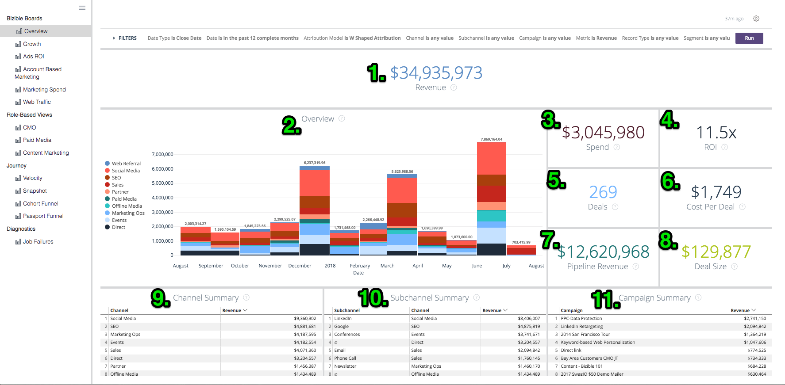
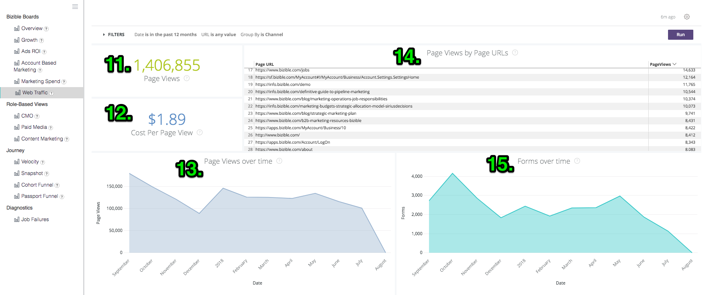
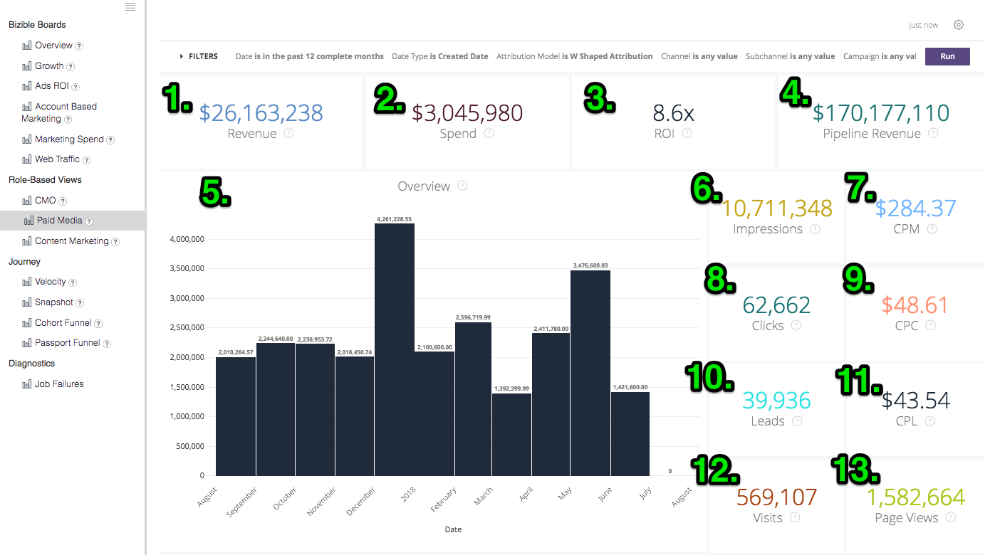
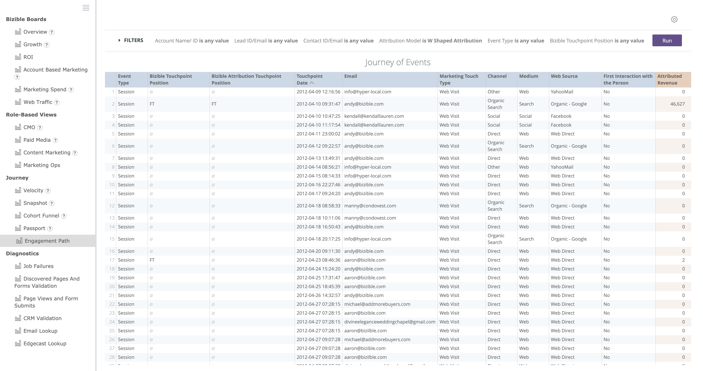

# Définitions et encyclopédie {#definitions-and-encyclopedia}

Vous trouverez ci-dessous un aperçu des différents panoramas et mosaïques présents sur la plate-forme Discover, ainsi que des filtres qu’ils contiennent. La capture d’écran de chaque panorama comporte plusieurs mosaïques dont les définitions se trouvent dans la section ci-dessous.

**[!DNL Marketo Measure]Panoramas**

APERÇU

Croissance

Publicités RSI

Marketing basé sur les comptes

Dépenses de marketing

Trafic Web

**Affichage basé sur les rôles**

Directeur marketing

Média payé

Marketing de contenu

Opérations marketing

**Parcours**

Vitesse

Instantané

Entonnoir de port

Parcours d’engagement

## [!DNL Marketo Measure] Panoramas {#marketo-measure-boards}

### APERÇU {#overview}

Aperçu donne à l’utilisateur une vue d’ensemble des performances de l’équipe marketing en ce qui concerne leur impact sur les recettes, les dépenses et le retour sur investissement.

**Filtres**

Type de date : Date de fermeture

La date correspond aux 12 derniers mois complets

Le modèle d’attribution est en forme de W

Mesure : recettes

Dimension est Canal

Le canal est égal à __

Le sous-canal est égal à __

Campaign est égal à __

Catégories

**Chiffre d&#39;affaires**

`1.` Le montant total des recettes des opportunités de gains fermés, basé sur le modèle d’attribution.

Cliquez sur pour Afficher les détails et explorez les données en les visualisant sous forme de visualisation et de tableau.

**APERÇU**

`2.` À l’aide de la liste déroulante Mesure du menu Filtres , ce graphique présente les recettes/recettes de pipeline/dépenses/offres/opportunités/pistes/contacts attribués à chaque canal, affichées au fil du temps.

**Dépenses**

`3.` Le montant total des dépenses enregistrées des coûts d’API et des coûts auto-déclarés cumulés au niveau de canal le plus élevé.

Cliquez sur pour Afficher les détails et explorez les données en les visualisant sous forme de visualisation et de tableau.

**RSI**

`4.` À l’aide de la liste déroulante Dimensions du menu Filtres , cela indique le retour sur investissement attribué à chaque canal/sous-canal/campagne/compte/groupe publicitaire/annonceur/créatif/mot-clé/référencement/site en fonction du modèle d’attribution pendant toute la période sélectionnée.

**Résumé du RSI**

À l’aide de la liste déroulante Dimensions du menu Filtres , cela indique le montant des recettes, des dépenses et du retour sur investissement attribué à chaque canal/sous-canal/campagne/compte/AdGroup/publicitaire/publicitaire/créatif/mot-clé/référencement/site en fonction du modèle d’attribution pendant toute la période sélectionnée.

**Affaires**

`5.` Le nombre total d’opportunités de gains fermés, en fonction du nombre de modèles d’attribution. Si le type de date &quot;Date du point de contact&quot; est sélectionné, des décomptes partiels sont possibles, car il est possible d’exclure certains points de contact d’une opportunité en utilisant ce type de date.

Cliquez sur pour Afficher les détails et explorez les données en les visualisant sous forme de visualisation et de tableau.

**Coût par contrat**

`6.` Le total des dépenses divisé par le nombre total d’offres, ce qui fournit un coût moyen nécessaire pour acquérir une opportunité gagnée fermée.

**Chiffre d’affaires de pipeline**

`7.` Chiffre d’affaires potentiel total provenant de toute opportunité ouverte, ce qui signifie qu’il n’est pas Fermé perdu ou Fermé gagné. Les recettes sont basées sur le modèle d’attribution sélectionné.

Cliquez sur pour Afficher les détails et explorez les données en les visualisant sous forme de visualisation et de tableau.

**Valeur de l’affaire**

`8.` Montant moyen d&#39;une opportunité de victoire close.

**Résumé du canal**

`9`. À l’aide de la liste déroulante Mesure du menu Filtres , il s’agit d’une liste de canaux basée sur le montant des recettes/recettes de pipeline/dépenses/offres/opportunités/contacts a été attribué à chaque canal, trié par le plus élevé en fonction du modèle d’attribution sélectionné.

**Résumé du sous-canal**

`10.` À l’aide de la liste déroulante Mesure du menu Filtres , il s’agit d’une liste de sous-canaux basée sur le montant des recettes / recettes de pipeline / dépenses / offres / opportunités / pistes / contacts attribué à chaque sous-canal, trié par le plus élevé en fonction du modèle d’attribution sélectionné.

**Résumé campagne**

`11.` À l’aide de la liste déroulante Mesure du menu Filtres , il s’agit d’une liste de campagnes basées sur le montant des recettes/recettes de pipeline/dépenses/offres/opportunités/contacts a été attribué à chaque campagne, triée par le plus élevé en fonction du modèle d’attribution sélectionné.

### Croissance {#growth}

La croissance permet au professionnel du marketing de voir ce qu&#39;il a généré dans l&#39;ensemble, des prospects aux contacts aux opportunités de revenus. Il s’agit d’un aperçu rapide de tous les pipelines et de leurs performances au fil du temps.

**Filtres**

Type de date : Date du point de contact

La date correspond aux 12 derniers mois complets

Le modèle d’attribution est en forme de W

Group by None

Le canal est égal à __

Le sous-canal est égal à __

Campaign est égal à __

Catégories

**Chiffre d&#39;affaires**

`1.` Le montant total des recettes des opportunités de gains fermés, basé sur le modèle d’attribution.

Cliquez sur pour Afficher les détails et explorez les données en les visualisant sous forme de visualisation et de tableau.

**Recettes dans le temps**

`2.` Le montant total des recettes des opportunités de gains fermés, basé sur le modèle d’attribution montrant la tendance sur une période spécifique. Utilisez le filtre Group By pour modifier la pile par canal, sous-canal, campagne, compte, groupe publicitaire, publicité, annonceur, créatif, mot-clé, référencement, site.

Explorez les données d’une dimension de date plus petite.

**Affaires**

`3.` Le nombre total d’opportunités de gains fermés, en fonction du nombre de modèles d’attribution.

Cliquez sur pour Afficher les détails et explorez les données en les visualisant sous forme de visualisation et de tableau.

**Offres au fil du temps**

`4.` Nombre total d’opportunités de gains fermés, basé sur le modèle d’attribution montrant la tendance sur une période spécifique. Utilisez le filtre Group By pour modifier la pile par canal, sous-canal, campagne, compte, groupe publicitaire, publicité, annonceur, créatif, mot-clé, référencement, site.

Explorez les données d’une dimension de date plus petite.

**Chiffre d’affaires de pipeline**

`5.` Chiffre d’affaires potentiel total provenant de toute opportunité ouverte, ce qui signifie qu’il n’est pas Fermé perdu ou Fermé gagné. Les recettes sont basées sur le modèle d’attribution sélectionné.

Cliquez sur pour Afficher les détails et explorez les données en les visualisant sous forme de visualisation et de tableau.

**Recettes du pipeline au fil du temps**

`6.` Chiffre d’affaires potentiel total provenant de toute opportunité ouverte, basé sur le modèle d’attribution affichant la tendance sur une période spécifique. Utilisez le filtre Group By pour modifier la pile par canal, sous-canal, campagne, compte, groupe publicitaire, publicité, annonceur, créatif, mot-clé, référencement, site.

Explorez les données d’une dimension de date plus petite.

**Prospects**

`7.` Nombre total de pistes, en fonction du modèle d’attribution. Si le type de date &quot;Date du point de contact&quot; est sélectionné, des décomptes partiels sont possibles, car il est possible d’exclure certains points de contact d’un enregistrement de piste utilisant ce type de date. Si un modèle d’attribution autre que En forme de U est appliqué, le nombre en forme de U est utilisé pour les modèles en forme de W, en forme de W et personnalisés.

Cliquez sur pour Afficher les détails et explorez les données en les visualisant sous forme de visualisation et de tableau.

**Pistes dans le temps**

`8.` Nombre total de pistes, basé sur le modèle d’attribution montrant la tendance sur une période spécifique. Utilisez le filtre Group By pour modifier la pile par canal, sous-canal, campagne, compte, groupe publicitaire, publicité, annonceur, créatif, mot-clé, référencement, site.

Explorez les données d’une dimension de date plus petite.

**Contacts**

`9.` Nombre total de contacts, en fonction du modèle d’attribution. Si le type de date &quot;Date du point de contact&quot; est sélectionné, des décomptes partiels sont possibles, car il est possible d’exclure certains points de contact d’un enregistrement Contact utilisant ce type de date. Si un modèle d’attribution autre que En forme de U est appliqué, le nombre en forme de U est utilisé pour les modèles en forme de W, en forme de W et personnalisés.

Cliquez sur pour Afficher les détails et explorez les données en les visualisant sous forme de visualisation et de tableau.

**Contacts dans le temps**

`10.` Nombre total de contacts, basé sur le modèle d’attribution montrant la tendance sur une période spécifique. Utilisez le filtre Group By pour modifier la pile par canal, sous-canal, campagne, compte, groupe publicitaire, publicité, annonceur, créatif, mot-clé, référencement, site.

Explorez les données d’une dimension de date plus petite.

**Opportunités**

`11.` Nombre total d’opportunités, en fonction du modèle d’attribution. Si le type de date &quot;Date du point de contact&quot; est sélectionné, des décomptes partiels sont possibles, car il est possible d’exclure certains points de contact d’un enregistrement d’opportunité utilisant ce type de date.

Cliquez sur pour Afficher les détails et explorez les données en les visualisant sous forme de visualisation et de tableau.

**Opportunités au fil du temps**

`12.` Nombre total d’opportunités, basé sur le modèle d’attribution montrant la tendance sur une période spécifique. Utilisez le filtre Group By pour modifier la pile par canal, sous-canal, campagne, compte, groupe publicitaire, publicité, annonceur, créatif, mot-clé, référencement, site.

Explorez les données d’une dimension de date plus petite.

**Visites**

`13.` Le nombre total de visites du site suivies par tous les visiteurs connus et anonymes.

Cliquez sur pour Afficher les détails et explorez les données en les visualisant sous forme de visualisation et de tableau.

(Si cette fonction est désactivée, la valeur 0 s’affiche.)

**Visites au fil du temps**

`14.` Le nombre total de visites suivies sur le site qui affiche la tendance sur une période spécifique. Utilisez le filtre Group By pour modifier la pile par canal, sous-canal, campagne, compte, groupe publicitaire, publicité, annonceur, créatif, mot-clé, référencement, site.

Explorez les données d’une dimension de date plus petite.

(Cette propriété apparaît vide si cette fonction est désactivée.)

**Visites uniques**

`15.` Nombre total de visites de site uniques suivies par tous les visiteurs connus et anonymes.

Cliquez sur pour Afficher les détails et explorez les données en les visualisant sous forme de visualisation et de tableau.

(Si cette fonction est désactivée, la valeur 0 s’affiche.)

**Visites uniques au fil du temps**

`16.` Le nombre total de visites de site uniques suivies montre la tendance sur une période spécifique. Utilisez le filtre Group By pour modifier la pile par canal, sous-canal, campagne, compte, groupe publicitaire, publicité, annonceur, créatif, mot-clé, référencement, site.

Explorez les données d’une dimension de date plus petite.

(Cette propriété apparaît vide si cette fonction est désactivée.)

**Formulaires**

`17.` Le nombre total de formulaires envoyés à tous les visiteurs connus et anonymes.

Cliquez sur pour Afficher les détails et explorez les données en les visualisant sous forme de visualisation et de tableau.

(Si cette fonction est désactivée, la valeur 0 s’affiche.)

**Forms au fil du temps**

`18.` Le nombre total de formulaires envoyés qui affichent la tendance sur une période spécifique. Utilisez le filtre Group By pour modifier la pile par canal, sous-canal, campagne, compte, groupe publicitaire, publicité, annonceur, créatif, mot-clé, référencement, site.

Explorez les données d’une dimension de date plus petite.

(Cette propriété apparaît vide si cette fonction est désactivée.)

### Publicités RSI {#ads-roi}

Le retour sur investissement des publicités permet aux responsables de médias payants d’avoir une vue d’ensemble de leurs efforts marketing, et ainsi d’avoir une vue d’ensemble des performances de leurs campagnes par mot-clé.

**Filtres**

Type de date : Date de fermeture

La date correspond aux 12 derniers mois complets

Le modèle d’attribution est en forme de W

Le canal est égal à __

Le sous-canal est égal à __

Campaign est égal à __

Catégories

**Résumé du RSI de la campagne**

`1.` Liste des campagnes basées sur le montant des recettes, des dépenses et du retour sur investissement attribués à chaque campagne, triées selon les recettes les plus élevées en fonction du modèle d’attribution sélectionné.

**Résumé du RSI du contenu publicitaire**

`2.` Liste des créatifs basés sur le montant des recettes, des dépenses et du retour sur investissement attribué à chaque créatif, triés par les recettes les plus élevées en fonction du modèle d’attribution sélectionné.

**Résumé du RSI du mot-clé**

`3.` Liste de mots-clés basés sur le montant des recettes, des dépenses et du retour sur investissement attribués à chaque mot-clé, triés par les recettes les plus élevées en fonction du modèle d’attribution sélectionné.

### Marketing basé sur les comptes {#account-based-marketing}

Le marketing basé sur les comptes permet aux entreprises qui utilisent ABM de suivre leurs efforts vers leurs comptes cibles et l’engagement qu’elles ont constaté grâce à leur marketing.

**Filtres**

Type de date : Date du point de contact

La date correspond aux 12 derniers mois complets

Le modèle d’attribution est en forme de W

Associer par canal

Comptes est égal à __

**Chiffre d&#39;affaires**

Le montant total des recettes des opportunités de gains fermés, basé sur le modèle d’attribution.

Cliquez sur pour Afficher les détails et explorez les données en les visualisant sous forme de visualisation et de tableau.

**Chiffre d’affaires de pipeline**

Chiffre d’affaires potentiel total provenant de toute opportunité ouverte, ce qui signifie qu’il n’est pas Fermé perdu ou Fermé gagné. Les recettes sont basées sur le modèle d’attribution sélectionné.

**Nombre moyen de tactiles par compte**

Nombre moyen de points de contact générés par chaque compte CRM, par identifiant de compte.

**Leads appariés**

Nombre total de pistes qui ont été mises en correspondance avec un compte à l’aide de la variable [!DNL Marketo Measure] Fonctionnalité de piste à compte, à l’aide des algorithmes de mise en correspondance de site web, nom de société et domaine de courriel.

**Comptes engagés**

Nombre total de comptes qui ont reçu un point de contact. Si une liste de comptes cible est utilisée, il s’agit du sous-ensemble de comptes de cette liste de comptes cible.

**Opportunités engagées**

Nombre total d’opportunités qui ont reçu un point de contact. Si une liste de comptes cible est utilisée, il s’agit du sous-ensemble des opportunités de cette liste de comptes cible.

**Individus engagés**

Nombre total d’individus (prospects et contacts par adresses email) ayant reçu un point de contact. Si une liste de comptes cible est utilisée, il s’agit du sous-ensemble des individus de cette liste de comptes cible.

**Touchpoints au fil du temps**

Nombre total de points de contact enregistrés au cours d’une période donnée. Si une liste de comptes cible est utilisée, il s’agit du sous-ensemble de comptes de cette liste de comptes cible.

**Comptes tactiles au fil du temps (graphique)**

Nombre total de comptes ayant reçu un point de contact par mois au cours d’une période spécifiée avec la possibilité de regrouper les résultats par canal, sous-canal, campagne, compte, groupe publicitaire, publicité, publicitaire, créatif, mot-clé, référencement ou site. Si une liste de comptes cible est utilisée, il s’agit du sous-ensemble de comptes de cette liste de comptes cible.

**Comptes par nombre de Touchpoints**

Par ID de compte et Nom du compte, le nombre total de points de contact de chaque compte.

**Nombre de Touchpoints**

Nombre de points de contact attribués à chaque dimension, où la dimension peut être modifiée par le filtre Group By , tel que : Aucun/Canal/Sous-canal/Campagne/Compte/Annonceur/Publicité/Créatif/Groupe publicitaire/Mot-clé/Emplacement/Site.

### Dépenses de marketing {#marketing-spend}

Les dépenses marketing indiquent aux marketeurs combien ils ont dépensé sur une période de temps afin de pouvoir suivre les dépenses par mois et par canal.

**Filtres**

Type de date : Date du point de contact

La date correspond aux 12 derniers mois complets

Modèle d’attribution

Group By est égal à Channel

Le canal est égal à __

Le sous-canal est égal à __

Campaign est égal à __

**Chiffre d&#39;affaires**

Le montant total des recettes des opportunités de gains fermés, basé sur le modèle d’attribution.

Cliquez sur pour Afficher les détails et explorez les données en les visualisant sous forme de visualisation et de tableau.

**Dépenses**

Le montant total des dépenses enregistrées des coûts d’API et des coûts auto-déclarés cumulés au niveau de canal le plus élevé.

Cliquez sur pour Afficher les détails et explorez les données en les visualisant sous forme de visualisation et de tableau.

**RSI**

Le ROI calculé (retour sur investissement) provenant du total des recettes (du modèle d’attribution sélectionné) et du total des dépenses.

**Dépense (graphique)**

Montant total des dépenses enregistrées affichant la tendance sur une période spécifique. Utilisez le filtre Group By pour modifier la pile par Aucun, Canal, Sous-canal, Campagne, Compte, Groupe publicitaire, Publicité, Annonceur, Créatif, Mot-clé, Emplacement, Site.

Comme la dépense n’est pas enregistrée à tous les niveaux, il est possible que les totaux ne soient pas égaux à chaque sélection &quot;Regrouper par&quot;. Par exemple, le total de toutes les campagnes n’est pas égal au total de tous les sous-canaux.

**Dépense + retour sur investissement**

Affiche le montant des dépenses marketing par mois en plus du retour sur investissement sur l’axe Y droit.

**Dépenses par canal**

Liste de canaux basés sur le montant reporté pour chaque canal, triés par dépenses les plus élevées.

**Dépenses par sous-canal**

Liste de sous-canaux basés sur le montant reporté pour chaque sous-canal, triés par dépenses les plus élevées.

**Dépenses par campagne**

Liste des campagnes basées sur le montant déclaré pour chaque campagne, triées par dépenses les plus élevées. Les campagnes se composent d’une liste complète de campagnes qui inclut des valeurs utm_campaign provenant de Pages vues.

### Trafic Web {#web-traffic}

La vue Trafic Web permet aux marketeurs de suivre l’activité sur leur site Web, en mesurant le trafic provenant des visiteurs connus et anonymes du site.

**Filtres**

Type de date : Date du point de contact

La date correspond aux 12 derniers mois complets

Le modèle d’attribution est en forme de W

L’URL est égale à __

Group By n’a aucune valeur

Mesure Visites

Le canal est égal à __

Le sous-canal est égal à __

Campaign est égal à __

**Visites uniques**

Nombre total de visites de site uniques suivies par tous les visiteurs connus et anonymes.

Cliquez sur pour Afficher les détails et explorez les données en les visualisant sous forme de visualisation et de tableau.

**Visites**

Le nombre total de visites du site suivies par tous les visiteurs connus et anonymes.

Cliquez sur pour Afficher les détails et explorez les données en les visualisant sous forme de visualisation et de tableau.

**Coût par visite unique**

Total des dépenses divisé par le nombre total de visites uniques, fournissant le coût par taux de visite unique.

**Coût par visite**

Total des dépenses, divisé par le nombre total de visites, fournissant le coût par visite.

**Recettes par visite unique**

Moyenne calculée des recettes clôturées par visite de site unique en provenance de visiteurs connus et anonymes.

**Recettes par visite**

Moyenne calculée des recettes clôturées par visite de site en provenance de visiteurs connus et anonymes.

**Aperçu pages**

Nombre total de pages vues suivies sur tous les visiteurs connus et anonymes.

Cliquez sur pour Afficher les détails et explorez les données en les visualisant sous forme de visualisation et de tableau.

**Formulaires**

Le nombre total de formulaires envoyés à tous les visiteurs connus et anonymes.

Cliquez sur pour Afficher les détails et explorez les données en les visualisant sous forme de visualisation et de tableau.

**APERÇU**

À l’aide de la liste déroulante Mesure du menu Filtres , ce graphique affiche les recettes/recettes de pipeline/dépenses/offres/opportunités/contacts/clics/impressions/visites uniques/pages vues/formulaires attribués à chaque dimension, affichés au fil du temps. Les Dimensions peuvent être changées de Aucun en Canal/Sous-canal/Campagne/Compte/Annonceur/Publicité/Créatif/Groupe publicitaire/Mot-clé/Emplacement/Site.

**Résumé du trafic Web**

Par URL, affichez le nombre de pages vues, de visites, de visites uniques et d’envois de formulaire crédités à chacune d’elles.

**Résumé du référent**

Nombre de visites de page et de visites uniques provenant de chaque URL de référence.

**Visites uniques par source**

Dans la liste déroulante Regrouper par du menu Filtres , affichez la source des visiteurs uniques sur votre site. Modifiez le groupe par pour : Canal, Sous-canal, Campagne, Compte, Groupe publicitaire, Publicité, Annonceur, Créatif, Mot-clé, Emplacement, Site.

**Visites par source**

Dans la liste déroulante Regrouper par du menu Filtres , affichez la source des visiteurs de votre site. Modifiez le groupe par pour : Canal, Sous-canal, Campagne, Compte, Groupe publicitaire, Publicité, Annonceur, Créatif, Mot-clé, Emplacement, Site.

**Leads par page de destination**

Liste des landing pages en fonction du nombre de pistes générées à partir de chaque landing page, triées selon le nombre le plus élevé de pistes.

**Leads par URL de formulaire**

Une liste d’URL de formulaire basée sur le nombre de pistes générées à partir de chaque URL, triées par le nombre le plus élevé de pistes.

## Affichage basé sur les rôles {#role-based-views}

### Directeur marketing {#cmo}

Les vues CMO donnent au CMO un aperçu général des performances de l’équipe marketing en ce qui concerne leur impact sur les recettes, les dépenses et le retour sur investissement.

**Filtres**

Type de date : Date de fermeture

La date correspond aux 12 derniers mois complets

Le modèle d’attribution est en forme de W

Le canal est égal à __

Le sous-canal est égal à __

Campaign est égal à __

Mesure : recettes

Catégories

**Chiffre d&#39;affaires**

`1.` Le montant total des recettes des opportunités de gains fermés, basé sur le modèle d’attribution.

Cliquez sur pour Afficher les détails et explorez les données en les visualisant sous forme de visualisation et de tableau.

**APERÇU**

`2.` À l’aide de la liste déroulante Mesure du menu Filtres , ce graphique présente les recettes/recettes de pipeline/dépenses/offres/opportunités/pistes/contacts attribués à chaque canal, affichées au fil du temps.

**Dépenses**

`3.` Le montant total des dépenses enregistrées des coûts d’API et des coûts auto-déclarés cumulés au niveau de canal le plus élevé.

Cliquez sur pour Afficher les détails et explorez les données en les visualisant sous forme de visualisation et de tableau.

**RSI**

`4.` Le ROI calculé (retour sur investissement) provenant du total des recettes (du modèle d’attribution sélectionné) et du total des dépenses.

**Affaires**

`5.` Le nombre total d’opportunités de gains fermés, en fonction du nombre de modèles d’attribution. Si le type de date &quot;Date du point de contact&quot; est sélectionné, des décomptes partiels sont possibles, car il est possible d’exclure certains points de contact d’une opportunité en utilisant ce type de date.

Cliquez sur pour Afficher les détails et explorez les données en les visualisant sous forme de visualisation et de tableau.

**Coût par contrat**

`6.` Le total des dépenses divisé par le nombre total d’offres, ce qui fournit un coût moyen nécessaire pour acquérir une opportunité gagnée fermée.

**Chiffre d’affaires de pipeline**

`7.` Chiffre d’affaires potentiel total provenant de toute opportunité ouverte, ce qui signifie qu’il n’est pas Fermé perdu ou Fermé gagné. Les recettes sont basées sur le modèle d’attribution sélectionné.

Cliquez sur pour Afficher les détails et explorez les données en les visualisant sous forme de visualisation et de tableau.

**Valeur de l’affaire**

`8.` Montant moyen d&#39;une opportunité de victoire close.

**Résumé du canal**

`9.` À l’aide de la liste déroulante Mesure du menu Filtres , il s’agit d’une liste de canaux basée sur le montant des recettes/recettes de pipeline/dépenses/offres/opportunités/contacts a été attribué à chaque canal, trié par le plus élevé en fonction du modèle d’attribution sélectionné.

**Résumé du sous-canal**

`10.` À l’aide de la liste déroulante Mesure du menu Filtres , il s’agit d’une liste de sous-canaux basée sur le montant des recettes / recettes de pipeline / dépenses / offres / opportunités / pistes / contacts attribué à chaque sous-canal, trié par le plus élevé en fonction du modèle d’attribution sélectionné.

**Résumé campagne**

`11.` À l’aide de la liste déroulante Mesure du menu Filtres , il s’agit d’une liste de campagnes basées sur le montant des recettes/recettes de pipeline/dépenses/offres/opportunités/contacts a été attribué à chaque campagne, triée par le plus élevé en fonction du modèle d’attribution sélectionné.

### Média payé {#paid-media}

Les tableaux de bord des médias payants donnent un aperçu des performances des médias payants aux responsables de médias payants (ou autres). Soyez en mesure de voir combien ont été servis dans les canaux pertinents et combien de demandes ont été générées par vos efforts. Toutes les mesures sont extraites des intégrations de médias payants.

**Filtres**

Type de date : Date du point de contact

La date correspond aux 12 derniers mois complets

Le modèle d’attribution est en forme de W

Mesure : recettes

Dimension est Canal

Le canal est égal à __

Le sous-canal est égal à __

Campaign est égal à __

Catégories

**Chiffre d&#39;affaires**

`1.` Le montant total des recettes des opportunités de gains fermés, basé sur le modèle d’attribution.

Cliquez sur pour Afficher les détails et explorez les données en les visualisant sous forme de visualisation et de tableau.

**Dépenses**

`2.` Le montant total des dépenses enregistrées des coûts d’API et des coûts auto-déclarés cumulés au niveau de canal le plus élevé.

Cliquez sur pour Afficher les détails et explorez les données en les visualisant sous forme de visualisation et de tableau.

**RSI**

`3.` Le ROI calculé (retour sur investissement) provenant du total des recettes (du modèle d’attribution sélectionné) et du total des dépenses.

**Chiffre d’affaires de pipeline**

`4.` Chiffre d’affaires potentiel total provenant de toute opportunité ouverte, ce qui signifie qu’il n’est pas Fermé perdu ou Fermé gagné. Les recettes sont basées sur le modèle d’attribution sélectionné.

Cliquez sur pour Afficher les détails et explorez les données en les visualisant sous forme de visualisation et de tableau.

**APERÇU**

`5.` À l’aide de la liste déroulante Mesure du menu Filtres , ce graphique présente les recettes/recettes de pipeline/dépenses/offres/opportunités/contacts/visites/visites uniques/impressions/clics/formulaires au fil du temps.

**Impressions**

`6.` Nombre total d’impressions diffusées à partir de tous les comptes de publicités connectés.

Cliquez sur pour Afficher les détails et explorez les données en les visualisant sous forme de visualisation et de tableau.

**CPM**

`7.` Total des dépenses des impressions servies divisé par le total des impressions (divisé par 1 000), fournissant le taux CPM.

**Clics**

`8.` Nombre total de clics suivis à partir de tous les comptes de publicités connectés.

Cliquez sur pour Afficher les détails et explorez les données en les visualisant sous forme de visualisation et de tableau.

**CPC**

`9.` Le total des dépenses des clics suivis divisé par le total des clics, fournissant le taux CPC.

**Prospects**

`10.` Nombre total de pistes créées dans le CRM.

**Coût par prospect**

`11.` Le total des dépenses des pistes créées divisé par le total des clics, fournissant le taux CPL.

**Visites**

`12.` Le nombre total de visites du site suivies par tous les visiteurs connus et anonymes.

Cliquez sur pour Afficher les détails et explorez les données en les visualisant sous forme de visualisation et de tableau.

**Visites uniques**

`13.` Nombre total de visites de site uniques suivies par tous les visiteurs connus et anonymes.

Cliquez sur pour Afficher les détails et explorez les données en les visualisant sous forme de visualisation et de tableau.

**Résumé du trafic Web**

À l’aide du sélecteur de dimension dans le menu Filtres, basculez entre Canal, Sous-canal, Campagne, Compte, Groupe publicitaire, Publicité, Annonceur, Créatif, Mot-clé, Emplacement, Site et afficher le nombre de pages vues, de visites, de visites uniques et d’envois de formulaire crédités à chacun d’eux.

**Résumé du pipeline de lead**

À l’aide du sélecteur de dimension dans le menu Filtres , basculez entre Canal, Sous-canal, Campagne, Compte, Groupe publicitaire, Publicité, Annonceur, Créatif, Mot-clé, Emplacement, Site et consultez le nombre de pistes ou de contacts attribués à chacune d’elles, en fonction du modèle d’attribution sélectionné.

**Résumé du pipeline d’opportunités**

À l’aide du sélecteur de dimension dans le menu Filtres, basculez entre Canal, Sous-canal, Campagne, Compte, Groupe publicitaire, Publicité, Annonceur, Créatif, Mot-clé, Emplacement, Site et affichez le nombre d’opportunités, d’affaires, de recettes de pipeline, de dépenses, de ROI et de recettes attribuées à chacun, en fonction du modèle d’attribution sélectionné.

### Marketing de contenu {#content-marketing}

Le tableau de bord Marketing du contenu permet aux spécialistes du marketing du contenu de déterminer les performances de leur contenu marketing, du nombre de visites qu’ils ont générées au montant des recettes qui ont été clôturées. Affichez-la selon tout le contenu ou réduisez-la en fonction de parties de contenu ou de pages spécifiques.

Filtres

Type de date : Date du point de contact

La date correspond aux 12 derniers mois complets

Le modèle d’attribution est en forme de W

La page d’entrée est égale à __

Le canal est égal à __

Le sous-canal est égal à __

Campaign est égal à __

Catégories

**Chiffre d’affaires total**

`1.` Le montant total des recettes provenant des opportunités Closed Won provenant de sources numériques uniquement, selon le modèle d’attribution.

Cliquez sur pour Afficher les détails et explorez les données en les visualisant sous forme de visualisation et de tableau.

**Pages de destination par chiffre d’affaires**

`2.` Liste des landing pages basée sur le montant des recettes attribué à chaque landing page, triées selon les recettes les plus élevées en fonction du modèle d’attribution sélectionné.

**Total des chiffres d’affaires de pipeline**

`3.` Chiffre d’affaires potentiel total provenant de n’importe quelle opportunité ouverte provenant de sources numériques uniquement, ce qui signifie qu’il n’est pas Fermé perdu ou Fermé gagné. Les recettes sont basées sur le modèle d’attribution sélectionné.

Cliquez sur pour Afficher les détails et explorez les données en les visualisant sous forme de visualisation et de tableau.

**Pages de destination par chiffre d’affaires de pipeline**

`4.` Liste de pages d’entrée basées sur le montant des recettes de pipeline attribuées à chaque page d’entrée, triées selon les recettes de pipeline les plus élevées en fonction du modèle d’attribution sélectionné.

**Total des opportunités**

`5.` Nombre total d’opportunités provenant de sources numériques uniquement, en fonction du modèle d’attribution.

Cliquez sur pour Afficher les détails et explorez les données en les visualisant sous forme de visualisation et de tableau.

**Pages de destination par compte d’opportunités**

`6.` Liste des landing pages basée sur le nombre d’opportunités attribuées à chaque landing page, triées selon le nombre d’opportunités le plus élevé en fonction du modèle d’attribution sélectionné.

**Formulaires**

`7.` Nombre total de formulaires envoyés sur toutes les pages suivies.

**URL des principaux formulaires par envoi de formulaire**

`8.` Une liste d’URL de formulaire basée sur le nombre de formulaires envoyés sur chaque URL, triés par le nombre maximum de formulaires envoyés sur une page.

**URL du formulaire par canal**

`9.` Les 10 premières URL de formulaire regroupées par canal qui conduit la visite.

Cliquez sur pour Afficher les détails et explorez les données en les visualisant sous forme de visualisation et de tableau.

**Visites uniques**

`10.` Nombre total de visites de site uniques suivies par tous les visiteurs connus et anonymes.

Explorez les visites uniques du site suivies par mois.

**Pages de destination principales par visites uniques**

`11.` Une liste de landing pages basée sur le nombre de visites uniques de chaque landing page, triée par les pages comportant le plus grand nombre de visites uniques.

Accédez à l’URL sélectionnée en effectuant une recherche pour afficher les visites uniques par mois.

**Visites**

`12.` Le nombre total de visites du site suivies par tous les visiteurs connus et anonymes.

**Pages de destination principales par visites**

`13.` Une liste de landing pages basée sur le nombre de visites initiales de chaque landing page, triée par les pages comportant le plus grand nombre de visites.

**Prospects**

`14.` Nombre total de pistes, en fonction du modèle d’attribution. Si le type de date &quot;Date du point de contact&quot; est sélectionné, des décomptes partiels sont possibles, car il est possible d’exclure certains points de contact d’un enregistrement de piste utilisant ce type de date. Si un modèle d’attribution autre que En forme de U est appliqué, le nombre en forme de U est utilisé pour les modèles en forme de W, en forme de W et personnalisés.

Cliquez sur pour Afficher les détails et explorez les données en les visualisant sous forme de visualisation et de tableau.

**Pages de destination par compte des leads**

`15.` Liste des URL de page en fonction du nombre de pistes créées à partir de chaque URL, triées par pages comportant le plus de pistes.

### Opérations marketing {#marketing-ops}

Valider et diagnostiquer [!DNL Marketo Measure] données avec une visibilité complète sur des points de contact individuels.

**Filtres**

ID de compte

Nom du compte

ID de l’opportunité

ID de lead ou de contact

E-mail du lead ou du contact

ID de la campagne

Opportunité gagnée (O/N)

Date de création d&#39;opportunité

Date de fermeture de l&#39;opportunité

Date du Touchpoint

Modèle d’attribution

**Listes de forage**

Détails de l’opportunité

Détails du contact

Détails du lead

Détails des points de contact d’attribution

Détails du Touchpoint

**Comptes**

`1.` Liste de tous les comptes avec points de contact. Les informations de chaque compte comprennent la note d’engagement, le nombre d’opportunités, le nombre de contacts, le nombre de pistes, le nombre de points de contact d’attribution et le nombre de points de contact.

Cliquez sur les nombres agrégés pour accéder aux détails des données de base.

**Opportunités**

`2.` Liste de toutes les opportunités avec des points de contact d’attribution. Les informations pour chaque opportunité incluent le nombre d’opportunités, le nombre de contacts et le nombre de points de contact d’attribution.

Cliquez sur les nombres agrégés pour accéder aux détails des données de base.

**Contacts**

`3.` Liste de tous les contacts avec les points de contact. Les informations de chaque contact incluent le nombre de points de contact d’attribut et le nombre de points de contact.

Cliquez sur les nombres agrégés pour accéder aux détails des données de base.

**Prospects**

`4.` Liste de toutes les pistes avec points de contact. Les informations de chaque piste incluent le nombre de points de contact.

Cliquez sur les nombres agrégés pour accéder aux détails des données de base.

**Campagnes**

`5.` Liste de toutes les campagnes avec des points de contact. Les informations de chaque campagne incluent les dépenses de campagne, le montant de l’attribut, le nombre de points de contact d’attribution et le nombre de points de contact.

Cliquez sur les nombres agrégés pour accéder aux détails des données de base.

**FAQ sur les opérations marketing**

**Q : Pourquoi y a-t-il à la fois un filtre &quot;Identifiant de compte&quot; et &quot;Nom de compte&quot; ?**

A : Bien que les identifiants de compte soient uniques, les noms de compte ne doivent pas nécessairement l’être. Par exemple, vous avez peut-être créé plusieurs comptes différents pour chaque unité opérationnelle au sein d’une entreprise. Bien que l’utilisation du nom du compte puisse s’avérer plus intuitive, pour vous assurer que vous filtrez un compte spécifique, vous pouvez utiliser l’identifiant de compte.

**Q : Si je filtre par ID de compte, toutes les tables seront-elles filtrées ?**

A : Oui, le filtre sera appliqué à chaque mosaïque du panorama. Par exemple, si vous appliquez un filtre de compte pour &quot;Microsoft&quot;, dans la mosaïque &quot;Opportunités&quot;, seules les opportunités liées à Microsoft s’afficheront.

**Q : Qu’est-ce que la colonne &quot;Évaluation de l’engagement&quot; ?**

A : L’évaluation de l’engagement extrait de la variable [!DNL Marketo Measure] Score d’engagement prédictif du compte, disponible dans [!DNL Marketo Measure] Niveau 2. Si vous ne l’avez pas, ce champ s’affiche comme nul.

**Q : Puis-je modifier le mode de tri du tableau ?**

A : Oui, si vous cliquez sur l’un des en-têtes de colonne, le tableau est trié. Si vous cliquez de nouveau sur le même en-tête, le mode de tri du tableau est inversé.

**Q : Puis-je exporter les données ?**

A : Oui, lorsque vous passez le curseur sur le titre de la mosaïque (par exemple, &quot;Comptes&quot;), cliquez sur les trois points verticaux dans le coin supérieur droit. Vous pourrez ainsi télécharger les données de cette mosaïque dans les formats suivants : TXT, CSV, XLS, JSON, HTML et Markdown.

**Q : Puis-je voir plus de 500 lignes de données ?**

A : La mosaïque est limitée à l’affichage de 500 lignes à la fois, mais vous pouvez exporter les données et sélectionner &quot;Tous les résultats&quot; pour afficher plus de 500 lignes affichées.

## Parcours {#journey}

### Vitesse des ventes {#sales-velocity}

La vitesse des ventes permet aux marketeurs et aux ventes de voir à quelle vitesse leurs prospects se déplacent dans l’entonnoir et de déterminer les canaux présentant un temps de conversion plus rapide (ou plus lent).

**Filtres**

La date correspond aux 12 derniers mois complets

Won is Yes

L’état est égal à __

Le canal est égal à __

Le sous-canal est égal à __

**Vitesse (jours)**

`1.` Nombre moyen de jours pendant lesquels les opportunités font partie de leur cycle de vente, depuis la première touche anonyme jusqu’à la fin de l’opportunité.

**Opportunités actives**

`2.` Nombre total d’opportunités provenant d’une opportunité ouverte, ce qui signifie qu’elle n’est pas Fermée Perdue ou Fermée Gagnée.

**Valeur moyenne de l’affaire**

`3.` Montant moyen d&#39;une opportunité de victoire close.

**Taux de confirmation**

`4.` Le nombre total d’opportunités avec succès fermé divisé par le nombre total d’opportunités avec succès fermé et d’opportunités avec succès fermé, indiquant le pourcentage de taux de victoire.

**Vitesse des opportunités par canal**

`5.` Nombre moyen de jours pendant lesquels les opportunités se trouvent dans leur cycle par étape, regroupées par canal marketing et montrant le temps nécessaire pour passer à l’étape suivante. Les scènes qui apparaissent ici sont des scènes de jalon (FT, LC, OC) et personnalisées.

**Vitesse des leads par canal**

`6.` Nombre moyen de jours pendant lesquels les pistes se trouvent dans leur cycle par étape avant d’être converties en contact/opportunité/compte, regroupées par canal marketing et indiquant le temps nécessaire pour passer à l’étape suivante. Les scènes qui apparaissent ici sont des scènes de jalon (FT, LC) et personnalisées.

**Vitesse moyenne des opportunités**

`7.` Nombre moyen de jours pendant lesquels les opportunités se trouvent dans leur cycle par étape, indiquant le temps nécessaire pour passer à l’étape suivante. Les scènes qui apparaissent ici sont des scènes de jalon (FT, LC, OC) et personnalisées. Les chiffres ici reflètent le temps par étape dans le graphique Vitesse de l’opportunité par canal ci-dessus.

**Vitesse moyenne des leads**

`8.` Nombre moyen de jours pendant lesquels les pistes se trouvent dans leur cycle par étape avant d’être converties en contact/opportunité/compte, indiquant le temps nécessaire pour passer à l’étape suivante. Les scènes qui apparaissent ici sont des scènes de jalon (FT, LC) et personnalisées. Les chiffres ici reflètent le temps par étape dans le graphique Vitesse de la piste par canal ci-dessus.

**Vitesse des opportunités au fil du temps**

`9.` Nombre moyen de jours pendant lesquels les opportunités se trouvent dans leur cycle par étape avec une tendance au fil du temps.

**Vitesse de la piste au fil du temps**

`10.` Nombre moyen de jours pendant lesquels les pistes se trouvent dans leur cycle par étape avec une tendance au fil du temps.

### Instantané {#snapshot}

L’instantané donne aux marketeurs une vue d’ensemble de leur pipeline à un moment donné. Une seule date est ajoutée au filtre pour indiquer à quoi ressemblait l’état de leur pipeline à cette date.

Filtres

La date est le 2018-01-01

Leads ou contacts

**Capture instantanée du lead/contact**

`1.` Nombre d’enregistrements de piste ou de contact qui se trouvaient à chaque étape à la date sélectionnée.

**Instantané de piste/contact (tableau)**

`2.` Nombre d’enregistrements de piste ou de contact qui se trouvaient à chaque étape à la date sélectionnée.

**Capture instantanée d’opportunités**

`3.` Le nombre d&#39;enregistrements d&#39;opportunité présents à chaque étape à la date sélectionnée.

**Instantané des opportunités (tableau)**

`4.` Le nombre d&#39;enregistrements d&#39;opportunité présents à chaque étape à la date sélectionnée.

### Passeport {#passport}

Le port est la nouvelle vue de cascade de la demande provenant de la [!DNL Marketo Measure] Tableau de bord du ROI, où chaque étape affiche le nombre d’enregistrements dans chaque étape et le total des enregistrements transmis par chaque étape.

**Filtres**

Type de date : Date du point de contact

La date correspond aux 12 derniers mois complets

Le modèle d’attribution est en forme de W

Le canal est égal à __

Le sous-canal est égal à __

Campaign est égal à __

Catégories

**Passeport de piste/contact**

`1.` &amp; `2.` Chaque étape indique le nombre d’enregistrements dans chaque étape État de piste ou Contact et le total des enregistrements transmis au cours de chaque étape.

**Passeport d’opportunités**

`3.` Chaque étape affiche le nombre d’enregistrements dans chaque étape d’opportunité et le total des enregistrements qui ont passé par chaque étape.

### Parcours d’engagement {#engagement-path}

Découvrez comment les prospects, les contacts, les opportunités et les comptes s’engagent de la première touche à la fermeture.

**Filtres**

Nom/ID du compte

E-mail/ID du lead

E-mail/ID du contact

Modèle d’attribution

Type d’événement

Position du Buyer Touchpoints

Position du Buyer Attribution Touchpoints

Date du Touchpoint

E-mail de Touchpoint de l’utilisateur

Type de contact marketing

Canal

Moyen

Source Internet

Première interaction avec la personne (O/N)

Chiffre d’affaires attribué

**Parcours des événements**

Liste de tous les événements avec les détails du point de contact associé et les recettes attribuées.

Cliquez sur Type d’événement pour afficher les détails de l’événement.

**FAQ sur le cheminement d’engagement**

**Q : Comment afficher le parcours d’une seule personne ?**

A : À l’aide du filtre &quot;Identifiant de piste/Adresse électronique&quot; ou &quot;Identifiant de contact/adresse électronique&quot;, définissez le filtre sur &quot;contient&quot; [adresse email]&#39;, puis cliquez sur &#39;Exécuter&#39;.

**Q : Quel est l’impact du filtre &quot;Modèle d’attribution&quot; ?**

A : Le filtre du modèle d’attribution affecte la colonne &quot;Recettes affectées&quot;.

**Q : Qu’est-ce que le filtre &quot;Type de contact marketing&quot; ?**

A : Le &quot;Type de contact marketing&quot; est le type d’engagement, qui peut inclure les visites web, les formulaires web, les conversations web, les e-mails, les appels, les messages de gauche ou la gestion de la relation client (c’est-à-dire l’appartenance à une campagne pour les canaux hors ligne).

**Q : Comment filtrer toutes les sessions web du parcours ?**

A : À l’aide du filtre &quot;Type de contact marketing&quot;, définissez le filtre sur &quot;ne contient pas de visite web&quot; OU &quot;contient&quot; [tous les types de contact, à l’exception de Visite web], puis cliquez sur &quot;Exécuter&quot;.

**Q : Puis-je exporter les données ?**

A : Oui, lorsque vous placez le curseur sur le tableau &quot;Parcours des événements&quot;, cliquez sur les trois points verticaux dans le coin supérieur droit. Vous pourrez ainsi télécharger les données dans les formats suivants : TXT, CSV, XLS, JSON, HTML et Markdown.

**Q : Puis-je modifier le mode de tri du tableau ?**

A : Oui, si vous cliquez sur l’un des en-têtes de colonne, le tableau est trié. Si vous cliquez de nouveau sur le même en-tête, le mode de tri du tableau est inversé. Par défaut, les tableaux sont triés par Date du point de contact , en commençant par la date la plus ancienne.

**Q : Puis-je voir plus de 500 lignes de données ?**

A : La mosaïque est limitée à l’affichage de 500 lignes à la fois, mais vous pouvez exporter les données et sélectionner &quot;Tous les résultats&quot; pour afficher plus de 500 lignes affichées.
