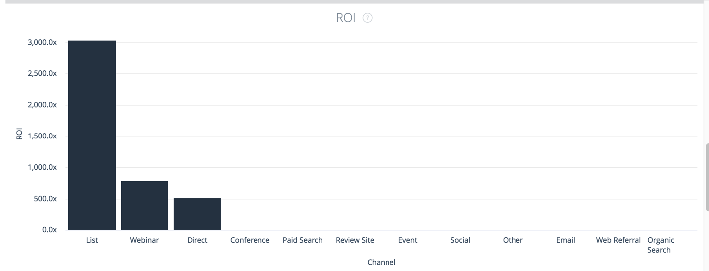
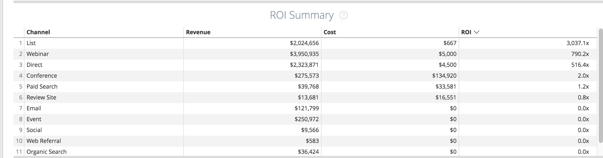

# Vue d’ensemble des cases du panorama {#overview-board-tiles}

Le panorama d’aperçu offre une vue d’ensemble la plus complète de vos performances marketing, ce qui permet aux équipes marketing de prendre les bonnes décisions lors de l’augmentation de votre équipe, de votre budget ou de vos recettes.

<table> 
 <colgroup> 
  <col> 
  <col> 
  <col> 
  <col> 
  <col> 
  <col> 
  <col> 
  <col> 
  <col> 
  <col> 
  <col> 
 </colgroup> 
 <tbody> 
  <tr> 
   <td> </td> 
   <td>
<strong>Type de date</strong>
</td> 
   <td>
<strong>Date</strong>
</td> 
   <td>
<strong>Modèle d’attribution</strong>
</td> 
   <td>
<strong>Métrique</strong>
</td> 
   <td>
<strong>Dimension</strong>
</td> 
   <td>
<strong>Canal</strong>
</td> 
   <td>
<strong>Sous-canal</strong>
</td> 
   <td>
<strong>Campagne</strong>
</td> 
   <td>
<strong>ID de compte publicitaire</strong>
</td> 
   <td>
<strong>Nom de compte CRM</strong>
</td> 
  </tr> 
  <tr> 
   <td>
<strong>Recettes</strong>
</td> 
   <td><strong>X</strong></td> 
   <td><strong>X</strong></td> 
   <td><strong>X</strong></td> 
   <td> </td> 
   <td> </td> 
   <td><strong>X</strong></td> 
   <td><strong>X</strong></td> 
   <td><strong>X</strong></td> 
   <td><strong>X</strong></td> 
   <td><strong>X</strong></td> 
  </tr> 
  <tr> 
   <td>
<strong>Vue d’ensemble</strong>
</td> 
   <td><strong>X</strong></td> 
   <td><strong>X</strong></td> 
   <td><strong>X</strong></td> 
   <td><strong>X</strong></td> 
   <td><strong>X</strong></td> 
   <td><strong>X</strong></td> 
   <td><strong>X</strong></td> 
   <td><strong>X</strong></td> 
   <td><strong>X</strong></td> 
   <td><strong>X</strong></td> 
  </tr> 
  <tr> 
   <td>
<strong>Dépenses</strong>
</td> 
   <td> </td> 
   <td><strong>X</strong></td> 
   <td> </td> 
   <td> </td> 
   <td> </td> 
   <td><strong>X</strong></td> 
   <td><strong>X</strong></td> 
   <td><strong>X</strong></td> 
   <td><strong>X</strong></td> 
   <td> </td> 
  </tr> 
  <tr> 
   <td>
<strong>ROI</strong>
</td> 
   <td><strong>X</strong></td> 
   <td><strong>X</strong></td> 
   <td><strong>X</strong></td> 
   <td> </td> 
   <td> </td> 
   <td><strong>X</strong></td> 
   <td><strong>X</strong></td> 
   <td><strong>X</strong></td> 
   <td><strong>X</strong></td> 
   <td><strong>X</strong></td> 
  </tr> 
  <tr> 
   <td>
<strong>Affaires</strong>
</td> 
   <td><strong>X</strong></td> 
   <td><strong>X</strong></td> 
   <td><strong>X</strong></td> 
   <td> </td> 
   <td> </td> 
   <td><strong>X</strong></td> 
   <td><strong>X</strong></td> 
   <td><strong>X</strong></td> 
   <td><strong>X</strong></td> 
   <td><strong>X</strong></td> 
  </tr> 
  <tr> 
   <td>
<strong>Coût par contrat</strong>
</td> 
   <td><strong>X</strong></td> 
   <td><strong>X</strong></td> 
   <td><strong>X</strong></td> 
   <td> </td> 
   <td> </td> 
   <td><strong>X</strong></td> 
   <td><strong>X</strong></td> 
   <td><strong>X</strong></td> 
   <td><strong>X</strong></td> 
   <td><strong>X</strong></td> 
  </tr> 
  <tr> 
   <td>
<strong>Chiffre d’affaires de pipeline</strong>
</td> 
   <td><strong>X</strong></td> 
   <td><strong>X</strong></td> 
   <td><strong>X</strong></td> 
   <td> </td> 
   <td> </td> 
   <td><strong>X</strong></td> 
   <td><strong>X</strong></td> 
   <td><strong>X</strong></td> 
   <td><strong>X</strong></td> 
   <td><strong>X</strong></td> 
  </tr> 
  <tr> 
   <td>
<strong>Valeur de l’affaire</strong>
</td> 
   <td><strong>X</strong></td> 
   <td><strong>X</strong></td> 
   <td><strong>X</strong></td> 
   <td> </td> 
   <td> </td> 
   <td><strong>X</strong></td> 
   <td><strong>X</strong></td> 
   <td><strong>X</strong></td> 
   <td><strong>X</strong></td> 
   <td><strong>X</strong></td> 
  </tr> 
  <tr> 
   <td>
<strong>Résumé du canal</strong>
</td> 
   <td><strong>X</strong></td> 
   <td><strong>X</strong></td> 
   <td><strong>X</strong></td> 
   <td><strong>X</strong></td> 
   <td> </td> 
   <td><strong>X</strong></td> 
   <td><strong>X</strong></td> 
   <td><strong>X</strong></td> 
   <td><strong>X</strong></td> 
   <td><strong>X</strong></td> 
  </tr> 
  <tr> 
   <td>
<strong>Résumé du sous-canal</strong>
</td> 
   <td><strong>X</strong></td> 
   <td><strong>X</strong></td> 
   <td><strong>X</strong></td> 
   <td><strong>X</strong></td> 
   <td> </td> 
   <td><strong>X</strong></td> 
   <td><strong>X</strong></td> 
   <td><strong>X</strong></td> 
   <td><strong>X</strong></td> 
   <td><strong>X</strong></td> 
  </tr> 
  <tr> 
   <td>
<strong>Résumé campagne</strong>
</td> 
   <td><strong>X</strong></td> 
   <td><strong>X</strong></td> 
   <td><strong>X</strong></td> 
   <td><strong>X</strong></td> 
   <td> </td> 
   <td><strong>X</strong></td> 
   <td><strong>X</strong></td> 
   <td><strong>X</strong></td> 
   <td><strong>X</strong></td> 
   <td><strong>X</strong></td> 
  </tr> 
  <tr> 
   <td>
<strong>ROI</strong>
</td> 
   <td><strong>X</strong></td> 
   <td><strong>X</strong></td> 
   <td><strong>X</strong></td> 
   <td> </td> 
   <td><strong>X</strong></td> 
   <td><strong>X</strong></td> 
   <td><strong>X</strong></td> 
   <td><strong>X</strong></td> 
   <td><strong>X</strong></td> 
   <td><strong>X</strong></td> 
  </tr> 
  <tr> 
   <td>
<strong>Résumé du RSI</strong>
</td> 
   <td><strong>X</strong></td> 
   <td><strong>X</strong></td> 
   <td><strong>X</strong></td> 
   <td> </td> 
   <td><strong>X</strong></td> 
   <td><strong>X</strong></td> 
   <td><strong>X</strong></td> 
   <td><strong>X</strong></td> 
   <td><strong>X</strong></td> 
   <td><strong>X</strong></td> 
  </tr> 
 </tbody> 
</table>

## Mosaïque Recettes {#revenue-tile}

Chiffre d’affaires total attribué des opportunités de succès fermé en fonction du modèle d’attribution.

-Détails de l’opportunité : affiche une ventilation des identifiants d’opportunité associés, de la date de création, de la date de fermeture, du code ISO et de l’attribution du chiffre d’affaires.\
- Afficher les détails : ventilation par mois.

## Mosaïque Aperçu (graphique) {#overview-chart-tile}

Le graphique affiche les recettes attribuées à chaque canal, affichées au fil du temps.

-Détails de l’opportunité : affiche une ventilation des identifiants d’opportunité associés, de la date de création, de la date de fermeture, du code ISO et de l’attribution du chiffre d’affaires.\
-Affiche une ventilation des ID d’Opp de contribution :

* Par semaine de retour sur investissement
* Par données de retour sur investissement
* Par heure de retour sur investissement
* Par minute de retour sur investissement
* Par heure de retour sur investissement

## Mosaïque Dépenser {#spend-tile}

Montant total des dépenses provenant des coûts de l’API et des coûts auto-déclarés pour une période donnée.

>[!NOTE]
>
>Lors d’un forage d’une valeur inférieure à un mois, [!DNL Marketo Measure] calculera la moyenne des dépenses pour ce mois-ci et affectera cette moyenne à chaque jour.

-Détails de la dépense : affiche une ventilation de l’identifiant unique de la campagne de dépenses associée, du nom de la campagne, du canal, du sous-canal, de la date, de la devise d’origine, des dépenses.  - Afficher les détails : ventilation par mois.

## Mosaïque ROI {#roi-tile}

Le ROI calculé (retour sur investissement) provenant du total des recettes (du modèle d’attribution sélectionné) et du total des dépenses (Mosaïque Recettes ÷ Dépense = Mosaïque ROI).

## Mosaïque Transactions {#deals-tile}

Affiche le nombre total d’accords attribués (les contrats sont un nombre d’opportunités de gains clôturés).

>[!NOTE]
>
>Si le type de date &quot;Date du point de contact&quot; est sélectionné, des décomptes partiels sont possibles, car certains points de contact peuvent ne pas faire partie de la période.

-Détails de l’opportunité : affiche une ventilation des identifiants d’opportunité associés, de la date de création, de la date de fermeture et de l’attribution (nombre).  - Afficher les détails : ventilation par mois.

## Mosaïque Coût par transaction {#cost-per-deal-tile}

Le coût moyen d&#39;acquérir une opportunité fermée. Total des dépenses divisé par le nombre total d’offres (Mosaïque Dépense ÷ Mosaïque Transactions = Mosaïque Coût par opération).

## Mosaïque Recettes du pipeline {#pipeline-revenue-tile}

Le total des recettes potentielles attribuées pour les opportunités ouvertes

>[!NOTE]
>
>Les recettes seront reflétées pour le modèle d’attribution spécifié.

-Détails de l’opportunité : affiche une ventilation des identifiants d’opportunité associés, de la date de création, de la date de fermeture, du code ISO et de l’attribution du chiffre d’affaires.  - Afficher les détails : ventilation par mois.

## Mosaïque Taille de transaction {#deal-size-tile}

Les recettes moyennes des opportunités de gains fermées (Mosaïque Recettes ÷ Mosaïque Opérations = Mosaïque Taille de l’opération).

## Mosaïque Résumé du canal {#channel-summary-tile}

Affichez une liste de canaux en fonction de la mesure sélectionnée (recettes, recettes de pipeline, dépenses, offres, opportunités, pistes, contacts).

## Mosaïque Résumé pour le sous-canal {#subchannel-summary-tile}

Afficher une liste de sous-canaux en fonction de la mesure sélectionnée (recettes, recettes de pipeline, dépenses, offres, opportunités, pistes, contacts).

## Mosaïque Résumé de campagne {#campaign-summary-tile}

Affichez une liste de campagnes d’après la mesure sélectionnée (recettes, recettes de pipeline, dépenses, offres, opportunités, pistes, contacts).

## Mosaïque ROI (graphique) {#roi-chart-tile}

Affiche le retour sur investissement attribué à la mesure sélectionnée (canal, sous-canal, campagne, compte, groupe, publicitaire, publicitaire, créatif, mot-clé, emplacement, site) en fonction du modèle d’attribution sélectionné.

## Mosaïque Résumé du ROI {#roi-summary-tile}

Affiche le retour sur investissement attribué à la mesure sélectionnée (canal, sous-canal, campagne, compte, groupe, publicitaire, publicitaire, créatif, mot-clé, emplacement, site) en fonction du modèle d’attribution sélectionné.

-Détails de l’opportunité : affiche une ventilation des identifiants d’opportunité associés, de la date de création, de la date de fermeture et de l’attribution (nombre).

- Afficher les détails : ventilation par mois.
