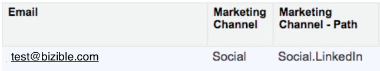

# Structure de Marketo Measure {#marketo-measure-framework}

Découvrez plus d’informations sur les quatre principaux composants qui constituent le framework Marketo Measure. Marketo Measure s’appuie sur ces applications pour effectuer le suivi, l’organisation et l’hébergement des données, ainsi que pour fournir des fonctionnalités de création de rapports. Les quatre composants constitutifs du framework Marketo Measure sont les suivants :

* Code JavaScript de Marketo Measure
* Intégrations CRM
* Applications/systèmes tiers
* Application Marketo Measure

## Code JavaScript Marketo Measure {#marketo-measure-javascript}

Le code JavaScript de Marketo Measure effectue le suivi de toutes les interactions marketing en ligne, également appelées points de contact, que les prospects/clients potentiels ont avec votre entreprise. Il s’agit d’un script personnalisé, ajouté avant la balise `</head>` fermante sur chaque page de votre site web.

``

>[!NOTE]
>Pour plus d’informations sur l’ajout du code JS Marketo Measure, [cliquez ici](/help/marketo-measure-tracking/adding-marketo-measure-script.md).

Le code JS de Marketo Measure capture les données provenant des visites web (y compris les visites anonymes), du trafic général, de la navigation sur les pages, des téléchargements de contenu et des envois de formulaire. Ces données sont transmises à votre CRM et chaque interaction marketing est affichée comme un point de contact.

## Intégrations CRM {#crm-integrations}

Marketo Measure s’intègre aux systèmes de gestion de la relation client (GRC) pour héberger et organiser toutes les données capturées par le script JS de Marketo Measure. Actuellement, Marketo Measure dispose d’API d’intégration pour deux CRM :

En intégrant les données Marketo Measure dans votre CRM, vous pouvez consulter les informations granulaires relatives à chaque point de contact et générer des rapports pour comprendre les performances de vos canaux.

## Applications tierces {#third-party-applications}

La plupart des responsables marketing s’appuient sur plusieurs applications différentes pour mener à bien leurs actions marketing. Outre Salesforce et MS Dynamics, Marketo Measure dispose d’intégrations pour 13 applications tierces, répertoriées ci-dessous.

Si vous utilisez ces applications dans le cadre de vos efforts marketing, vous pouvez lier ces comptes à Marketo Measure, Cela simplifie le suivi et le transfert des données vers votre compte Marketo Measure.

## Application Marketo Measure {#marketo-measure-application}

L’application Marketo Measure permet de consulter vos données d’attribution et de générer des rapports à leur sujet, de configurer les paramètres du compte et de mettre à jour ses informations. Les principales options du menu de l’application Marketo Measure sont les suivantes :

**Configuration de compte**

C’est ici que vous pouvez mettre à jour les informations générales portant sur votre entreprise et accéder au code JavaScript Marketo Measure.

**Paramètres**

Cette option de menu vous permet de configurer vos paramètres d’attribution et de mappage des canaux, de gérer les intégrations dans les GRC et les applications tierces, d’afficher ou d’ajouter des personnes au compte Marketo Measure et de mettre à jour les informations de facturation.

**Tableau de bord de retour sur investissement marketing**

Le tableau de bord de retour sur investissement marketing vous permet de visualiser vos données en termes de performances, d’activité et de coûts pour chaque canal.
