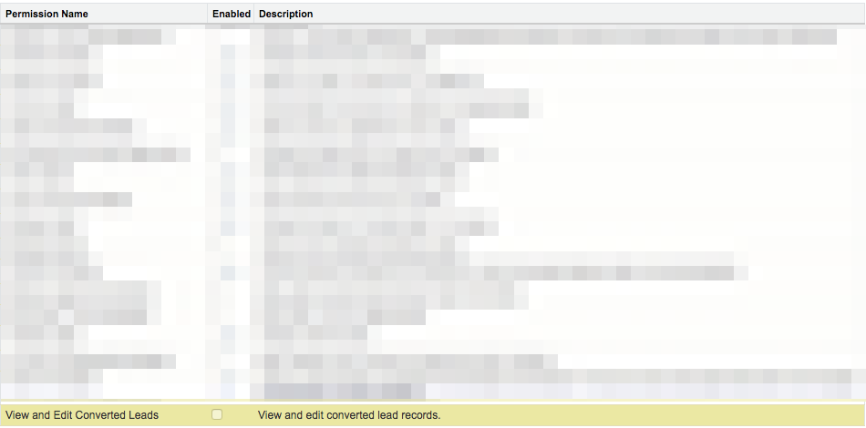

# Activation de l’autorisation de modifier les prospects convertis {#enabling-the-permission-to-edit-converted-leads}

Découvrez comment activer l’autorisation de modification des enregistrements de prospect convertis dans [!DNL Salesforce]. [!DNL Marketo Measure] permet d’envoyer des données vers vos différents objets dans Salesforce. Lors de l’intégration des prospects, nous constatons que, dans certains scénarios, il peut être nécessaire d’intégrer à nouveau un enregistrement de prospect qui a déjà été converti. Pour que nous puissions transmettre des données à ces enregistrements, l’utilisateur avec lequel nous sommes connectés doit avoir l’autorisation d’afficher et de modifier les prospects convertis au niveau du profil.

1. Accédez à [!UICONTROL Configuration] et développez le regroupement [!UICONTROL Gérer les utilisateurs] pour sélectionner Profils.

   

1. Sélectionnez le profil de l’utilisateur avec lequel nous sommes connectés.

1. Recherchez l’autorisation d’afficher et de modifier les prospects convertis.

   

1. Cochez la case pour autoriser l’affichage et la modification des prospects convertis.

   

Et c&#39;est fini !
