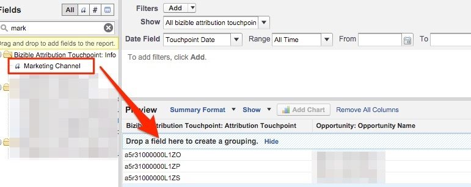

# Opportunités concrétisées ou perdues par canal marketing {#closed-lost-opportunities-by-marketing-channel}

Bien que ce rapport puisse dépendre de vos étapes d’opportunité, il vous indique quels canaux marketing ont contribué aux opportunités qui ne sont pas fermées ont été gagnés.

1. Cliquez sur l’onglet **[!UICONTROL Rapports]** de Salesforce et sélectionnez **[!UICONTROL Nouveau rapport]**.

   

1. Dans la recherche rapide, saisissez &quot;Attribution Bizible&quot; et sélectionnez le type de rapport **[!UICONTROL Point de contact d’attribution Bizible avec opportunité]** , puis sélectionnez **[!UICONTROL Créer]**.

   

1. En commençant par la partie supérieure du rapport, affichez &quot;[!UICONTROL Tous les points de contact d’attribution Bizible]&quot; et ajustez le champ de date en fonction de la période sur laquelle vous souhaitez créer un rapport. Dans notre exemple, nous regardons &quot;All Time&quot;. De plus, remplacez le format du rapport Tabulaire par Résumé.

   

   

1. Nous allons maintenant ajouter des champs au rapport. Dans la recherche rapide à gauche, saisissez &quot;Canal marketing&quot; et ajoutez-le au regroupement de synthèse dans le rapport.

   

1. Ensuite, nous allons ajouter un filtre afin de n’examiner que les opérations perdues fermées. Dans la recherche rapide à gauche, recherchez le champ &quot;Stage&quot; et faites-le glisser dans la zone de filtrage.

   

1. A partir de là, vous allez sélectionner la loupe pour choisir la ou les scènes que vous utilisez pour les opportunités &quot;Fermées Perdues&quot;. Dans notre cas, nous utiliserons le nom standard &quot;Fermé perdu&quot;.

   

1. Maintenant, allez-y et exécutez le rapport !

   Il s’agit d’un rapport sur les opportunités résumé par Canal marketing qui mesure les opportunités perdues fermées sur l’ensemble de vos canaux. Ce rapport vous permet de comprendre les canaux peu performants. N’hésitez pas à ajouter des filtres ou des champs sur lesquels vous souhaitez créer des rapports.

>[!MORELIKETHIS]
>
>[[!DNL Marketo Measure] Tutorials : Rapports SFDC supplémentaires](https://experienceleague.adobe.com/fr/docs/marketo-measure-learn/tutorials/onboarding/marketo-measure-102/addtional-salesforce-reports)
