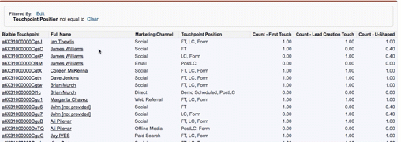

# Doublons d’enregistrements dans mon rapport {#duplicate-records-in-my-report}

>[!NOTE]
>
>Vous pouvez voir des instructions spécifiant « [!DNL Marketo Measure] » dans la documentation, mais toujours voir « [!DNL Bizible] » dans votre CRM. Nous nous efforçons de mettre cela à jour. Notre nouvelle identité de marque (rebranding) sera bientôt répercutée dans votre CRM.

À mesure que vous parcourez les rapports [!DNL Marketo Measure] dans [!DNL Salesforce], il se peut que vous commenciez à trouver des enregistrements en double dans vos rapports. Vous ressentirez probablement ce sentiment lorsque vous examinerez [!DNL Marketo Measure] rapports prêts à l’emploi.

Lors de la création de rapports avec l’objet Points de contact de l’acheteur ou l’objet Buyer Attribution Touchpoint, il est important de comprendre que vous ne créez plus de rapports sur le nombre de leads, de contacts ou d’opportunités, mais que vous allez plutôt créer des rapports sur le nombre de points de contact d’attribution de l’acheteur ou de points de contact d’attribution de l’acheteur associés à ces objets standard (leads, contacts, opportunités).

Prenons l’exemple du rapport suivant :

Il s&#39;agit d&#39;un rapport **Contacts avec les points de contact des acheteurs**. Encore une fois, cela signifie que nous examinons le nombre de points de contact associés à un contact individuel.

Comme vous pouvez le voir, il semble qu&#39;il y ait trois contacts James Williams dans le rapport, et donc vous pourriez penser, « doublons ! »

Cependant, ce rapport indique le nombre de points de contact liés à James. Dans le rapport, vous pouvez voir que James a un FT (Première touche) individuel, un LC individuel, un formulaire (touche de création de lead), et un point de contact PostLC (un envoi de formulaire qui a lieu après le point de contact LC).

Si vous souhaitez comprendre le « nombre de contacts », vous pouvez utiliser les champs « Comptage - Première touche », « Comptage - Étape de création du lead » ou « Comptage en forme de U » pour comprendre le nombre de contacts qui ont eu des interactions marketing.

>[!MORELIKETHIS]
>
>[[!DNL Marketo Measure] Tutoriels : rapports Stock SFDC](https://experienceleague.adobe.com/fr/docs/marketo-measure-learn/tutorials/onboarding/marketo-measure-102/stock-salesforce-reports){target="_blank"}
