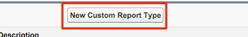

# Rapport Leads avec points de contact des acheteurs {#leads-with-buyer-touchpoints-report}

>[!NOTE]
>
>Vous pouvez voir des instructions spécifiant « [!DNL Marketo Measure] » dans la documentation, mais toujours voir « [!DNL Bizible] » dans votre CRM. Nous nous efforçons de mettre cela à jour. Notre nouvelle identité de marque (rebranding) sera bientôt répercutée dans votre CRM.

Prête à l’emploi, vous disposez de nombreuses fonctionnalités de création de rapports du bout des doigts en ce qui concerne [!DNL Marketo Measure], mais nous vous recommandons de créer d’autres types de rapports. Découvrez ci-dessous comment créer un type de rapport Leads inclusifs avec points de contact acheteur.

1. Accédez à l’option Configuration dans [!DNL Salesforce]. À partir de là, développez le regroupement « Créer » et sélectionnez **[!UICONTROL Types de rapports]**.

   

1. Sélectionnez **[!UICONTROL Nouveau type de rapport personnalisé]**.

   

1. Définissez l’objet principal en tant que « Leads » et dans l’entrée « Libellé du type de rapport » « Leads avec points de contact de l’acheteur - Inclusif ». Stockez le rapport dans la catégorie « Leads » et modifiez le statut du déploiement en **[!UICONTROL Déployé]**. Sélectionnez ensuite **[!UICONTROL Suivant]**.

   

1. Pour les relations d’objet, sélectionnez l’objet **[!DNL Marketo Measure]Personnes** comme objet secondaire. Sélectionnez la relation A à B comme suit : « Chaque enregistrement « A » doit avoir au moins un enregistrement « B » associé. » À partir de là, vous allez mettre en relation l’objet « Buyer Touchpoint » et sélectionner la même relation entre les objets B et C.

   

1. Enregistrez et commencez à créer des rapports.
