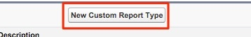

# Rapport Prospects avec points de contact acheteur {#leads-with-buyer-touchpoints-report}

>[!NOTE]
>
>Vous pouvez voir des instructions spécifiant &quot;[!DNL Marketo Measure]&quot; dans notre documentation, mais toujours voir &quot;[!DNL Bizible]&quot; dans votre CRM. Nous nous efforçons de mettre à jour cette version et la nouvelle image sera bientôt répercutée dans votre CRM.

De nombreuses fonctionnalités de reporting sont à portée de main lorsqu’il s’agit d’élaborer des rapports prêts à l’emploi. [!DNL Marketo Measure], mais il existe d’autres types de rapports que nous vous recommandons de créer. Découvrez le type de rapport Pistes avec points de contact d’achat ci-dessous.

1. Accédez à l’option Configuration dans [!DNL Salesforce]. À partir de là, développez le regroupement &quot;Créer&quot; et sélectionnez **[!UICONTROL Types de rapports]**.

   

1. Sélectionner **[!UICONTROL Nouveau type de rapport personnalisé]**.

   

1. Définissez l’objet Principal comme &quot;Pistes&quot; et dans l’entrée &quot;Étiquette de type de rapport&quot; &quot;Pistes avec points de contact d’achat - Inclus&quot;. Stockez le rapport dans la catégorie &quot;Leads&quot; et modifiez l’état du déploiement en **[!UICONTROL Déployé]**. Sélectionnez **[!UICONTROL Suivant]**.

   

1. Pour les relations d’objet, sélectionnez l’événement **[!DNL Marketo Measure]Personnes** comme objet secondaire. Sélectionnez la relation A/B comme suit : &quot;Chaque enregistrement &quot;A&quot; doit comporter au moins un enregistrement &quot;B&quot; associé.&quot; A partir de là, vous associerez l’objet &quot;Point de contact de l’acheteur&quot; et sélectionnerez la même relation entre les objets B et C.

   

1. Enregistrez et commencez à créer des rapports.
