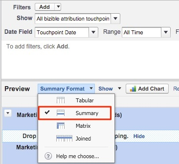

# Opportunités par canal marketing {#opportunities-by-marketing-channel}

Ce rapport fait apparaître le nombre d’opportunités générées par vos canaux marketing ; il inclut toutes vos opportunités. Cependant, vous pouvez filtrer ce rapport pour analyser des types spécifiques d’opportunités.

1. Cliquez sur l’onglet **[!UICONTROL Rapports]** dans Salesforce et sélectionnez **[!UICONTROL Nouveau rapport]**.

1. Dans le type de recherche rapide dans « Attribution Bizible » et sélectionnez le type de rapport **[!UICONTROL Point de contact d’attribution Bizible avec opportunité]** et sélectionnez **[!UICONTROL Créer]**.

   

1. En commençant par la partie supérieure du rapport, affichez **[!UICONTROL Tous les points de contact d’attribution Bizible]** et ajustez le champ de date en fonction de la période sur laquelle vous souhaitez créer votre rapport. Dans notre exemple, nous prenons All Time. De plus, modifiez le format du rapport de [!UICONTROL Tabulaire] en **[!UICONTROL Résumé]**.

   

1. À présent, nous allons ajouter des champs au rapport. Dans la recherche rapide sur la gauche, saisissez « Canal marketing » et ajoutez-le au regroupement Résumé dans le rapport.

   

1. Maintenant, exécutez le rapport et analysez !

   Il s’agit d’un rapport d’opportunités résumé par canal marketing. Ce rapport se concentre sur toutes les opportunités, mais n’hésitez pas à le filtrer en fonction de l’étape/du type d’opportunité. N’hésitez pas non plus à ajouter des champs dans les champs sur lesquels vous souhaitez créer des rapports.

>[!MORELIKETHIS]
>
>[[!DNL Marketo Measure] Tutoriels : rapports Stock SFDC](https://experienceleague.adobe.com/en/docs/marketo-measure-learn/tutorials/onboarding/marketo-measure-102/stock-salesforce-reports){target="_blank"}
