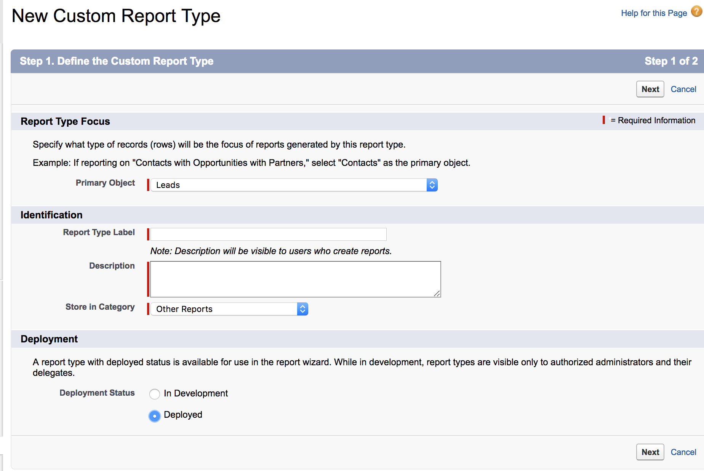
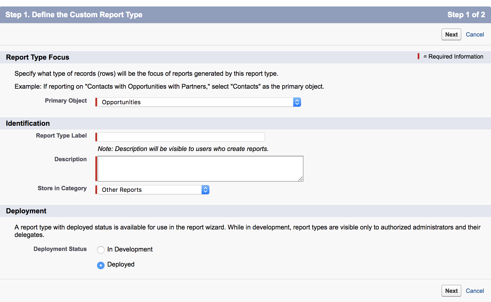

# Création de types de rapports [!DNL Marketo Measure] personnalisés {#creating-custom-marketo-measure-report-types}

>[!NOTE]
>
>Vous pouvez voir des instructions spécifiant « [!DNL Marketo Measure] » dans la documentation, mais toujours voir « [!DNL Bizible] » dans votre CRM. Nous nous efforçons de mettre cela à jour. Notre nouvelle identité de marque (rebranding) sera bientôt répercutée dans votre CRM.

Découvrez comment créer des types de rapports [!DNL Marketo Measure] [!DNL Salesforce] personnalisés. Nous recommandons de créer trois types de rapports différents : Leads avec points de contact d’acheteur (personnalisés), Personne [!DNL Marketo Measure] avec points de contact d’acheteur (personnalisés), Opportunités avec Buyer Attribution Touchpoint (personnalisées).

## Leads avec points de contact d’acheteur (personnalisés) {#leads-with-buyer-touchpoints-custom}

1. Accédez à **[!UICONTROL Configuration]** > **[!UICONTROL Créer]** > **[!UICONTROL Types de rapports]** > **[!UICONTROL Nouveaux types de rapports personnalisés]**.

   

1. Définissez le type de rapport personnalisé.

   * [!UICONTROL Focus sur le type de rapport] > [!UICONTROL [!UICONTROL Objet de Principal &#x200B;]] : lead
   * Identification > [!UICONTROL Libellé de type de rapport] : leads avec des points de contact d’acheteur (personnalisés)
   * [!UICONTROL Stocker dans la catégorie] : autres rapports
   * [!UICONTROL Déploiement] > [!UICONTROL Statut du déploiement] : déployé

   

1. Définissez les relations de l’objet.

   * Mettre en relation l’objet de lead (A) avec l’objet de personne [!DNL Marketo Measure] (B), puis avec l’objet de Buyer Touchpoint (C)
   * Assurez-vous que « [!UICONTROL &#x200B; Chaque enregistrement A/B doit avoir au moins un enregistrement B/C &#x200B;] » est sélectionné
   * [!UICONTROL Enregistrer &#x200B;]

   

## [!DNL Marketo Measure] Personne avec les points de contact de l’acheteur (personnalisé) {#marketo-measure-person-with-buyer-touchpoints-custom}

1. Accédez à **[!UICONTROL Configuration]** > **[!UICONTROL Créer]** > **[!UICONTROL Types de rapports]** > **[!UICONTROL Nouveaux types de rapports personnalisés]**.

   

1. Définissez le type de rapport personnalisé.

   * [!UICONTROL Focus du type de rapport] > [!UICONTROL Objet de Principal &#x200B;] : [!DNL Marketo Measure] personnes
   * [!UICONTROL Identification] > [!UICONTROL Étiquette de type de rapport] : [!DNL Marketo Measure] personne avec des points de contact d’acheteur (personnalisé)
   * [!UICONTROL Stocker dans la catégorie] : autres rapports
   * [!UICONTROL Déploiement] > [!UICONTROL Statut du déploiement] : déployé

   

1. Définissez les relations de l’objet.

   * Associez l’objet Personne [!DNL Marketo Measure] (A) à l’objet Buyer Touchpoint (B)
   * Assurez-vous que « [!UICONTROL Chaque enregistrement A doit avoir au moins un enregistrement B] » est sélectionné
   * [!UICONTROL Enregistrer &#x200B;]

   

## Opportunités avec Buyer Attribution Touchpoint (personnalisé) {#opportunities-with-buyer-attribution-touchpoint-custom}

1. Accédez à **[!UICONTROL Configuration]** > **[!UICONTROL Créer]** > **[!UICONTROL Types de rapports]** > **[!UICONTROL Nouveaux types de rapports personnalisés]**.

   

1. Définissez le type de rapport personnalisé.

   * [!UICONTROL Focus sur le type de rapport] > [!UICONTROL Objet de Principal &#x200B;] : Opportunités
   * [!UICONTROL Identification] > [!UICONTROL Libellé de type de rapport] : opportunités avec Buyer Attribution Touchpoint (personnalisé)
   * [!UICONTROL Stocker dans la catégorie] : autres rapports
   * [!UICONTROL Déploiement] > [!UICONTROL Statut du déploiement] : déployé

   

1. Définissez les relations de l’objet.

   * Mettre en relation l’objet Opportunités (A) avec l’objet Buyer Attribution Touchpoint (B)
   * Assurez-vous que « [!UICONTROL Chaque enregistrement A doit avoir au moins un enregistrement B] » est sélectionné
   * [!UICONTROL Enregistrer &#x200B;]

   

## Ajout de champs personnalisés aux types de rapports personnalisés {#adding-custom-fields-to-custom-report-types}

1. Une fois les rapports créés, vous êtes redirigé vers un aperçu du type de rapport. Cliquez sur **[!UICONTROL Modifier la disposition]**.

   

1. Assurez-vous que les champs personnalisés que vous souhaitez ajouter au rapport apparaissent dans la section Propriétés de la disposition du champ . Si vous souhaitez ajouter d’autres champs, utilisez l’option « [!UICONTROL &#x200B; Ajouter des champs liés par le biais de la recherche »].

   
