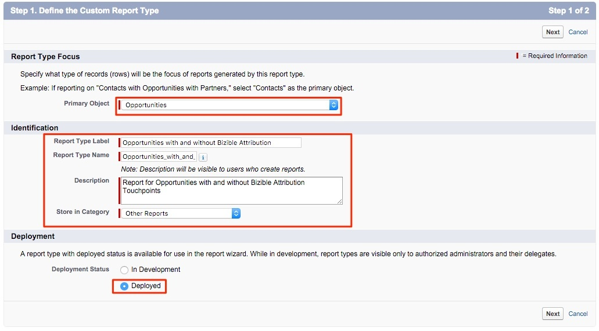

# Type de rapport pour les contacts sans opportunités {#report-type-for-contacts-without-opportunities}

>[!NOTE]
>
>Vous pouvez voir des instructions spécifiant « [!DNL Marketo Measure] » dans la documentation, mais toujours voir « [!DNL Bizible] » dans votre CRM. Nous nous efforçons de mettre cela à jour. Notre nouvelle identité de marque (rebranding) sera bientôt répercutée dans votre CRM.

Pour générer des rapports sur les contacts avec des points de contact acheteur qui ne sont pas associés à une opportunité, vous devez créer un type de rapport personnalisé.

1. Accédez à **[!UICONTROL Configuration]** > **[!UICONTROL Créer]** > **[!UICONTROL Types de rapports]**.

   

1. Sélectionnez **[!UICONTROL Nouveau type de rapport personnalisé]**.

   

1. Définissez l&#39;objet de Principal  en tant que « [!UICONTROL Contacts]. » Nommez le libellé de type de rapport « Contacts avec les points de contact de l’acheteur ». Utilisez le même nom pour le nom du type de rapport. Dans l’entrée de description, « Contacts avec les points de contact de l’acheteur ». Enregistrez le rapport dans la « [!UICONTROL Autre] » et définissez-le sur « [!UICONTROL Déployé] ».

   

1. À partir de là, vous lierez l’objet Contacts à l’objet Points de contact de l’acheteur. Assurez-vous de choisir le bouton « Chaque enregistrement « A » doit comporter au moins un enregistrement « B » associé. »

   

1. Cliquez sur **[!UICONTROL Enregistrer]** et vous avez terminé !
