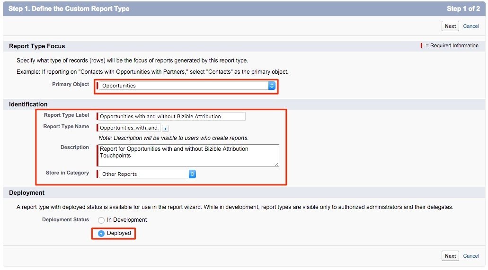

# Type de rapport pour les contacts sans opportunités {#report-type-for-contacts-without-opportunities}

>[!NOTE]
>
>Vous pouvez voir des instructions spécifiant &quot;[!DNL Marketo Measure]&quot; dans notre documentation, mais toujours voir &quot;[!DNL Bizible]&quot; dans votre CRM. Nous nous efforçons de mettre à jour cette version et la nouvelle image sera bientôt répercutée dans votre CRM.

Pour créer des rapports sur les contacts avec les points de contact d’acheteurs qui ne sont pas associés à une opportunité, vous devez créer un type de rapport personnalisé.

1. Accédez à **[!UICONTROL Configuration]** > **[!UICONTROL Créer]** > **[!UICONTROL Types de rapports]**.

   

1. Sélectionner **[!UICONTROL Nouveau type de rapport personnalisé]**.

   

1. Définissez la variable [!UICONTROL Objet Principal] as &quot;[!UICONTROL Contacts].&quot; Nommez le libellé de type de rapport &quot;Contacts avec les points de contact de l’acheteur&quot;. Utilisez le même nom pour le nom du type de rapport. Dans l’entrée de description, &quot;Contacts avec les points de contact de l’acheteur&quot;. Enregistrez le rapport dans le[!UICONTROL Autre]&quot; et définissez le rapport sur &quot;[!UICONTROL Déployé].&quot;

   

1. A partir de là, vous allez lier l’objet Contacts à l’objet Points de contact de l’acheteur. Veillez à choisir le bouton &quot;Chaque enregistrement &quot;A&quot; doit comporter au moins un enregistrement &quot;B&quot; associé.&quot;

   

1. Cliquez sur **[!UICONTROL Enregistrer]** et vous avez fini !
