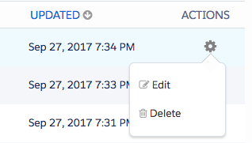

# Ajout de [!DNL Marketo Measure] JavaScript à [!DNL Pardot] {#adding-marketo-measure-javascript-to-pardot}

[!DNL Pardot] les formulaires nécessitent une gestion supplémentaire dans le modèle de formulaire, au-delà de l’insertion d’un script sur le site pour [!DNL Marketo Measure] afin de reconnaître les envois de formulaire. Le processus est simple ; il nécessite uniquement de placer le script de suivi [!DNL Marketo Measure] dans le modèle de formulaire [!DNL Pardot].

## Instructions détaillées {#step-by-step-instructions}

Une fois que vous êtes connecté à votre compte [!DNL Pardot], procédez comme suit.

1. Accédez à **[!UICONTROL Marketing]**.

1. Cliquez sur **[!UICONTROL Landing Pages]**.

1. Sélectionnez **[!UICONTROL Modèle de mise en page]**.

   

1. Déterminez le modèle de mise en page approprié, puis cliquez sur **[!UICONTROL Modifier]** à droite.

   

1. Copiez et collez le code JavaScript [!DNL Marketo Measure] juste avant la balise d’en-tête close sur votre page d’HTML.

   `<script type="text/javascript" src="https://cdn.bizible.com/scripts/bizible.js" async=""></script>`

1. Suivez ces étapes pour tous les modèles de mise en page de page d’entrée applicables.

1. Assurez-vous que le JavaScript [!DNL Marketo Measure] se trouve également sur la page générale du site.

   Dans le modèle de mise en page [!DNL Pardot], le code ressemble à ceci :

```text
<script type="text/javascript" src="https://cdn.bizible.com/scripts/bizible.js" async=""></script>
   </head>
   <body>
```

## Remarques supplémentaires {#additional-notes}

Si le paramètre [!DNL Pardot] IFrame comporte la balise d’HTML suivante :

`<base href="http://go.pardot.com">`

_Et_ le IFrame lui-même est en fait une page sécurisée (HTTPS) plutôt qu’une page non sécurisée (HTTP). Lors du chargement du script dans le IFrame [!DNL Pardot], le navigateur tente de charger une version HTTP du script sur une page HTTPS qui échoue, interrompant ainsi le suivi. La solution consiste à mettre à jour le script sur l’IFrame [!DNL Pardot] pour charger la version sécurisée du script :

`<script type="text/javascript" src="https://cdn.bizible.com/scripts/bizible.js" async=""></script>`

Il peut déjà y avoir d’autres fragments de code de suivi dans cette zone, tels qu’un code [!DNL Google Analytics]. Veillez à les séparer par un point-virgule `;` et un espace unique, comme illustré dans cet exemple :

`<script type="text/javascript" src="https://cdn.bizible.com/scripts/bizible.js" async=""></script>; <script async="true" type="othercode_example" src="otherfile_example.js" ></script>`
