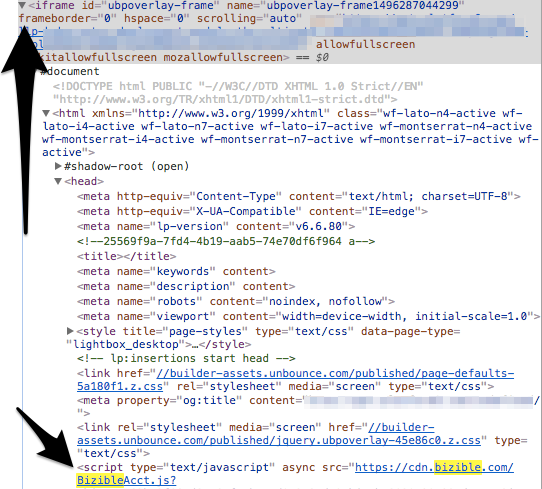

# Ajout de scripts [!DNL Marketo Measure] à Lightbox Forms {#adding-marketo-measure-script-to-lightbox-forms}

Découvrez comment ajouter correctement le JavaScript [!DNL Marketo Measure] à un formulaire dans une Lightbox.

Un cadre lumineux ouvre un formulaire devant votre contenu lorsque le visiteur effectue une action spécifique (c’est-à-dire lorsqu’il clique sur une partie spécifique de la page, passe un certain temps sur la page, etc.). En règle générale, nous demandons que le JavaScript [!DNL Marketo Measure] soit placé dans l’en-tête de la page d’entrée, mais pour les formulaires dans un cadre lumineux, une étape supplémentaire est nécessaire.

Un formulaire dans un cadre lumineux étant essentiellement un formulaire dans un iFrame, le script est placé dans ce cadre.

Tout d’abord, localisez l’iFrame dans lequel se trouve le formulaire [!UICONTROL lightbox].

Placez ensuite le JavaScript [!DNL Marketo Measure] dans l’iFrame.

Enfin, lorsque JavaScript est ajouté, les envois de formulaire de validation sont suivis en suivant les instructions suivantes :

1. Copiez l’URL de la landing page contenant le formulaire [!UICONTROL lightbox].
1. Ouvrez un navigateur Incognito et collez l’URL.
1. Envoyez le formulaire à l’aide d’une adresse électronique unique.
1. Vérifiez que le test a été suivi en vérifiant dans votre CRM l’adresse email unique utilisée et assurez-vous que les données du point de contact sont renseignées.
