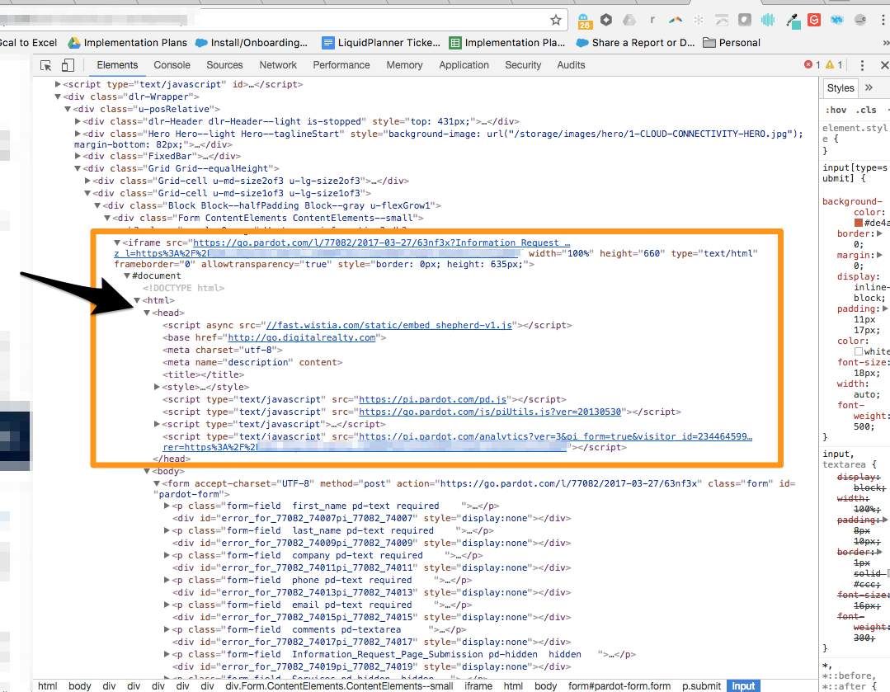

# Formulaires IFrame et [!DNL Marketo Measure] {#iframe-forms-and-marketo-measure}

Avec [!DNL Marketo Measure], l’une des principales fonctionnalités est le suivi de vos efforts de marketing numérique par le biais de sessions sur votre site et d’envois de formulaire. En règle générale, lorsque le code JavaScript est placé sur le site, nous le joignons automatiquement à tous les formulaires du site. Toutefois, cette fonctionnalité est limitée si le formulaire est contenu dans un IFrame.

Considérez un IFrame comme une page dans une page. De la même manière que nous demandons l’ajout du script à toutes les pages de votre site, nous avons besoin du script placé dans IFrame pour nous assurer que nous effectuons le suivi.

Dans de nombreux cas, l’IFrame est géré via un fournisseur d’automatisation du marketing. Vous devrez donc le configurer dans cette plateforme ou via votre fournisseur de formulaires.

Il est recommandé de placer le code JavaScript dans l’en-tête de l’IFrame et de là, nous le joignons automatiquement aux formulaires dans ce cadre.

Si vous avez des questions sur l’ajout de notre JavaScript aux formulaires IFrame, contactez l’équipe du compte Adobe (votre gestionnaire de compte) ou l’assistance de [Marketo](https://nation.marketo.com/t5/support/ct-p/Support){target="_blank"}.
