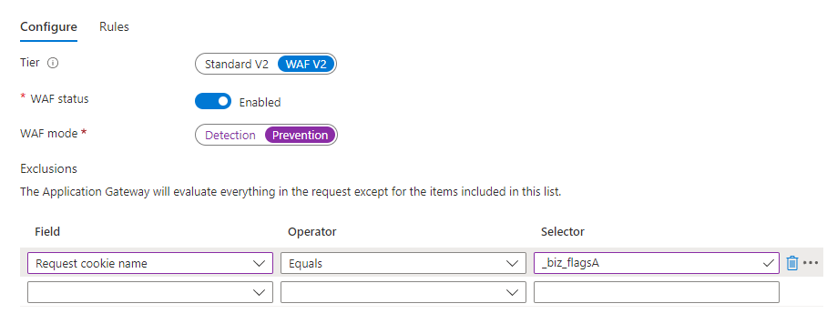

# Cookies Marketo Measure {#marketo-measure-cookies}

En savoir plus sur les différents cookies [!DNL Marketo Measure] chargés sur votre site lorsque vous appliquez le JavaScript [!DNL Marketo Measure] à vos pages de destination. Ces informations peuvent se révéler utiles à l’équipe de développement web lors de la mise en œuvre.

>[!IMPORTANT]
>
>En raison de problèmes de confidentialité, des cookies tiers sont en cours d’élimination. L’abandon des cookies tiers annoncé par Google Chrome au troisième trimestre 2024 marque effectivement la fin de cette forme de suivi. Par conséquent, Adobe abandonnera les fonctions Marketo Measure qui reposent sur des cookies tiers, en particulier le suivi inter-domaines et l’attribution d’affichage publicitaire, qui utilisent le cookie d’impression Google/DoubleClick. Aucune autre fonction de Marketo Measure ne sera affectée. L’utilisation des cookies propriétaires n’est pas non plus affectée. Compte tenu de la planification Google, la date d’obsolescence attendue des deux fonctions ci-dessus est 6/1/2024. Les données connexes collectées avant cette date restent disponibles pour les clients Adobe.

<table>
<thead>
  <tr>
    <th>Nom du cookie</th>
    <th>Type de cookie</th>
    <th>But</th>
    <th>Expiration</th>
    <th>L’indicateur sécurisé est-il défini ? </th>
    <th>L’indicateur HTTP uniquement est-il défini ?</th>
    <th>Créateur de cookie</th>
  </tr>
</thead>
<tbody>
  <tr>
    <td>_biz_uid</td>
    <td>Premier niveau</td>
    <td>Identifier de manière unique une personne sur le domaine actuel.</td>
    <td>1 an</td>
    <td>Non</td>
    <td>Non</td>
    <td>bizible.js</td>
  </tr>
  <tr>
    <td>_biz_nA</td>
    <td>Premier niveau</td>
    <td>Numéro de séquence que Marketo Measure inclut pour toutes les requêtes, à des fins de diagnostic interne.</td>
    <td>1 an</td>
    <td>Non</td>
    <td>Non</td>
    <td>bizible.js</td>
  </tr>
  <tr>
    <td>_biz_flagsA</td>
    <td>Premier niveau</td>
    <td>Cookie qui stocke diverses informations sur la personne, telles que l’envoi de formulaire, la migration interdomaines, le pixel d’affichage publicitaire, le statut de suivi de la désinscription, etc.</td>
    <td>1 an</td>
    <td>Non</td>
    <td>Non</td>
    <td>bizible.js</td>
  </tr>
  <tr>
    <td>_biz_pendingA</td>
    <td>Premier niveau</td>
    <td>Stocke temporairement les données d’analyse jusqu’à ce qu’elles aient été envoyées au serveur Marketo Measure.</td>
    <td>1 an</td>
    <td>Non</td>
    <td>Non</td>
    <td>bizible.js</td>
  </tr>
  <tr>
    <td>_biz_ABTestA</td>
    <td>Premier niveau</td>
    <td>Liste des sommes de contrôle provenant des données ABTests Optimizely et Visual Web Optimizer qui ont déjà été signalées, ce qui empêche bizible.js de renvoyer les données collectées.</td>
    <td>1 an</td>
    <td>Non</td>
    <td>Non</td>
    <td>bizible.js</td>
  </tr>
  <tr>
    <td>_biz_EventA</td>
    <td>Premier niveau</td>
    <td>Liste des sommes de contrôle signalées par les événements Bizible pour empêcher bizible.js d’envoyer à nouveau les données collectées.</td>
    <td>1 an</td>
    <td>Non</td>
    <td>Non</td>
    <td>bizible.js</td>
  </tr>
  <tr>
    <td>_biz_su</td>
    <td>Premier niveau</td>
    <td>Identifiant d’utilisateur ou d’utilisatrice universel permettant d’identifier une personne sur plusieurs domaines, applicable uniquement aux clientes et clients avec une intégration qui outrepasse les limites ITP.</td>
    <td>1 an</td>
    <td>Oui</td>
    <td>Non</td>
    <td>Edgecast</td>
  </tr>
  <tr>
    <td>_BUID</td>
    <td>Tiers, domaine=.<a href="http://bizible.com/">bizible.com</a></td>
    <td>Identifiant d’utilisateur ou d’utilisatrice universel permettant d’identifier une personne sur plusieurs domaines.</td>
    <td>1 an</td>
    <td>Oui</td>
    <td>Non</td>
    <td>Edgecast</td>
  </tr>
  <tr>
    <td>_BUID</td>
    <td>Tiers, domaine=.<a href="http://bizibly.com/">bizibly.com</a></td>
    <td>Mappage entre l’ID de cookie Marketo Measure sur le domaine du client ou de la cliente et son ID de cookie d’impression Doubleclick.</td>
    <td>1 an</td>
    <td>Oui</td>
    <td>Non</td>
    <td>Edgecast</td>
  </tr>
</tbody>
</table>

Si un avertissement de pare-feu d’application web (WAF) est déclenché lors de la configuration de JavaScript, les utilisateurs et utilisatrices peuvent désactiver cette règle de WAF ou placer les cookies sur la liste autorisée, comme dans l’exemple ci-dessous :

