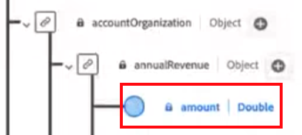

# [!DNL Marketo Measure] Guide de mise en oeuvre ultime {#marketo-measure-ultimate-implementation-guide}

PHRASE INTRO

## Principales différences lors de l’utilisation de l’option Ultimate par rapport aux mosaïques standard {#main-differences-when-using-ultimate-over-standard-tiers}

Importer des données B2B par l’intermédiaire d’AEP : les marketeurs doivent importer leurs données B2B (par exemple, compte, opportunité, contact, prospect, campagne, membre de campagne, activité) via AEP. Ingérez des données de presque toutes les sources de données, ainsi que de plusieurs sources de données du même type, afin d’importer toutes vos données pour l’attribution.

* Utilisez-le avec presque tous les CRM, pas uniquement Salesforce et Dynamics.
* Connectez plusieurs instances CRM et/ou des instances MAP à une instance Marketo Measure.
* Incluez des données d’inscription et de participation à des webinaires tiers.

Les connexions CRM directes et Marketo Engage ne sont plus disponibles pour Ultimate.

* Ultimate ne repousse pas les données vers le CRM. Les clients peuvent utiliser les données de l’entrepôt de données.
* Les marketeurs continueront d’apporter des données Ad Platform par le biais de connexions directes et du suivi des activités web par le biais de JavaScript Marketo Measure.

Les utilisateurs finaux sont configurés en AEP. S’ils disposent déjà d’AEP, nous ne réinitialiserons pas une nouvelle instance.

* La version AEP configurée comprend tous les connecteurs source, la modélisation des données de schéma, les jeux de données, le service de requête ad hoc et une destination pour Marketo Measure uniquement.

En savoir plus sur [Marketo Measure Ultimate](/help/marketo-measure-ultimate/marketo-measure-ultimate-overview.md){target="_blank"}.

## Schémas et jeux de données {#schemas-and-datasets}

>[!NOTE]
>
>Consulter [Blocs de création d’un schéma](https://experienceleague.adobe.com/docs/experience-platform/xdm/schema/composition.html?lang=en#building-blocks-of-a-schema){target="_blank"} pour un aperçu des schémas, des classes et des groupes de champs.

**Schéma XDM = Classe + Groupe de champs de schéma&#42;**

* Les champs obligatoires ne sont pas modifiables. Les clients peuvent créer et ajouter des champs personnalisés selon leurs besoins.
* Exemple de nom de champ basé sur la hiérarchie : accountOrganization.yearRevenue.amount

&#42; _Un schéma comprend une classe et zéro ou plusieurs groupes de champs de schéma. Cela signifie que vous pouvez composer un schéma de jeu de données sans utiliser de groupes de champs._

[Présentation des jeux de données](https://experienceleague.adobe.com/docs/experience-platform/catalog/datasets/overview.html){target="_blank"}: toutes les données correctement ingérées dans AEP sont conservées en tant que jeux de données dans le lac de données. Un jeu de données est une structure de stockage et de gestion pour une collecte de données, généralement sous la forme d’un tableau, qui contient un schéma (des colonnes) et des champs (des lignes).

## Création d’un schéma {#creating-a-schema}

Nous vous recommandons d’utiliser un utilitaire de génération automatique pour créer 10 schémas B2B standard.

* Procédure de téléchargement et de configuration de l’utilitaire [peut être consulté ici](https://experienceleague.adobe.com/docs/experience-platform/sources/connectors/adobe-applications/marketo/marketo-namespaces.html#set-up-b2b-namespaces-and-schema-auto-generation-utility){target="_blank"}.

Pour ceux qui disposent d’un _**Droit CDP**_: créez des schémas en accédant à la page Sources .

* Depuis une source, sélectionnez Ajouter des données > Utiliser des modèles .

* Sélectionnez un compte et tous les modèles B2B pour créer 10 schémas B2B standard.

## Flux de données {#dataflows}

[Présentation des flux de données](https://experienceleague.adobe.com/docs/experience-platform/dataflows/home.html){target="_blank"}

**Procédure de création d’un flux de données :**

1. Sélectionnez une source.
1. Sélectionnez un compte existant ou créez-en un.
1. Sélectionnez un type de données dans la liste des types disponibles à importer à partir de la source.
1. Sélectionnez un jeu de données existant ou créez-en un.
1. Mappez les champs de la source au schéma.

   >[!NOTE]
   >
   >* Si vous mappez un type de schéma à un autre identique, cela sera fait automatiquement.
   >* Vous pouvez également importer le mappage à partir d’un autre flux du système.
   >* Vous pouvez mapper un champ Source à plusieurs champs de destination, mais vous ne pouvez pas faire le contraire.
   >* Vous pouvez créer des champs calculés (ExL : fonctions de mappage de la préparation de données).

   >[!CAUTION]
   >
   >* Vous pouvez modifier un flux de données, mais les données ne sont pas renvoyées lorsqu’un mappage est modifié.
   >* Si un champ obligatoire est NULL, l’ensemble du flux est rejeté.

   >[!NOTE]
   >
   >[Exigence d’intégrité des données de Marketo Measure Ultimate](/help/marketo-measure-ultimate/data-integrity-requirement.md){target="_blank"}

1. Définissez une cadence de chargement des données.
1. Vérifiez et terminez.
1. Cochez la page &quot;État du compte&quot; dans les paramètres de l’interface utilisateur de mesure pour l’état du flux de données.

**Surveillance :**

Page Sources > Flux de données pour vérifier l’état des flux de données

* Pour afficher les détails de l’activité d’un jeu de données, cliquez simplement sur le jeu de données.
* Pour afficher les erreurs de flux de données, sélectionnez un flux de données, choisissez une exécution de flux de données, puis cliquez sur &quot;Aperçu des diagnostics d’erreur&quot;.

## Inspection des données {#data-inspection}

ExL : exigence d’intégrité des données Marketo Measure Ultimate Ce document comprend les champs requis pour chaque XDM ainsi que les requêtes d’inspection. Il sera publié dans ExL. - IL EST DÉJÀ BALISÉ AU-DESSUS - IL EST DE NOUVEAU POST???

Option 1 : pour exécuter des requêtes directement à partir de l’interface utilisateur, accédez à l’onglet Requêtes sous Data Management.

Option 2 : [Téléchargement et utilisation de PSQL](https://experienceleague.adobe.com/docs/experience-platform/query/clients/psql.html){target="_blank"} (plus rapide et plus fiable).

## Activation du jeu de données pour Marketo Measure {#activate-dataset-for-marketo-measure}

Avant de commencer, accédez à la section &quot;Experience Platform > Mappage des environnements de test&quot; dans les paramètres de l’interface utilisateur de mesure et mappez un environnement de test.

>[!CAUTION]
>
>Cette option ne peut pas être modifiée une fois sélectionnée.

1. Dans AEP, accédez à &quot;Destinations > Page Marketo Measure&quot; pour exporter des jeux de données.
1. Configurez la destination.
1. Activez le jeu de données.
1. Cochez la page &quot;État du compte&quot; dans les paramètres de l’interface utilisateur de mesure pour l’état du flux de données.

>[!NOTE]
>
>* Les données d’une entité donnée (un compte, par exemple) provenant d’une source donnée ne peuvent être transmises qu’à un seul jeu de données. Chaque jeu de données ne peut être inclus que dans un seul flux de données. Les violations arrêtent le flux de données au moment de l’exécution.
>* Supprimez la destination entière dans AEP pour supprimer les données dans Mesure. La désactivation ne fera qu’arrêter les nouvelles exportations de données et conserver les anciennes données.
>* La configuration de la mesure sera pour la plupart identique, mais certaines parties, comme le mappage des étapes, auront un aspect différent.
>* Il faut quelques heures pour qu’un nouveau flux de données génère une exécution de flux, puis elles se produisent à intervalles réguliers horaires.

En mesure, la devise par défaut doit être définie dans la section &quot;Devise&quot;.

* Si vous utilisez plusieurs devises, le schéma de taux de conversion de devise doit être renseigné dans AEP pour que nous puissions le lire et l’utiliser pour les conversions.

**Mappage d’étape :**

Les étapes n’étant pas automatiquement importées à partir des données utilisateur, elles doivent être mappées manuellement.

* Les utilisateurs peuvent mapper des scènes à partir de différentes sources.

Si les scènes ne sont pas mappées, le système ne fonctionnera pas, car il n’y aura nulle part où les données pourront aller.

**Règles des membres de campagne :**

Vous devez sélectionner un jeu de données et définir des règles pour chacun d’eux.

**Règles d’événements d’expérience :**

Vous devez sélectionner un jeu de données et les types d’activité.

* Les activités personnalisées ne sont pas encore prises en charge.
* Si le client possède des activités qui ne correspondent pas aux options disponibles, nous vous suggérons de les classer comme &quot;Moments intéressants&quot; et d’utiliser des champs personnalisés pour les distinguer.

**Canaux hors ligne :**

* Nous ne créons pas de règles de mappage de canal spécifiques à un jeu de données, ce serait donc global.
* Nous devons éventuellement faire correspondre le type de campagne CRM et le canal, mais pour l’instant, nous pouvons mapper le nom du canal aux deux champs comme solution de contournement.
* **Règles de canal : les données renvoyées ne comportent pas de données de transition intermédiaire.**

Les paramètres Point de contact et Segment restent les mêmes.
