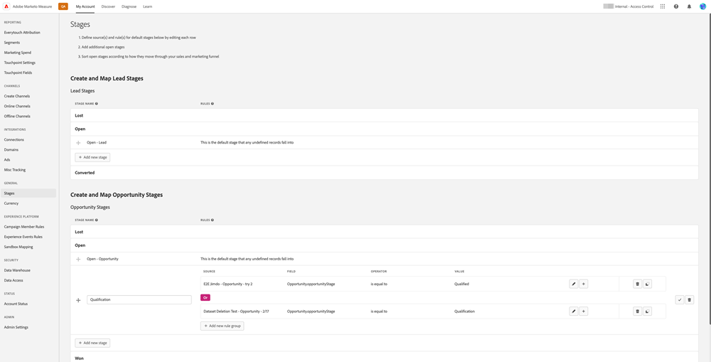

# Vue d’ensemble de [!DNL Marketo Measure] Ultimate {#marketo-measure-ultimate-overview}

[!DNL Marketo Measure] (anciennement Bizible) permet aux spécialistes du marketing d’identifier les actions marketing les plus efficaces pour générer des revenus et optimiser le retour sur investissement pour leur entreprise. [!DNL Marketo Measure] est une solution d’attribution marketing qui effectue automatiquement le suivi et la création de rapports sur les performances des canaux, ce qui vous permet d’identifier ceux qui génèrent le plus d’engagement client et d’optimiser ainsi vos dépenses.

[!DNL Marketo Measure Ultimate] inclut les fonctionnalités supplémentaires suivantes :

* Ingérez des données de presque toutes les sources de données, ainsi que de plusieurs sources de données du même type, afin d’importer toutes vos données pour l’attribution.
   * Utilisez-le avec presque tous les CRM, pas uniquement Salesforce et Dynamics.
   * Connectez plusieurs instances CRM et/ou MAP à une instance [!DNL Marketo Measure].
   * Incluez des données d’inscription et de participation à des webinaires tiers.

* Transformez vos données de manière flexible grâce aux fonctionnalités de mappage de champs et de transformation afin de garantir la bonne forme des données.

* Mettez les informations d’attribution à la disposition des applications externes par le biais de l’entrepôt de données inclus pour intégrer les informations dans votre workflow. Obtenez des données de résultats plus précises et créez des rapports basés sur l’informatique décisionnelle. L’entrepôt de données Snowflake permet notamment d’accéder à des données de résultats précises et d’utiliser n’importe quel outil d’informatique décisionnelle à des fins d’analyse et de création de rapports.

* Intégration à la plateforme RTCDP (édition B2B ou B2P), fournissant une solution d’attribution intégrée B2B pour les clients RTCDP, étant donné que RTCDP et [!DNL Marketo Measure] fonctionnent tous les deux à partir de données Adobe Experience Platform (AEP) centralisées.

Niveaux 1 à 3 **[!DNL Marketo Measure]**

**[!DNL Marketo Measure Ultimate]**

## Nouveautés de [!DNL Marketo Measure Ultimate] {#whats-new-in-marketo-measure-ultimate}

**Import de données B2B via AEP**

Les personnes spécialisées dans le marketing sont censées importer leurs données B2B (par exemple, Compte, Opportunité, Contact, Prospect, Campagne, Personne membre de campagne, Activité) via AEP. Les connexions directes au CRM et à Marketo Engage ne sont plus disponibles pour Ultimate. Les personnes spécialisées dans le marketing continueront d’importer les données de la plateforme publicitaire par le biais de connexions directes et d’effectuer le suivi des activités web par le biais du code JavaScript [!DNL Marketo Measure].

**Paramètre de devise par défaut**

[!DNL Marketo Measure Ultimate] définit la devise par défaut sur USD jusqu’à ce que l’utilisateur ou l’utilisatrice la modifie. Si vous définissez une nouvelle devise par défaut, les données sont mises à jour sans nouveau traitement. Tant que la devise sélectionnée est présente en tant que code ISO cible, il n’est pas nécessaire d’envoyer des taux de conversion.

Sandbox **[!DNL Marketo Measure Ultimate]**

L’instance [!DNL Marketo Measure Ultimate] doit être mappée à un sandbox de test AEP avant de créer le flux de données de destination [!DNL Marketo Measure] dans AEP.

>[!NOTE]
>
>Une instance de production [!DNL Marketo Measure Ultimate] doit être mappée à un sandbox de production AEP, une instance de développement [!DNL Marketo Measure Ultimate] doit être mappée à un sandbox de développement AEP.

Une fois la sélection du mappage de sandbox enregistrée, vous ne pouvez plus la modifier dans l’application. Pour le modifier, contactez l’assistance technique de [Marketo](https://nation.marketo.com/t5/support/ct-p/Support){target="_blank"}.

Les données d’une entité donnée (un compte, par exemple) provenant d’une source de données particulière ne peuvent entrer que dans un seul jeu de données. Chaque jeu de données ne peut être inclus que dans un seul flux de données. Les violations arrêtent le flux de données au moment de l’exécution.

**Mappage d’étape**

Toutes les règles [!DNL Marketo Measure Ultimate] sont spécifiques à un jeu de données. Les règles de mappage d’étapes doivent être créées pour tous les jeux de données et toutes les étapes sélectionnées.

Il existe six étapes intégrées :

* Prospect perdu
* Prospect ouvert
* Prospect converti
* Opportunité perdue
* Opportunité ouverte
* Opportunité gagnée

Les sections Perdu, Gagné et Converti n’autorisent pas les étapes personnalisées. Les données source peuvent toutefois être mappées aux étapes Perdu/Gagné/Converti intégrées en mettant à jour la règle de mappage.

Les étapes personnalisées ne peuvent être définies que pour les sections Ouvert.
Nous n’incluons plus automatiquement les étapes CRM lors du mappage d’étapes.

Quatre étapes intégrées doivent être mappées à des règles (les règles de mappage des deux autres, Prospect perdu et Prospect converti, sont facultatives) :

* Prospect ouvert
* Opportunité perdue
* Opportunité ouverte
* Opportunité gagnée

Les conditions de règle sont spécifiques à un jeu de données. Les règles de mappage d’étapes doivent être créées pour tous les jeux de données et toutes les étapes, à l’exception de Pospect perdu et de Prospect converti.

Aucune sélection pour les modèles en entonnoir, en boomerang ou personnalisé. Toutes les étapes sont sélectionnées pour les modèles en entonnoir, en boomerang et personnalisé. Le nombre d’étapes que nous prenons en charge est limité : 15 étapes personnalisées plus 6 étapes intégrées.

Les règles de points de contact des membres de campagne et les règles de points de contact d’activité sont spécifiques à un jeu de données.

Les points de contact d’attribution ne sont pas écrits dans le CRM, car Ultimate n’a pas de connexion directe au CRM.

Les services ML ABM [!DNL Marketo Measure] (mappage prospect>compte et score d’engagement prédictif) ne sont pas disponibles pour [!DNL Marketo Measure Ultimate]. Ces services sont inclus gratuitement dans l’édition B2B RT-CDP.

## Limites {#limitations}

* Les champs disponibles pour les règles de transformation des données sont limités.
* Il n’existe aucun chemin de migration pour les utilisateurs et utilisatrices de niveau 1/2/3 existants. Nécessite une nouvelle implémentation, mais nous aidons à migrer les données d’activité web suivies à partir de l’instance existante.

>[!MORELIKETHIS]
>
>* [Destination Marketo Measure Ultimate](https://experienceleague.adobe.com/docs/experience-platform/destinations/catalog/adobe/marketo-measure-ultimate.html?lang=fr){target="_blank"}
>
>* [VIDÉO : présentation de Marketo Measure Ultimate](https://experienceleague.adobe.com/fr/docs/marketo-measure-learn/tutorials/marketo-measure-ultimate/overview){target="_blank"}
