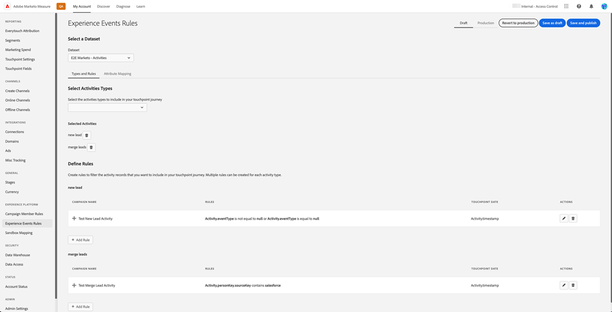

# Vue d’ensemble de [!DNL Marketo Measure] Ultimate {#marketo-measure-ultimate-overview}

[!DNL Marketo Measure] (anciennement Bizible) donne aux marketeurs un aperçu des actions marketing les plus efficaces pour générer des recettes et optimiser le retour sur investissement pour leur entreprise. [!DNL Marketo Measure] est une solution d’attribution marketing qui effectue automatiquement un suivi et des rapports sur les performances des canaux, ce qui vous permet d’identifier les canaux qui suscitent le plus d’engagement des clients et d’optimiser vos dépenses marketing en conséquence.

[!DNL Marketo Measure Ultimate] contient les fonctionnalités supplémentaires :

* Ingérez à partir de pratiquement n’importe quelle source de données ainsi que de plusieurs sources de données du même type afin d’importer toutes vos données pour l’attribution.
   * Utilisation avec presque tous les CRM, pas seulement Salesforce et Dynamics.
   * Connexion de plusieurs instances CRM et/ou de MAP à une [!DNL Marketo Measure] instance.
   * Incluez des données d’inscription et de participation à des webinaires tiers.

* Transformez vos données avec une grande flexibilité grâce aux fonctionnalités de mappage de champs et de transformation pour garantir la bonne forme des données.

* Mettez les informations d’attribution à la disposition des applications externes par le biais de l’entrepôt de données inclus pour intégrer les informations dans votre workflow. Données de résultats plus granulaires et création de rapports basés sur la BI, y compris Snowflake Data Warehouse, qui permet d’accéder à des données de résultats granulaires et d’utiliser n’importe quel outil de BI pour l’analyse et la création de rapports.

* Intégration à la plateforme RTCDP (édition B2B ou B2P), fournissant une solution d’attribution intégrée B2B pour les clients RTCDP sous la forme RTCDP et [!DNL Marketo Measure] les deux fonctionnent à partir de données Adobe Experience Platform centralisées (AEP).

**[!DNL Marketo Measure]Niveaux 1 à 3**

**[!DNL Marketo Measure Ultimate]**

## Nouveautés de [!DNL Marketo Measure Ultimate] {#whats-new-in-marketo-measure-ultimate}

**Importation de données B2B via AEP**

Les marketeurs sont censés importer leurs données B2B (par exemple, compte, opportunité, contact, prospect, campagne, membre de campagne, activité) via AEP. Les connexions CRM directes et Marketo Engage ne sont plus disponibles pour Ultimate. Les marketeurs continueront d’apporter des données Ad Platform par le biais de connexions directes et du suivi des activités web par le biais de [!DNL Marketo Measure] javascript.

**Paramètre de devise par défaut**

[!DNL Marketo Measure Ultimate] définit la devise par défaut sur USD jusqu’à ce que l’utilisateur la modifie. Si vous définissez une nouvelle devise par défaut, les données seront mises à jour sans retraitement. Tant que la devise sélectionnée est présente en tant que code ISO cible, il n’est pas nécessaire d’envoyer des taux de conversion.

**[!DNL Marketo Measure Ultimate]Instance Sandbox**

[!DNL Marketo Measure Ultimate] doit être mappée à un environnement de test AEP avant de créer la variable [!DNL Marketo Measure] flux de données de destination dans AEP.

>[!NOTE]
>
>A [!DNL Marketo Measure Ultimate] l’instance de production doit être mappée à un environnement de test de production AEP, un [!DNL Marketo Measure Ultimate] L’instance de développeurs doit être mappée à un environnement de test de développeurs AEP.

Une fois la sélection du mappage de l’environnement de test enregistrée, vous ne pouvez pas la modifier dans l’application pour le moment. Pour le modifier, veuillez contacter [Prise en charge de Marketo](https://nation.marketo.com/t5/support/ct-p/Support){target="_blank"}.

Les données d’une entité donnée (un compte, par exemple) provenant d’une source de données donnée ne peuvent entrer que dans un seul jeu de données. Chaque jeu de données ne peut être inclus que dans un seul flux de données. Les violations arrêtent le flux de données au moment de l’exécution.

**Mappage d’étape**

Tous [!DNL Marketo Measure Ultimate] les règles sont spécifiques à un jeu de données. Les règles de mappage des environnements intermédiaires doivent être créées pour tous les jeux de données et toutes les étapes sélectionnées.

Il existe six étapes intégrées :

* Perte de piste
* Ouverture de piste
* Plomb converti
* Opportunité perdue
* Ouverture d’opportunité
* Opportunité confirmée

Les sections Perdu, Gagnant et Converti n’autorisent pas les étapes personnalisées. Les données source peuvent toutefois être mappées aux étapes Lost/Won/Converted intégrées en mettant à jour la règle de mappage.

Les étapes personnalisées ne peuvent être définies que pour les sections Ouvrir .
Nous n’incluons plus automatiquement les étapes CRM lors du mapping intermédiaire.

Quatre étapes intégrées doivent être mises en correspondance avec des règles (les règles de mappage des deux autres, Lead Lost et Lead Converted, sont facultatives) :

* Ouverture de piste
* Opportunité perdue
* Ouverture d’opportunité
* Opportunité confirmée

Les conditions de règle sont spécifiques à un jeu de données. Les règles de mappage des environnements intermédiaires doivent être créées pour tous les jeux de données et toutes les étapes, à l’exception de la perte de piste et de la conversion de pistes.

Aucune sélection pour l’entonnoir ou le modèle personnalisé. Toutes les étapes sont sélectionnées pour l’entonnoir, le boomerang et le modèle personnalisé. Le nombre d’étapes que nous prenons en charge est limité : 15 scènes personnalisées plus 6 scènes intégrées.

Les règles de points de contact des membres de campagne et les règles de points de contact d’activité sont spécifiques à un jeu de données.

Les points de contact d’attribution ne sont pas écrits dans le CRM, car Ultimate n’a pas de connexion CRM directe.

[!DNL Marketo Measure] Les services ML ABM (correspondance de piste vers compte et note d’engagement prédictif) ne sont pas disponibles pour [!DNL Marketo Measure Ultimate]. Ces services sont inclus gratuitement dans l’édition B2B RT-CDP.

## Limites {#limitations}

* Actuellement, des champs limités sont disponibles pour les règles de transformation des données.
* Il n’existe aucun chemin de migration pour les utilisateurs de niveau 1/2/3 existants. Nécessite une nouvelle mise en oeuvre, mais nous aiderons à migrer les données d’activité web trackées à partir de l’instance existante.

>[!MORELIKETHIS]
>
>[Destination Marketo Measure Ultimate](https://experienceleague.adobe.com/docs/experience-platform/destinations/catalog/adobe/marketo-measure-ultimate.html?lang=en){target="_blank"}
