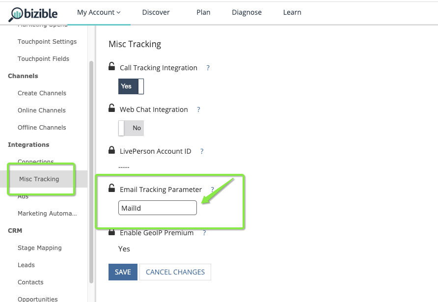

# Paramètre de suivi des e-mails {#email-tracking-parameter}

Le paramètre de suivi des courriers électroniques [!DNL Marketo Measure] permet aux marketeurs de traiter les clics par courrier électronique comme des envois de formulaire, de sorte que des points de contact soient générés pour ces actions. Sans utiliser de paramètre de suivi d’email, les clics publicitaires provenant d’un email ne sont traités comme des &quot;visites web&quot; que lorsque l’utilisateur interagit réellement avec le site par le biais d’un envoi de formulaire ou d’une discussion web.

## Cas d’utilisation  {#use-cases}

**Enregistrement de webinaire** : l’équipe marketing envoie une invitation par courrier électronique avec un seul bouton pour s’inscrire à un webinaire. Comme le courrier électronique contient déjà les informations de la personne, le simple clic les enregistre automatiquement. La page d’entrée contient le paramètre de suivi des courriers électroniques. Ainsi, lorsqu’ils cliquent et arrivent sur la page de confirmation, [!DNL Marketo Measure] peut capturer l’adresse électronique et traiter le clic publicitaire comme un remplissage de formulaire, ce qui génère un point de contact.

**Téléchargement de contenu** : l’équipe de marketing de contenu souhaite promouvoir un livre électronique récent qu’elle a publié avec un lien de téléchargement direct d’un courrier électronique. Une fois le modèle d’email créé, la page de confirmation des téléchargements contient le paramètre de suivi des emails afin que, lorsqu’ils cliquent dessus, [!DNL Marketo Measure] puisse capturer l’adresse email. Sans avoir à remplir un formulaire sur le site, [!DNL Marketo Measure] peut générer un point de contact pour le téléchargement du contenu. En effet, le courrier électronique les a envoyés sur la page de confirmation avec le paramètre de suivi de courrier électronique.

## Fonctionnement {#how-it-works}

Lorsqu’un visiteur arrive sur votre site, [!DNL Marketo Measure] s’attend à trouver une page d’entrée avec une adresse électronique ou un identifiant [!DNL Salesforce] afin que nous puissions associer cette visite à un &quot;envoi de formulaire&quot; et générer un point de contact pour cette activité.

En tant que client, vous créez un modèle d’email comme vous le feriez normalement. Une fois qu’il est temps d’ajouter dans la page d’entrée l’action dont vous souhaitez effectuer le suivi, vous devez déterminer le jeton, la balise de variable ou la macro que votre plateforme d’automatisation marketing accepte pour afficher dynamiquement la valeur de chaque individu.

Marketo Measure accepte les valeurs suivantes : Email Address, Salesforce Lead Id ou Salesforce Contact Id.

## Exemples de balises {#tag-examples}

<table> 
 <colgroup> 
  <col> 
  <col> 
  <col> 
  <col> 
 </colgroup> 
 <tbody> 
  <tr> 
   <th>
Automatisation du marketing
</th> 
   <th>
Jeton/Balise/Macro 
</th> 
   <th>
Exemple
</th> 
   <th>
Matériel de support
</th> 
  </tr> 
  <tr> 
   <td>
Marketo
</td> 
   <td>
&lbrace;{lead.Email Address} 
</td> 
   <td>
https://engage.marketo.com/rs/460-TDH-945/images/BZ-B2B-Marketing-Attribution-101-ebook.pdf?mailId={{lead.EmailAddress}}
</td> 
   <td>
https://experienceleague.adobe.com/docs/marketo/using/product-docs/demand-generation/landing-pages/personalizing-landing-pages/tokens-overview.html?lang=fr
</td> 
  </tr> 
  <tr> 
   <td>
Pardot
</td> 
   <td>
%%email% 

ou

%%user_crm_id%%
</td> 
   <td>
https://engage.marketo.com/rs/460-TDH-945/images/BZ-B2B-Marketing-Attribution-101-ebook.pdf?mailId=%%email%%
</td> 
   <td>
https://help.salesforce.com/s/articleView?language=en_US&amp;id=pardot_variable_tags_reference.htm&amp;type=5
</td> 
  </tr> 
  <tr> 
   <td>
Hubspot
</td> 
   <td>
(inséré via l’éditeur)
</td> 
   <td>
s/o
</td> 
   <td>
https://knowledge.hubspot.com/website-pages/personalize-your-content
</td> 
  </tr> 
  <tr> 
   <td>
Activation
</td> 
   <td>
(inséré via le compositeur de message)
</td> 
   <td>
s/o
</td> 
   <td>
https://connect.act-on.com/hc/en-us/articles/360033436074-How-to-Personalize-Email-Content-with-CRM-Data
</td> 
  </tr> 
 </tbody> 
</table>

Enfin, dans [!DNL Marketo Measure], vous devez spécifier le paramètre de suivi afin que [!DNL Marketo Measure] puisse localiser la valeur d’adresse électronique ou d’identifiant. La valeur par défaut est &quot;mailId&quot;, comme illustré dans les exemples ci-dessus et dans la capture d’écran ci-dessous. Saisissez la valeur dans vos Paramètres dans [!DNL Marketo Measure], puis cliquez sur **[!UICONTROL Enregistrer]**.

