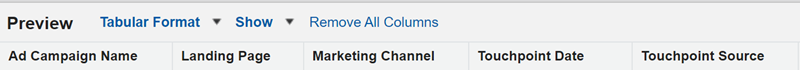

# Notes de mise à jour : 2023 {#release-notes-2023}

Vous trouverez ci-dessous toutes les nouvelles fonctionnalités et fonctionnalités mises à jour pour nos versions 2023.

## Version du 4e trimestre {#q4-release}

**Tableau de bord Trafic web**

Le nouveau [Tableau de bord Trafic web](/help/marketo-measure-discover-ui/dashboards/web-traffic-dashboard.md){target="_blank"} est désormais accessible à l’ensemble de la clientèle. Ce tableau de bord offre une vue d’ensemble complète des interactions des visiteurs et visiteuses de votre site Web. Vous pouvez analyser des mesures telles que le nombre de visiteurs et visiteuses uniques par URL, les visites globales, les pages vues et les envois de formulaire à partir d’URL ou de pages de destination de formulaire spécifiques. Vous pouvez également suivre les tendances mensuelles du trafic et identifier les médias achetés hautement performants, ce qui vous aidera à affiner vos stratégies pour une génération optimale de revenu.

Ce nouvel ensemble de tableaux de bord préconfigurés devrait être introduit par étapes avant la fin de l’année.

>[!NOTE]
>
>En mars 2024, les tableaux de bord actuels deviendront obsolètes. Pour assurer une transition fluide, vous pouvez utiliser les deux versions jusqu’à cette date.

**Suppression des données d’adresse IP**

Nous supprimons les données d’adresse IP de notre stockage à long terme pour garantir la conformité de la confidentialité des données. Actuellement, les tableaux et vues de Snowflake suivants contiennent des adresses IP. Nous prévoyons de supprimer ces données et d’ajouter de nouvelles informations de géolocalisation :

<table style="width:400px">
<thead>
  <tr>
    <th style="width:50%">Tableaux</th>
    <th>Vues</th>
  </tr>
</thead>
<tbody>
  <tr>
    <td>CUSTOMER_AB_TESTS</td>
    <td>BIZ_CUSTOMER_AB_TESTS</td>
  </tr>
  <tr>
    <td>CUSTOMER_EVENTS</td>
    <td>BIZ_CUSTOMER_EVENTS</td>
  </tr>
  <tr>
    <td>FORM_SUBMITS</td>
    <td>BIZ_FORM_SUBMITS</td>
  </tr>
  <tr>
    <td>IMPRESSIONS</td>
    <td>BIZ_IMPRESSIONS</td>
  </tr>
  <tr>
    <td>PAGE_VIEWS</td>
    <td>BIZ_PAGE_VIEWS</td>
  </tr>
  <tr>
    <td>SESSIONS</td>
    <td>BIZ_SESSIONS</td>
  </tr>
  <tr>
    <td>WEB_HOST_MAPPINGS</td>
    <td>BIZ_WEB_HOST_MAPPINGS</td>
  </tr>
</tbody>
</table>

* Désormais, nous téléchargerons Code de pays, Nom de ville et Code de région au lieu du Nom de pays, Nom de ville et Nom de région.
* Lors du traitement de toutes les activités web historiques, des incohérences peuvent survenir dans les informations de localisation entre les enregistrements. Ces incohérences peuvent inclure la présence d’adresses IP sans détails de géolocalisation, des informations de géolocalisation mises à jour sans adresses IP ou un mélange de noms et de codes de pays ou de région.
* _**Cette période de données mixte devrait se dérouler du 04/01/2023 au 29/02/2023.**_

**Données des titres de page dans la table des URL**

La table des URL de l’[entrepôt de données](/help/marketo-measure-data-warehouse/data-warehouse-schema.md){target="_blank"} inclut désormais un champ de titre de page, en plus des tables de données web.

Veuillez noter que le titre de la page dans la table des URL ne correspond pas toujours au titre de la page dans d’autres tables web. La table des URL comporte le titre de page le plus récent. Si le titre de l’URL a été modifié après l’activité web, il ne correspondra pas à ce qui se trouve dans la table des URL.

**Refonte du tableau de bord de Discover**

Bientôt disponibles pour tous les utilisateurs et toutes les utilisatrices de Marketo Measure, les tableaux de bord in-app font peau neuve et offrent plus de convivialité et d’efficacité. Nous introduisons également de nouvelles mesures, telles que le « Retour sur investissement réalisé », qui prend en compte le délai type entre les investissements marketing et les achats dans les stratégies B2B clé-en-main.

Ces nouveaux tableaux de bord intégrés seront progressivement déployés à partir de la première semaine d’octobre jusqu’à la fin de l’année. Ils seront automatiquement déployés sur vos instances et afficheront des informations sur les produits et des liens vers la documentation.

* [Nouveau guide du tableau de bord Discover](/help/marketo-measure-discover-ui/dashboards/new-discover-dashboard-guide.md){target="_blank"}
* [Bases du tableau de bord Discover](/help/marketo-measure-discover-ui/dashboards/discover-dashboard-basics.md){target="_blank"}
* [Tableau de bord Vue d’ensemble des revenus](/help/marketo-measure-discover-ui/dashboards/revenue-overview-dashboard.md){target="_blank"}
* [Tableau de bord Revenus affectés](/help/marketo-measure-discover-ui/dashboards/attributed-revenue-dashboard.md){target="_blank"}
* [Tableau de bord Retour sur investissement](/help/marketo-measure-discover-ui/dashboards/roi-dashboard.md){target="_blank"}
* [Tableau de bord Passeport](/help/marketo-measure-discover-ui/dashboards/passport-dashboard.md){target="_blank"}

>[!NOTE]
>
>En mars 2024, les tableaux de bord actuels deviendront obsolètes. Pour assurer une transition fluide, vous pouvez utiliser les deux versions jusqu’à cette date.

### Obsolescence {#deprecations}

#### Dépréciations des champs Salesforce

Nous supprimerons progressivement nos tâches d’export pour les objets Prospect/contact afin de simplifier notre intégration et d’éliminer la nécessité d’exporter vers des objets standard Salesforce. Les champs dénormalisés répertoriés ci-dessous seront également obsolètes, car les clientes et clients peuvent obtenir les mêmes données de leurs objets Touchpoint. _**Le calendrier d’obsolescence est fixé à juin 2024.**_

<table style="width:350px">
<tbody>
  <tr>
    <td>bizible2__Ad_Campaign_Name_FT__c</td>
  </tr>
  <tr>
    <td>bizible2__Ad_Campaign_Name_LC__c</td>
  </tr>
  <tr>
    <td>bizible2__Landing_Page_FT__c</td>
  </tr>
  <tr>
    <td>bizible2__Landing_Page_LC__c</td>
  </tr>
  <tr>
    <td>bizible2__Touchpoint_Date_FT__c</td>
  </tr>
  <tr>
    <td>bizible2__Touchpoint_Date_LC__c</td>
  </tr>
  <tr>
    <td>bizible2__Touchpoint_Source_FT__c</td>
  </tr>
  <tr>
    <td>bizible2__Touchpoint_Source_LC__c</td>
  </tr>
  <tr>
    <td>bizible2__Marketing_Channel_FT__c</td>
  </tr>
  <tr>
    <td>bizible2__Marketing_Channel_LC__c</td>
  </tr>
</tbody>
</table>

Les champs qui contiennent les mêmes informations sur les objets Touchpoint et Attribution Touchpoints sont les suivants :

* bizible2__Ad_Campaign_Name__c
* bizible2__Landing_Page__c
* bizible2__Marketing_Channel__c
* bizible2__Touchpoint_Date__c
* bizible2__Touchpoint_Source__c

**Actions requises**

* Créez de nouveaux types de rapports pour les prospects et les contacts avec ou sans Touchpoints.

* Créez des rapports pour capturer la fonctionnalité de tout rapport existant qui utilise les champs supprimés. Dans le cadre de ce processus, vous pouvez modifier les champs du rapport, comme indiqué ci-dessous :

   * Supprimer les champs Prospect/Contact FT/LC :

* Ajouter des champs Touchpoint :

* Le filtre Position de Touchpoint et les filtres qui utilisent les champs FT/LC, y compris le champ Date, doivent être mis à jour comme suit :

* Supprimez les rapports préexistants qui utilisaient les champs supprimés de l’objet Prospect/Contact pour ne plus référencer ces champs.

#### Package Dynamics connexe

* Pour rester connecté à Dynamics, installez notre dernière version de package (6.12). Les anciennes versions `(<v6.12)` ne seront plus prise en charge. Cette mise à jour optimise la création d’enregistrements historiques afin de réduire l’utilisation du stockage.

* La méthode OAuth par jeton d’actualisation a fait son temps et devient obsolète. Consultez ce [ce guide](/help/marketo-measure-and-dynamics/getting-started-with-marketo-measure-and-dynamics/oauth-with-azure-active-directory-for-dynamics-crm.md){target="_blank"} pour mettre à jour vos informations d’identification afin de respecter les bonnes pratiques de Microsoft concernant l’utilisation de ClientSecret.

#### Champ « custom_properties »

Dans notre entrepôt de données, le champ « custom_properties » sert de stockage pour les points de données supplémentaires non couverts par notre schéma fixe. L’utilisation de ce champ, stocké au format JSON, est limitée et son intégration aux requêtes SQL peut s’avérer compliquée et nuire aux performances. Nous avons donc décidé de rendre ce champ obsolète. Ce changement aura une incidence sur la couche de traitement de données dans notre stockage Table Azure et les données exportées vers notre entrepôt de données.

### Que va-t-il se passer ? {#q4-whats-coming}

**Création de rapports personnalisés in-app**

Pour la première fois, les clients et clientes Marketo Measure pourront créer et enregistrer leurs propres rapports directement dans l’application. Cette fonctionnalité sera déployée après la publication des tableaux de bord intégrés début 2024.

 

## Version du 2e trimestre {#q2-release}

* **Consolidation des packages Salesforce**

Nous fusionnons tous les packages Salesforce en un seul package complet, pour une meilleure expérience utilisateur et une utilisation simplifiée. Les packages V1, V2_EXT et Reporting seront abandonnés au trimestre prochain. Le nouveau package combine toutes les fonctionnalités précédentes, pour un suivi plus efficace et des informations plus approfondies sur les clients et les clientes.

Les personnes qui disposent déjà du package V2 doivent le mettre à jour vers la nouvelle version consolidée.

Nous avons ajouté deux nouveaux champs qui vous aideront à améliorer vos capacités de reporting :

* form_name : désormais disponible dans les objets BT/BAT, ce champ permet aux utilisateurs et utilisatrices de créer des rapports en fonction des noms de formulaire.
* user_touchpoint_id : ce champ permet aux utilisateurs et utilisatrices de créer des rapports avec des nombres de points de contact utilisateur uniques.

[Cet article](/help/configuration-and-setup/marketo-measure-and-salesforce/salesforce-package-consolidation.md){target="_blank"} comprend des guides sur la recréation de rapports et de tableaux de bord à partir des packages de création de rapports hérités.

* **Mises à jour des versions d’API Salesforce**

Toutes les versions d’API Salesforce des classes Apex, y compris la classe UserActivityContext, sont mises à jour vers les versions prises en charge. (31.0 à 57.0)

* **Nouvelle installation du package**

Le nouveau lien d’installation consolidé du package [peut être consulté ici](https://login.salesforce.com/packaging/installPackage.apexp?p0=04t1P000000VY6Z){target="_blank"}

### Que va-t-il se passer ? {#q2-whats-coming}

**Modifications du stockage des adresses IP**

Nous ne stockerons plus d’adresses IP dans notre système conformément aux considérations en matière de confidentialité. Nous continuerons à identifier et stocker l’emplacement géographique de l’adresse IP, mais le format changera (par exemple, États-Unis en US).
