# Modèle de rapport [!DNL Marketo Measure] - Tableau {#marketo-measure-report-template-tableau}

## Prise en main {#getting-started}

Vous pouvez accéder au modèle de rapport [!DNL Tableau] [ici](https://github.com/adobe/Marketo-Measure-BI-Templates){target="_blank"}.

Ouvrez le fichier Classeur de Tableau du modèle de création de rapports [!DNL Adobe Marketo Measure].

Vous devez mettre à jour les données de connexion existantes avec vos informations de connexion Snowflake spécifiques. Cliquez sur le bouton [!UICONTROL Modifier la connexion] et suivez les étapes décrites dans la section [[!UICONTROL Connexion des données]](#data-connection) de cette documentation.

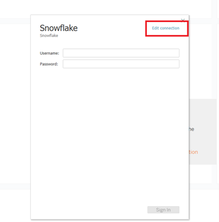

## Connexion des données {#data-connection}

Vous devez configurer une connexion de données à votre instance Snowflake. Pour ce faire, vous avez besoin du nom du serveur ainsi que de votre nom d’utilisateur ou d’utilisatrice et de votre mot de passe. En cas de besoin, vous trouverez [ici](/help/data-warehouse-access-reader-account.md){target="_blank"} comment accéder à ces informaions et réinitialiser votre mot de passe.

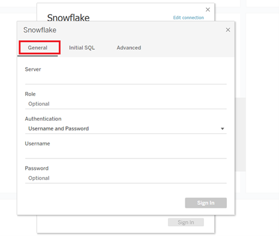

Vous devez également saisir une commande SQL initiale. Les requêtes personnalisées sont prises en charge dans ce modèle de données. La commande à saisir est « Utiliser le schéma `<your schema name>` ». Le nom de votre schéma figure sur la page [!UICONTROL connexions à l’entrepôt de données] (voir la documentation référencée ci-dessus).

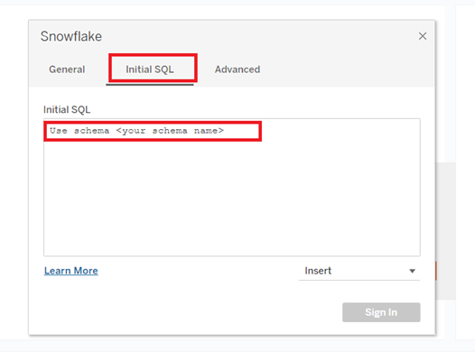

### Requêtes SQL personnalisées {#custom-sql-queries}

Parce que [!DNL Tableau] applique des filtres de source de données à la requête globale, et non au tableau individuel sur laquelle le filtre est défini, nous avons choisi d’utiliser des requêtes SQL personnalisées pour chaque tableau du modèle. Cela permet au modèle de filtrer les lignes supprimées et en double au niveau de la table. Par exemple, lorsqu’il est appliqué en tant que filtre de source de données, session_deleted_date est null et est ajouté à la clause where de la requête, ce qui entraîne la requête suivante.

**Filtres ajoutés à la source de données**

```sql
--A deleted session removes this row completely and the touchpoint data is lost. Select *
   From Touchpoint    tp
      join Session sn
      on tp.session_id = sn.session_id
 Where tp._deleted_date is null
    and sn._deleted_date is null
```

Cependant, cette erreur est due au fait que si une session a été supprimée, mais que le point de contact correspondant n’est pas supprimé, les données du point de contact sont supprimées du jeu de données. Nous voulons que les données de point de contact soient présentes dans le jeu de données, car le point de contact n’a pas été supprimé. L’ajout de requêtes SQL personnalisées garantit que les critères de filtre sont appliqués au niveau du tableau, ce qui entraîne la requête suivante.

**Filtres appliqués via des requêtes SQL personnalisées**

```sql
--A deleted session only removes the session related data, and the touchpoint data is preserved. Select *
   From Touchpoint       tp
      join Session sn
      on tp.session_id          = sn.session_id
      and sn._deleted_date      is null
  Where tp._deleted_date is null
```

## Transformations des données {#data-transformations}

Quelques transformations ont été appliquées aux données dans [!DNL Tableau] depuis son état d’origine dans Snowflake. La plupart de ces transformations sont appliquées dans les requêtes SQL personnalisées qui génèrent les tableaux dans le modèle [!DNL Tableau]. Pour afficher la requête SQL personnalisée utilisée pour générer un tableau, cliquez avec le bouton droit sur le nom du tableau et sélectionnez « Modifier la requête SQL personnalisée ». Certaines des transformations spécifiques sont décrites ci-dessous.

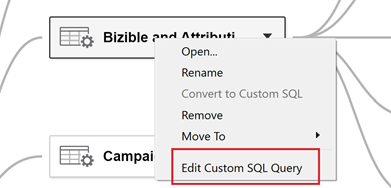

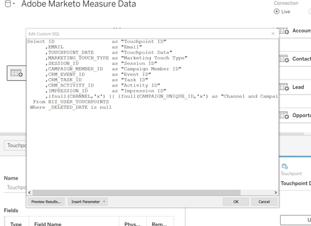

### Colonnes supprimées {#removed-columns}

Pour simplifier le modèle de données et supprimer les données redondantes et inutiles, nous avons réduit le nombre de colonnes importées dans Tableau à partir du tableau Snowflake d’origine. Les colonnes supprimées incluent les clés étrangères inutiles, les données dimensionnelles dénormalisées mieux exploitées par le biais de relations avec d’autres tableaux dans le modèle, les colonnes d’audit et les champs utilisés pour le traitement [!DNL Marketo Measure] interne. Vous pouvez ajouter ou supprimer des colonnes selon les besoins de votre entreprise en modifiant la liste des colonnes importées dans la section Sélectionner de la requête SQL personnalisée.

>[!NOTE]
>
>La plupart des tableaux de l’entrepôt de données contiennent des données dimensionnelles dénormalisées. Nous avons œuvré à normaliser et nettoyer le modèle dans [!DNL Tableau] autant que possible pour améliorer les performances et la précision des données. Faites preuve de prudence lorsque vous incluez des champs dénormalisés supplémentaires dans les tableaux de faits, cela peut rompre le filtrage dimensionnel dans les tableaux et générer des rapports inexacts.

### Colonnes renommées {#renamed-columns}

Les tableaux et les colonnes ont été renommés afin de les rendre plus conviviaux et de normaliser les conventions de nommage. Pour afficher les modifications de nom de colonne, consultez les instructions SQL personnalisées qui créent les tables.

### Lignes ajoutées {#rows-added}

Pour ajouter des fonctionnalités de conversion de devises aux calculs dans le modèle, nous avons ajouté un taux de conversion d’entreprise et une colonne de taux de conversion cible aux tableaux Opportunité et Coût. La valeur de ces colonnes est ajoutée au niveau de la ligne et évaluée en effectuant une jointure avec la table Conversion Rate sur la date et l’ID de devise. Comme Tableau ne permet pas aux tableaux de faits de partager plusieurs tableaux de dimensions, les taux de conversion ont été ajoutés directement aux tableaux qui les utilisent. Pour plus d’informations sur le fonctionnement de la conversion de devises dans ce modèle, consultez la section [Conversion de devises](#currency-conversion) dans cette documentation.

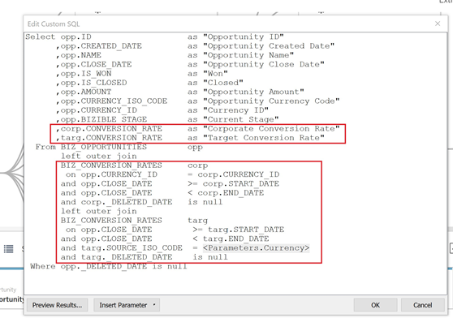

Il y a quelques endroits où deux tableaux de [!DNL Snowflake] ont été combinés avec une union pour créer un tableau dans le modèle de données [!DNL Tableau]. Dans ces cas, une colonne « Type » a été ajoutée pour indiquer de quel tableau [!DNL Snowflake] elle provient et désigner l’entité que la ligne représente. Pour plus d’informations sur les tables qui ont été combinées, consultez la section « Relation et flux de données » de cette documentation.&#x200B;

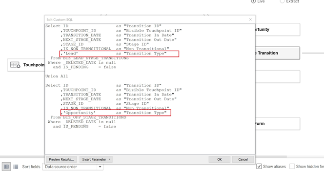

### Noms de segments {#segment-names}

Les noms de segments pouvant être personnalisés, ils comportent des noms de colonne génériques dans l’entrepôt de données Snowflake. [!DNL BIZ_SEGMENT_NAMES] est un tableau de mappage qui répertorie le nom du segment générique avec le nom du segment personnalisé auquel il est mappé, tel que défini dans la section du segment dans l’interface utilisateur [!DNL Marketo Measure]. Si vous utilisez des noms de segment personnalisés et souhaitez mettre à jour votre modèle [!DNL Tableau] pour les incorporer, utilisez ce tableau et renommez manuellement les colonnes du modèle Tableau. Les colonnes de segments se trouvent dans les tables Lead Touchpoint et Attribution Touchpoint. Elles ne devront être renommées qu’une seule fois.

La colonne [!UICONTROL CATÉGORIE] répertorie le numéro de catégorie et la colonne SEGMENT_NAME possède le nom de segment personnalisé auquel elle est mappée.

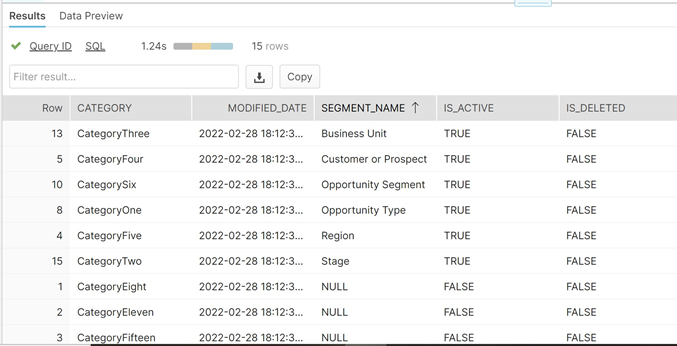

Les noms peuvent être mis à jour de deux manières. La première option consiste à mettre à jour le code SQL personnalisé. Dans cet exemple, les catégories 1 à 6 ont été renommées en fonction du mappage issu du tableau Noms de segments.

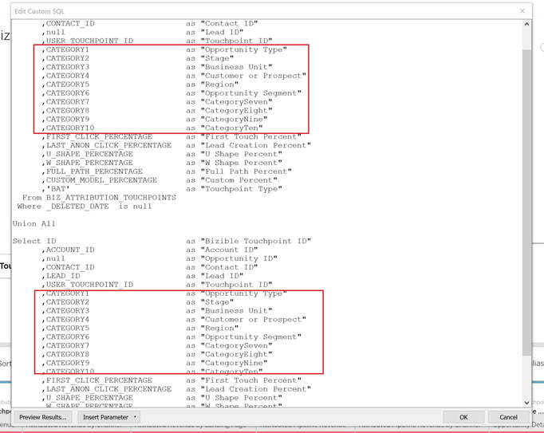

L’autre option consiste à renommer les colonnes directement dans le tableau [!DNL Tableau].

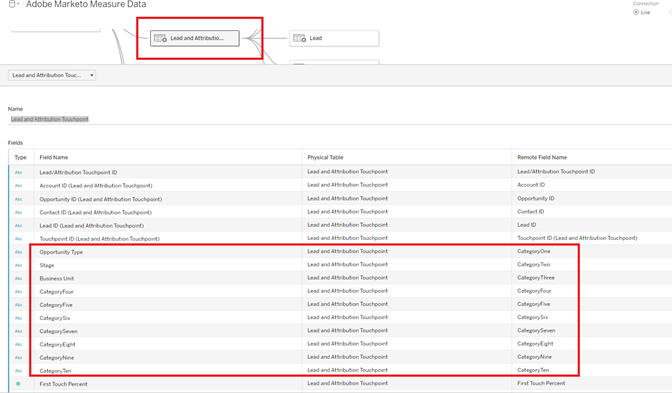

## Modèle de données {#data-model}

Cliquez sur l’image ci-dessous pour afficher la version agrandie.

[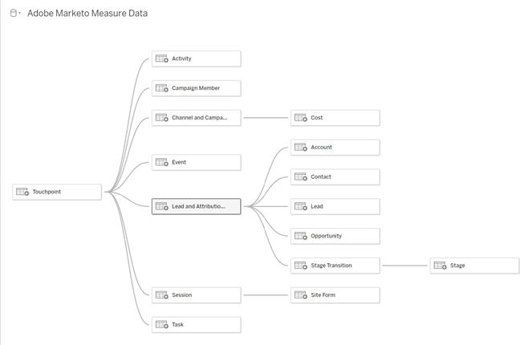](assets/tableau-model-1.png){target="_blank"}

### Relations et flux de données {#relationships-and-data-flow}

Les données d’événement, utilisées pour créer des points de contact, sont stockées dans les tableaux [!UICONTROL Session], [!UICONTROL Tâche], [!UICONTROL Événement], [!UICONTROL Activité], et [!UICONTROL Membre de la campagne]. Ces tables d’événements se joignent à la table Touchpoint via leurs ID respectifs. Si l’événement a donné lieu à un point de contact, les détails sont stockés dans la table Touchpoint.

Dans ce modèle, les tables Lead Touchpoint et Attribution Touchpoint sont regroupées en une seule table, avec un lien vers la table Touchpoint. La colonne « Touchpoint Type » (Type de point de contact) a été ajoutée pour indiquer si une ligne correspond à un point de contact de type Lead ou Attribution. La plupart des données dimensionnelles des points de contact de Lead et Attribution proviennent de leur lien avec le point de contact correspondant.

Les transitions d’étape d’opportunité et les transitions d’étape de prospect sont combinées en un tableau dans ce modèle, avec un lien vers le tableau de points de contact [!UICONTROL Prospect et attribution]. La colonne « Transition Type » (Type de transition) a été ajoutée pour indiquer si une ligne est une transition d’étape de type Opportunité ou Lead.

Les données Coût et Point de contact partagent les dimensions Canal et Campagne. Cependant, Tableau est limité dans sa capacité à modéliser des dimensions partagées entre des tableaux de faits. Puisque la limite est définie à un seul tableau de dimension partagé, les données Canal et Campagne ont été combinées en un seul tableau. Elles sont combinées en une seule table dans Tableau en effectuant une jointure croisée entre les deux dimensions : Channel et Campaign. L’ID unique est créé en concaténant les ID de canal et de campagne. Cette même valeur d’ID est ajoutée aux tableaux Point de contact et Coût pour créer une relation avec ce tableau de dimension combiné.

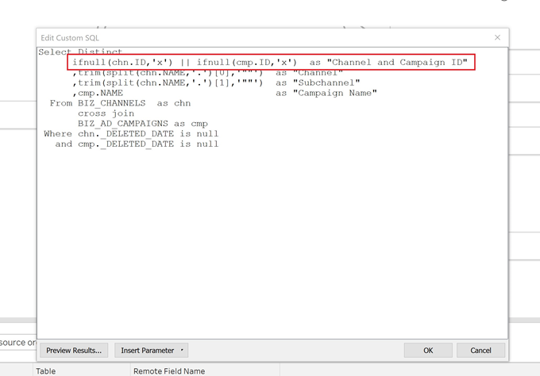

Dans ce modèle, les dimensions Campagne et Canal sont liées au point de contact. Par conséquent, tous les rapports sur ces dimensions passent par ce lien, ce qui signifie que les rapports dimensionnels sur les données d’évènement peuvent être incomplets.&#x200B; En effet, de nombreux événements ne comportent de liens vers ces dimensions qu’après leur traitement dans les points de contact.

>[!NOTE]
>
>Certains événements, tels que les sessions, comportent des liens directs vers les dimensions Campagne et Canal. Si vous souhaitez créer des rapports au niveau de la session sur ces dimensions, il est recommandé de créer un modèle de données distinct.

Les données de coût sont stockées à différents niveaux d’agrégation dans le tableau Coût de l’entrepôt de données Snowflake. Pour tous les fournisseurs d’annonces publicitaires, les données au niveau de la campagne peuvent être cumulées au niveau du canal. Ce modèle extrait ainsi les données de coût en fonction de l’indicateur « campaign_is_aggregatable_cost ». Les coûts déclarés manuellement peuvent être envoyés uniquement au niveau du canal et ne requièrent pas obligatoirement de données de campagne. Pour fournir un rapport de coûts le plus précis possible, les coûts auto-déclarés sont extraits en fonction de l’indicateur « channel_is_aggregatable_cost ». La requête qui importe les données de coût est écrite avec la logique suivante : si ad_provider = « SelfReported » alors channel_is_aggregatable_cost = true, sinon campaign_is_aggregatable_cost = true.

Dans le contexte de ce modèle, les données Prospect, [!UICONTROL Contact], [!UICONTROL Compte], et [!UICONTROL Opportunité] sont considérées comme des données dimensionnelles et sont jointes directement au tableau Point de contact de prospect et d’attribution.

### Conversion de devise {#currency-conversion}

Les taux dans le tableau Taux de conversion représentent la valeur nécessaire pour convertir un montant à partir de la devise de l’entreprise. Les conversions vers n’importe quelle devise nécessitent une double conversion, d’abord de la devise d’origine vers la devise de l’entreprise, puis de la devise de l’entreprise vers la devise sélectionnée. La première étape de cette chaîne au sein du modèle consiste à ajouter deux colonnes contenant ces taux de conversion aux tables qui contiennent des montants, à savoir Opportunity et Cost. Ces étapes sont détaillées dans la section Lignes ajoutées de ce document. Étant donné que les taux de conversion ne doivent pas être statiques et peuvent varier selon des périodes spécifiées, tous les calculs de conversion de devise doivent être effectués au niveau de la ligne. La conversion de la devise d’origine vers la devise de l’entreprise consiste à diviser la valeur par le taux de conversion de l’entreprise, puis à la multiplier par le taux de conversion cible. Le taux de conversion cible est déterminé par la valeur du paramètre de devise sélectionné.

* Convertir la valeur d’origine en valeur de devise de l’entreprise/taux de conversion de l’entreprise = valeur en devise de l’entreprise
* Convertir la valeur de la devise de l’entreprise en valeur de devise sélectionnée dans la devise de l’entreprise `*` taux de conversion de la devise sélectionnée = valeur dans la devise sélectionnée

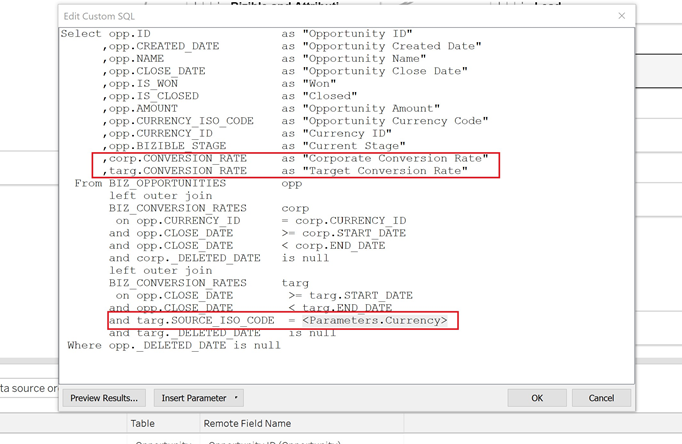

Les mesures de conversion de devise de ce modèle remplacent le taux par une valeur de 1,0 si aucun taux de conversion ne peut être identifié. Des mesures distinctes ont été créées pour afficher la valeur de la devise pour la mesure et alerter si un calcul comprend plusieurs valeurs de devise (c’est-à-dire qu’une valeur n’a pas pu être convertie dans la devise sélectionnée). Ces mesures, Cost Currency et Revenue Currency, sont incluses sous la forme d’infobulles dans n’importe quel visuel qui affiche des données de coûts ou de revenus.&#x200B;

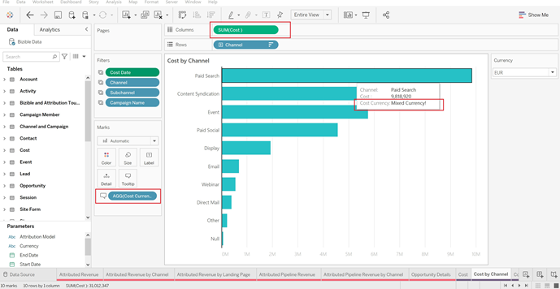

## Définitions des données {#data-definitions}

Des définitions ont été ajoutées au [!DNL Tableau model] pour les paramètres, les colonnes personnalisées et les mesures.

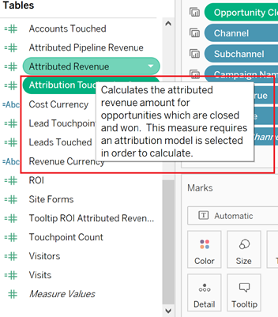

Pour afficher les définitions des colonnes provenant directement de [!DNL Snowflake], reportez-vous à la [documentation de l’entrepôt de données](/help/data-warehouse-schema.md){target="_blank"}.

## Incohérences entre les modèles et Discover {#discrepancies-between-templates-and-discover}

### Revenu attribué {#attributed-revenue}

Les enregistrements Lead Touchpoint et Attribution Touchpoint héritent des données dimensionnelles de l’enregistrement Touchpoint d’origine. Le modèle de reporting extrait toutes les données dimensionnelles héritées de la relation avec la table Touchpoint, tandis que dans le modèle Discover, les données dimensionnelles sont dénormalisées au niveau des enregistrements Lead Touchpoint et Attribution Touchpoint. Les valeurs de revenu totales attribuées ou de revenu de pipeline attribuées doivent correspondre entre les deux rapports. Cependant, des incohérences peuvent se produire lorsque le revenu est divisé ou filtré par données dimensionnelles (canal, sous-canal ou campagne). Si les revenus dimensionnels ne correspondent pas entre le modèle et Discover, il est probable qu’il manque des enregistrements de point de contact dans le jeu de données du rapport de modèle. Cela se produit lorsqu’il existe un enregistrement Lead ou Attribution Touchpoint, mais qu’il n’y a aucun enregistrement correspondant dans la table Touchpoint du jeu de données importé dans le rapport. Comme ces tableaux sont filtrés par date de modification, il est possible que l’enregistrement Point de contact de prospect/d’attribution ait été modifié plus récemment que l’enregistrement Point de contact. Par conséquent, le point de contact de prospect/d’attribution a été importé dans le jeu de données alors que l’enregistrement Point de contact d’origine ne l’était pas. Pour résoudre ce problème, élargissez la période filtrée du tableau Point de contact ou envisagez de supprimer la contrainte de date.

>[!NOTE]
>
>Point de contact est un tableau volumineux. Il faut donc tenir compte des compromis entre un jeu de données plus complet et la quantité de données à importer.

### Coût {#cost}

Le reporting des coûts dans les modèles est uniquement disponible au niveau de la campagne et du canal. Cependant, Discover propose un reporting à des niveaux de granularité inférieurs pour certains fournisseurs publicitaires (par exemple, au niveau de la création, du mot-clé, des groupes d’annonces, etc.). Pour plus d’informations sur la manière dont les données de coût sont modélisées dans les modèles, reportez-vous à la section [!UICONTROL Modèle de données] de cette documentation. Si le filtre de dimension dans [!UICONTROL Discover] est défini sur canal ou campagne, les coûts au niveau du canal, du sous-canal et de la campagne doivent correspondre entre Discover et les modèles de rapport.

### ROI {#roi}

Comme le ROI est calculé à partir du revenu et des coûts attribués, les incohérences qui peuvent survenir dans l’un de ces calculs peuvent apparaître dans le ROI et pour les mêmes raisons, comme indiqué dans ces sections.

### Points de contact {#touchpoints}

Ces mesures, comme indiqué dans les modèles de création de rapports, ne sont pas reflétées dans Discover. Il n’existe actuellement aucune comparaison directe possible entre les deux.

### Trafic Web {#web-traffic}

Le modèle de données de création de rapports normalise les données des dimensions des canaux, des sous-canaux et des campagnes au moyen de la relation entre la session et le point de contact. Il diffère du modèle de données Discover, qui dénormalise ces dimensions en session. En raison de cette distinction, les comptes globaux des visites, des visiteurs et des visiteuses doivent correspondre entre Discover et le modèle de création de rapports. Toutefois, une fois affichés ou filtrés par dimension, ces chiffres ne sont pas censés correspondre. En effet, les données dimensionnelles du modèle ne sont disponibles que pour les événements web qui ont généré un point de contact (c’est-à-dire des événements non anonymes). Pour plus d’informations, reportez-vous à la section [Modèle de données](#data-model) de cette documentation.

Il peut y avoir de légères différences dans le nombre total de formulaires du site entre [!DNL Discover] et le modèle. En effet, le modèle de données du modèle de création de rapports obtient des données dimensionnelles pour le formulaire du site par le biais d’une relation avec la session, puis avec le point de contact. Dans certains cas, les données de formulaire de site n’ont pas de session en corrélation.

### Prospects et comptes {#leads-and-accounts}

Les rapports dimensionnels pour les comptes concernés peuvent différer légèrement entre [!DNL Discover] et le modèle. Cela est également dû à la modélisation dimensionnelle issue de la relation entre le point de contact et le point de contact de prospect ou le point de contact d’attribution. Pour plus d’informations, reportez-vous aux détails décrits dans la section Revenu attribué.

Tous les comptes de prospects dans [!UICONTROL Discover] se voient attribuer des nombres de prospects et, dans le modèle de création de rapports, la mesure est le nombre de [!UICONTROL prospects] concernés. Il n’y a donc pas de comparaison directe entre les deux rapports pour cette mesure.

### Parcours d’engagement {#engagement-path}

Il n’existe aucune comparaison directe entre le rapport [!UICONTROL Parcours d’engagement] dans [!DNL Discover] et le modèle. Le rapport dans [!DNL Discover] est modélisé à partir du point de contact, tandis que le rapport du modèle est modélisé à partir du point de contact d’attribution. Le modèle se concentre uniquement sur les opportunités et leurs points de contact associés au lieu d’afficher toutes les données de point de contact.

### Vitesse de transaction {#deal-velocity}

Il ne doit pas y avoir d’incohérence entre ce rapport dans le modèle et la tuile Vitesse de transaction dans le tableau de bord Vitesse de Discover.
