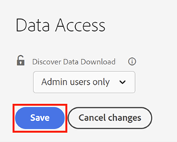

# [!UICONTROL Contrôle d’accès au téléchargement des données de Discover] {#discover-data-download-access-control}

[!UICONTROL Téléchargement des données de Discover] control active [!DNL Marketo Measure] Les administrateurs doivent définir les stratégies de téléchargement des données pour les tableaux de bord de Discover en fonction des rôles des utilisateurs. Le contrôle couvre toutes les actions de téléchargement de données sur les tableaux de bord de Discover.

1. Cliquez sur **[!UICONTROL Accès aux données]** under [!UICONTROL Sécurité].

   

1. Cliquez sur la liste déroulante et sélectionnez l’option appropriée pour votre console.

   

   <table>
    <tr>
     <td><strong>Tous les utilisateurs</strong></td>
     <td>Tous les utilisateurs peuvent télécharger des données, y compris des formats PDF et CSV.</td>
    </tr>
    <tr>
     <td><strong>Utilisateurs administrateurs uniquement</strong></td>
     <td>Seuls les utilisateurs administrateurs peuvent télécharger des données, y compris les formats PDF et CSV.</td>
    </tr>
    <tr>
     <td><strong>Aucun</strong></td>
     <td>Personne ne peut télécharger de données, y compris les formats PDF et CSV.</td>
    </tr>
   </table>

1. Cliquez sur **[!UICONTROL Enregistrer]** une fois terminé.

   

>[!NOTE]
>
>Il se peut que le paramètre ne prenne effet que lorsque les utilisateurs se sont déconnectés puis reconnectés.
