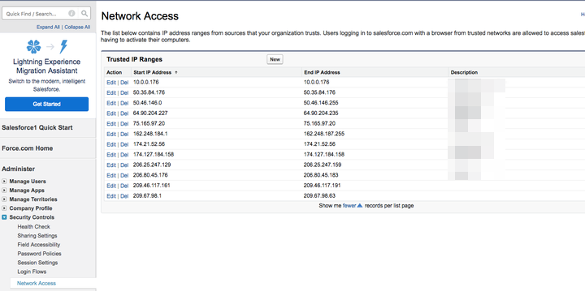

# Restrictions de session de sécurité : adresses IP à placer sur la liste autorisée {#security-session-restrictions-ip-addresses-to-allowlist}

Si des [&#x200B; paramètres de sécurité de session](https://help.salesforce.com/articleView?id=admin_sessions.htm&type=0){target="_blank"} sont en place pour empêcher des adresses IP spécifiques de pousser/extraire des données vers votre instance [!DNL Salesforce], nous aurons besoin des plages d’adresses IP suivantes placées sur la liste autorisée pour permettre à [!DNL Marketo Measure] de transmettre des données vers [!DNL Salesforce] :

* 52.162.84.192 - 52.162.84.207
* 23.100.229.112 - 23.100.229.127
* 20.186.163.0 - 20.186.163.15

Pour ajouter [!DNL Marketo Measure] adresses IP aux plages d’adresses IP approuvées dans Salesforce, cliquez sur **[!UICONTROL Configuration]** > **[!UICONTROL Configuration de l’administration]** > **[!UICONTROL Contrôles de sécurité]** > **[!UICONTROL Accès réseau]** > **[!UICONTROL Nouveau]**.

